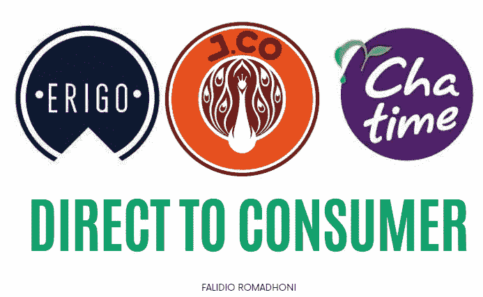
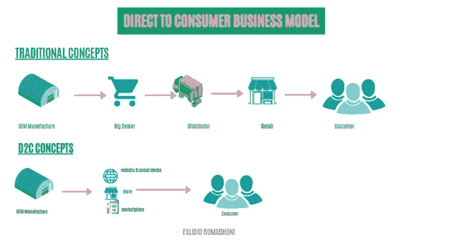
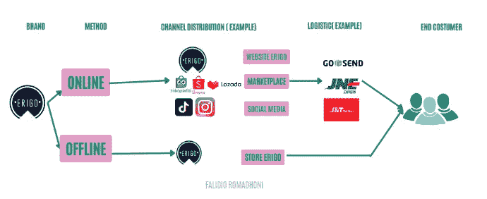
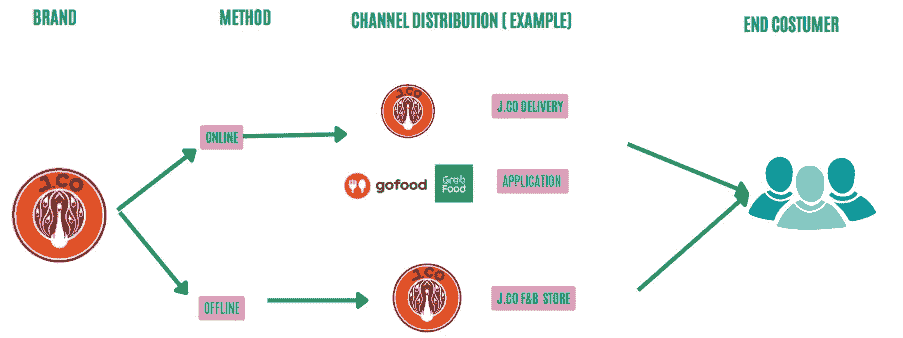

# 如何在 D2C 商业模式中取胜？

> 原文：<https://medium.com/geekculture/how-to-win-in-d2c-business-model-9923e30db570?source=collection_archive---------16----------------------->

当你直接向最终用户销售你的产品和服务，而不是通过批发商、零售商、分销商或其他中介时，你使用的是直接面向消费者(D2C)的商业模式。

[Created by Falidio Romadhoni via Canva](https://www.canva.com/design/DAFTfh3IQ0Y/rK_okpN68GK0a-ue9WLixQ/edit)

在这篇文章中，我将探讨直接面向消费者的商业模式或营销方法的本质，以及为什么这种商业模式或营销方法在世界各地越来越受欢迎。所以，事不宜迟，让我们现在就开始吧。

D2C 或直接面向消费者营销允许品牌在向客户销售商品时定期与客户互动。

这使得品牌能够与他们的客户发展真正的关系。

直接面向消费者的模式使品牌能够获得关于受众人口统计、客户偏好和市场趋势的所有相关数据，使他们能够开展更个性化的活动，并实现更高的转化率。

> D2C 模式也相对便宜。

因为很明显 D2C 营销在未来是多么重要，你必须精通这个主题。

## 直接面向客户的定义(D2C)

> ***消除中间商，通过线下门店或线上网站直接向终端用户销售产品，以物流为合作伙伴的商业模式。***

## 直接面向客户的供应链(D2C)

[Created by Falidio Romadhoni via Canva](https://www.canva.com/design/DAFTfh3IQ0Y/rK_okpN68GK0a-ue9WLixQ/edit)

## 例:
1。 **Erigo**

Created [by Falidio Romadhoni via Canva](https://www.canva.com/design/DAFTfh3IQ0Y/rK_okpN68GK0a-ue9WLixQ/edit)

## 2.J.CO

Created [by Falidio Romadhoni via Canva](https://www.canva.com/design/DAFTfh3IQ0Y/rK_okpN68GK0a-ue9WLixQ/edit)

## 使用 D2C 商业模式的好处

1.  获得更详细的客户人口统计和地理信息。
2.  产品开发和创新的空间更大。
3.  没有中介，导致利润控制更大。

更多完整的好处，你可以访问这个[博客。](/@navdeepyadav/10-startup-business-models-you-must-know-with-examples-b274f012e1a2)

## 如何在直接面向消费者的营销中取得成功

1.  创建一个真实、易记、易发音的品牌。
2.  拥有一个线下的位置，比如一个战略位置，和一个线上的存在，比如一个电子商务网站。
3.  通过 B2B 平台和交付应用改善渠道分销。
4.  有很强的保障，如 F&B(20 分钟以内发货)&时尚(网站不同颜色可以退换)。
5.  具有功能并参与交易辅助，例如在支付和借记卡/信用卡中使用金融科技。

> 感谢您阅读这篇文章。我希望企业家和对 D2C 商业模式感兴趣的读者发现它有用，我希望很快再次见到你。:)