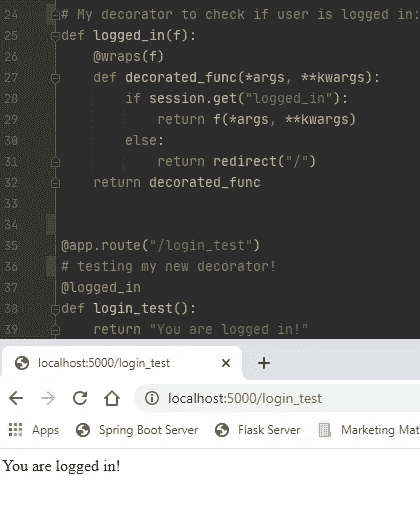
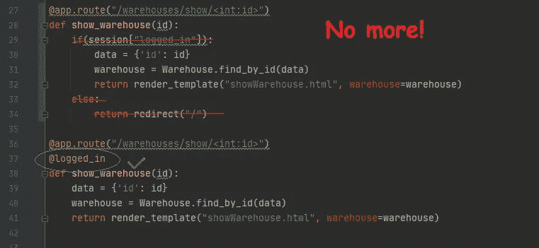

# 如何在 Python Flask 中编写一个 Decorator 来检查登录状态

> 原文：<https://medium.com/geekculture/how-to-write-a-decorator-for-python-flask-to-check-logged-in-status-3689872f6635?source=collection_archive---------8----------------------->



Testing my @logged_in decorator

如果您正在编写一个 web 应用程序，那么您可能希望根据用户是否登录或是否拥有特定权限来限制对某些端点的访问。

您可能会在整个项目中为每个路由重复这样的代码片段:

```
if session.get(“logged_in”):
    return render_template(“private_stuff.html”)
else:
    return redirect(“/login”)
```

这不仅仅是添加几行代码，您必须将您的主控制器或视图逻辑封装在您想要限制访问的每个端点的 if 语句中。

如果每个端点只使用一行代码就能做到这一点，会怎么样呢？你可以和室内设计师一起。

# 什么是室内设计师？


Photo by [Jess Bailey](https://unsplash.com/@jessbaileydesigns?utm_source=medium&utm_medium=referral) on [Unsplash](https://unsplash.com?utm_source=medium&utm_medium=referral)

装饰器的超级简单的定义是它可以修改函数的行为。在使用 Flask 的过程中，你可能已经对几个装饰者有所了解，比如`@app.route()`、`@classmethod`、`@staticmethod`等。

具体来说，装饰器本身就是一个函数，它接受另一个函数作为参数，并“包装”传递给它的函数。我花了一点时间来理解这一点(没有双关语的意思)，因为它解释起来容易，实现起来难。

一个非常简单的装饰例子:

```
def my_decorator(a_function):
    print(“I decorate thee”)
    return a_function()

@my_decorator
def print_hello():
    print(“hello”)
```

其输出将是:

```
>>> I decorate thee
>>> hello
```

但是这不适用于接受参数的函数，所以你需要一个内部函数来处理`*args`和`**kwargs`，假设你包装的给定函数可能有参数。

```
def my_decorator(a_function):
    def inner(*args, **kwargs):
        print("I decorate thee")
        return a_function(*args, **kwargs)
    return inner@my_decorator
def print_color(color):
    print(color)print_color("Red")
```

输出将是:

```
>>> I decorate thee
>>> Red
```

在上面的例子中，装饰器没有对传入`print_color()`的参数做任何事情

例如，我们可以获取关键字参数，并编写装饰器来相应地更改输出。

```
def my_decorator(a_function):
    def inner(*args, **kwargs):
        if kwargs.get('color') == "Red":
            print("oh my favorite color!")
        else:
            print("here's a boring color:")
        return a_function(*args, **kwargs)
    return inner@my_decorator
def print_color(color):
    print(color)print_color(color="Red")
print_color(color="Blue")
```

在这种情况下，输出将是:

```
>>> oh my favorite color!
>>> Red
>>> here’s a boring color:
>>> Blue
```

注意:要实现这一点，必须在函数调用中使用关键字“color”。

这绝不是对装饰器(又名“包装器函数”)最好的甚至是非常全面的解释，但是我们已经有足够的内容来为我们的 Flask 应用程序编写一个。

另一个细节是 functools 的`@wraps` decorator，它用于保存包装函数的元数据。这通常不是必需的，但是它将帮助我们为 Flask 构造装饰器。这是`@wraps`的官方[文件](https://docs.python.org/3/library/functools.html?highlight=wraps#functools.wraps)。

# @logged_in 装饰器

让我们假设两件事:您已经为会话提供了一个名为“logged_in”的布尔参数，以确定用户是否登录，以及任何导航到私有端点的人是否被重定向到您的根端点/。

我们需要为将要使用的`@wraps`装饰器包含以下导入语句:
`from functools import wraps`

我们现在可以像这样编写装饰函数:

```
def logged_in(f):
    @wraps(f)
    def decorated_func(*args, **kwargs):
        if session.get("logged_in"):
            return f(*args, **kwargs)
        else:
            return redirect("/")
    return decorated_func
```



The old way and the new way!

而在此之前，您需要像这样编写受保护的端点:

```
@app.route(“/private_stuff”)
def private_stuff():
    if session.get(“logged_in”):
        return render_template(“private.html”)
    else:
        return redirect(“/”)
```

你现在可以这样写:

```
@app.route(“/private_stuff”)
@logged_in
def private_stuff():
    return render_template(“private.html”)
```

您可以看到，即使在这个非常基本的示例中，编写路由方法也变得简单多了。在有许多端点的全栈应用程序中，您将有不同的路由规则、验证和保护，像这样的装饰器将使跟踪变得容易得多。

因为`session`对象在任何地方都是可访问的，所以装饰者只需要传递`*args`和`**kwargs`而不需要对它们做任何事情。但是，如果您想根据传递给路由方法的参数来更改路由，也有许多方法可以做到这一点，如上面的装饰示例所示。

最终，创建你自己的装饰器的好处将会是拥有更精简的代码，更少的出错机会和更好的路由方法可读性。我期待着看到你能想到的更好的装饰者！