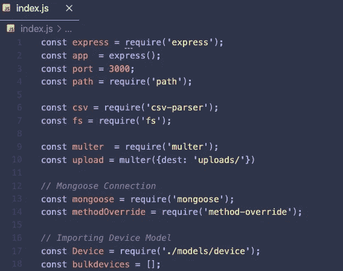
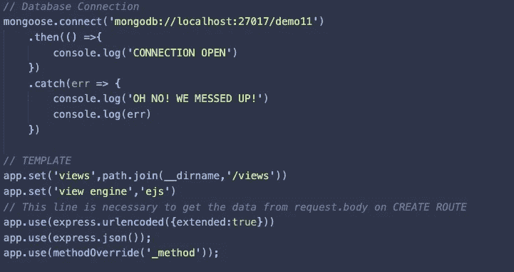
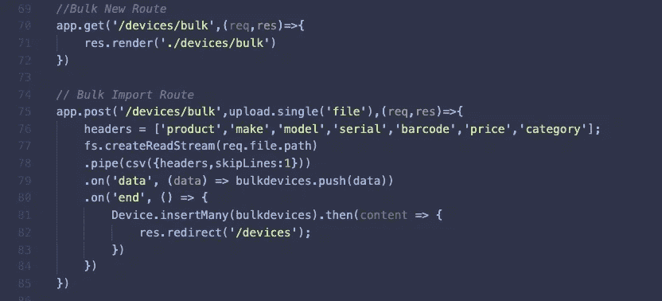
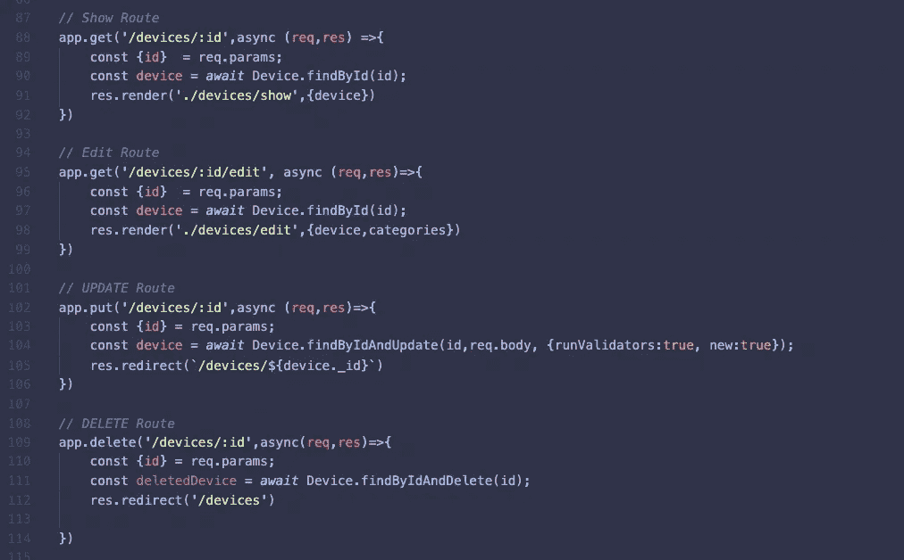

# 如何用 MEN Stack 加布尔玛 CSS 框架写一个完整的 CRUD web 应用

> 原文：<https://medium.com/geekculture/how-to-write-a-full-crud-web-application-with-men-stack-plus-bulma-css-framework-e54202cde3db?source=collection_archive---------15----------------------->

大家好！！！为了编写一个完整的 CRUD(创建、读取、更新、删除)web 应用程序，特别是用 JavaScript 编写的应用程序，我将带您经历无数的步骤。

我用过 MEN stack，那个 M 是代表 [MongoDB](https://www.mongodb.com/) ，E 是代表 [Express](https://expressjs.com/) ，N 是代表 [Node JS。](https://nodejs.org/en/)除此之外，我还链接了[布尔玛](https://bulma.io/) CSS 框架，而不是 Bootstrap，我发现[布尔玛](https://bulma.io/)更有语义，更有意义。

Photo by [Gabriel Heinzer](https://unsplash.com/@6heinz3r?utm_source=medium&utm_medium=referral) on [Unsplash](https://unsplash.com?utm_source=medium&utm_medium=referral)

以下是步骤:

1.  正在安装节点 JS 和 MongoDB，
2.  安装所需的 [*npm*](https://www.npmjs.com/) 包，创建并表现 web 服务器，
3.  本地连接 MongoDB。
4.  将创建 CRUD(创建、读取、更新和删除)路由，
5.  将集成其他功能，如 Multer an CSV Parser npm 软件包。
6.  EJS 和布尔玛 CSS 框架集成。

对于第一步，我不会分享一个解释，因为 on-time-installation 需要设置您的开发环境，所以这里有相应资源的链接。

*   " [Node.js](https://nodejs.org/en/) 是基于 [Chrome 的 V8 JavaScript 引擎](https://v8.dev/)构建的 JavaScript 运行时。"
*   [MongoD](https://www.mongodb.com/) B“构建更快，构建更智能”
*   [Express](https://expressjs.com/) JS“为 [Node.js](https://nodejs.org/en/) 设计的快速、无个性化、极简的 web 框架”
*   "[布尔玛](https://bulma.io/):现代 CSS 框架刚刚工作."

我来分享一下 *index.js :*

在 *index.js* 文件的第一部分，我们需要必要的 *npm* 包并初始化它们。

*app* 被初始化并分配给 *express* ()以便网络服务器将建立在 app 变量上。

*端口*是监听 *app* 的服务器的端口号。

*path* 用于目录，如果需要从根目录访问，我们需要 path 变量并设置 *__dirname。*这部分我以后再解释。

*csv* 用于解析这个应用程序中的 *csv* 文件，我已经将其用于批量导入功能。安装 *csv* - *解析器*的 *npm* 包，用于解析 csv 文件。

*multer* 是另一个 *npm* 包，主要用于上传文件并在 web 应用程序中使用它们。我选择使用 *multer* 上传 *csv* 文件，然后用 *csv* - *解析器*解析它们。

mongoose 是 MongoDB 的对象建模库，我已经安装了它来为数据库建模对象。

*method-override* 库用于更新和删除路由，一个表单只能发送 GET 和 POST 两种类型的请求。因此，我们需要操作指定形式的方法属性。

在 *index.js* 的第二部分中，MongoDB 已经连接到一个名为 demo11 的本地数据库。然后，我们设置了“*视图*目录的路径，因为所有的 [*EJS*](https://ejs.co/) 模板都将在这个文件夹中创建。

这里我们还包括了*应用程序，使用*行从表单主体获取数据。

这是肮脏的路线；

*索引路由*为我们提供了所有设备的信息，但是在本例中，我们已经传递了一个类别数组，查询将帮助我们按类别显示所有设备。

*新路由*是一个名为 New 的 ejs 模板，它包含一个提交新设备的表单。

*创建路由*是一个 POST 路由，从 req.body 获取数据并保存到 MongoDB，重定向到新设备页面。

我为这个简单的 web 应用程序添加了一个新功能，它将上传一个 csv 文件并解析它，然后数据将被保存到 MongoDB。下面是显示的代码:

此外，其余路线如下:

*显示路线*显示一个设备的内容。它将通过其 *id* 找到特定的设备，并且 *id* 可在 *req.params.* 处获得。在本节中，我们使用了 model 的方法，在本例中是 device。这些方法可以在这个[链接](https://mongoosejs.com/docs/api/model.html)中找到。如前所述，我们使用 *Device.findById()* 方法从数据库中查找具体的项目，相对的 *findByIdAndUpdate()* 方法用于更新， *findByIdAndDelete()* 方法用于删除一个设备。

我将在这里结束这篇文章，因为有很多部分要解释，我想提出来，让你自己去理解。希望代码的任何部分对你有所帮助。

你可以在这个 [GitHub 仓库获得完整的代码。](https://github.com/bunyaminsari/deviceApp)