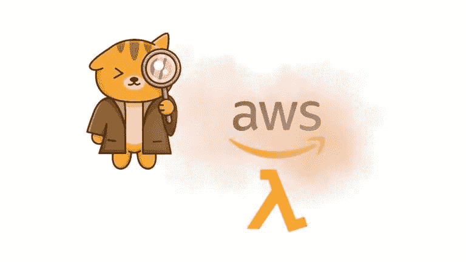
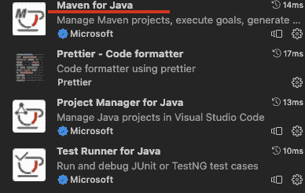
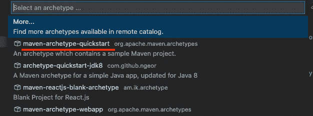
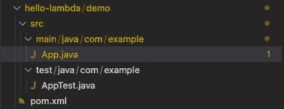
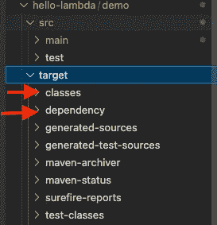
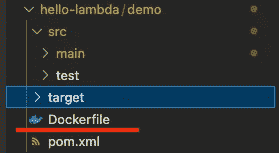
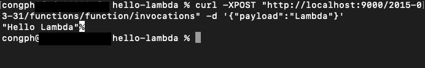

# 如何在笔记本电脑上使用 Docker 运行和测试 AWS Lambda 函数

> 原文：<https://medium.com/geekculture/how-to-write-and-test-aws-lambda-function-using-docker-in-your-laptop-f937d7d06e2a?source=collection_archive---------6----------------------->



Image Source ([https://unbiased-coder.com/detect-aws-env-python-nodejs/](https://unbiased-coder.com/detect-aws-env-python-nodejs/))

AWS Lambda 是一种无服务器计算服务，它允许开发人员在无需管理服务器的情况下构建和运行应用程序，由 Amazon Web Service 提供。

有几种方法可以编写和测试 AWS Lambda。我们可以直接在 AWS Lambda 控制台中编写代码，也可以在笔记本电脑中编写代码，构建它，然后将构建包上传到 AWS Lambda 控制台并在那里进行测试。这两种方式都要求我们拥有 AWS 帐户和对 AWS Lambda 控制台的访问权限，这可能非常不方便且昂贵，尤其是对于拥有许多工程师的组织来说。因此，使用 Docker 容器在本地运行和测试代码可以帮助消除访问 AWS Lambda 控制台的需要，从而减少成本和开发时间。

Lambda 支持多种编程语言，在本文中我们将以 Java 为例。

**步骤 1)安装 Maven**

一些 ide 通常有 Maven 作为插件，我使用 Visual Studio 代码(VSC)和 Maven 插件。关于如何安装 Maven 的更多信息，你可以访问 VSC 团队提供的[链接。](https://code.visualstudio.com/docs/java/java-build)



**步骤 2)创建项目文件夹并生成 Maven 代码模板**

为了创建项目文件夹，我们在终端中运行这个命令

> `**mkdir hello-lambda**`

要生成一个 Maven 项目，在 VSC 打开`Command Palette`并搜索`Create Java Project`命令。



在此之后，让我们保持其他一切默认。

完成步骤 2 后，项目文件夹应该是这样的。



**步骤 3)添加 AWS 依赖项和打包插件**

AWS SDK 允许我们编写 lambda 函数可以读取的 lambda 处理程序代码。打包插件帮助我们将代码打包成一个可以在 Docker 容器中运行的构建文件。

为了向我们的项目添加 AWS 依赖项，我们转到`pom.xml`文件，并在`dependencies`标签下添加这些依赖项。

要添加插件打包，在`pom.xml`文件中并在`plugins`标签下添加这些插件。

**步骤 4)添加示例λ代码**

在`App.java`的同一个目录下添加一个`Input.java`文件。


这个文件作为 lambda 函数的输入对象。然后，将下面的代码添加到`Input.java`中。

在`App.java`文件夹中，我们可以添加简单的 Java 代码，比如

这个 lambda 代码用`Hello <input payload string>`接收输入对象和响应。

**步骤 5)构建并打包我们的代码**

在我们的终端中，跳转到`demo`文件夹并运行

> `**mvn compile dependency:copy-dependencies -DincludeScope=runtime**`

该命令生成一个`target`文件夹，里面有`classes`和`dependency`文件夹。



在 Docker 容器中运行并测试我们的代码

在`demo`文件夹中，添加一个`Dockerfile`



然后把下面的内容复制到我们的 Dockerfile。

基本上，这个 Dockerfile 所做的就是使用来自 AWS for Java 11 的 lambda 运行时映像。然后，它将我们之前在`target`文件夹中生成的`classes`和`dependency`复制到 Docker 容器的 lambda 工作目录中。最后，它指定了我们的 Java 代码在哪里供`command handler`运行。

现在我们已经准备好在 Docker 容器中构建和运行我们的代码了。运行这两个命令。(确保您安装了 docker，并且 Docker 正在后台运行)

> `**docker build -t lambdacode .**`
> 
> `**docker run -p 9000:8080 lambdacode**`

一旦运行，我们的终端输出应该看起来类似

```
08 Aug 2022 02:54:36,830 [INFO] (rapid) exec '/var/runtime/bootstrap' (cwd=/var/task, handler=)
```

我们将无法键入新命令，因为 Docker 容器正在当前终端中运行我们的 lambda 代码。

然后，创建第二个终端并运行以下命令

> `**curl -XPOST “http://localhost:9000/2015-03-31/functions/function/invocations" -d ‘{“payload”:”Lambda”}’**`

这个命令为我们的 lambda 函数提供了有效载荷输入字符串`Lambda`，我们将看到结果`Hello Lambda`。我们可以用任何东西代替`"Lambda"`进行测试。



我们已经使用 Docker 运行了 lambda 函数，没有将它上传到 AWS 控制台。恭喜你。