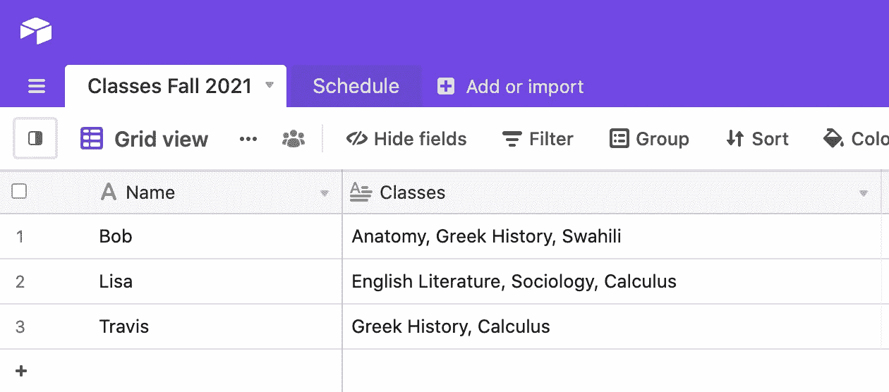
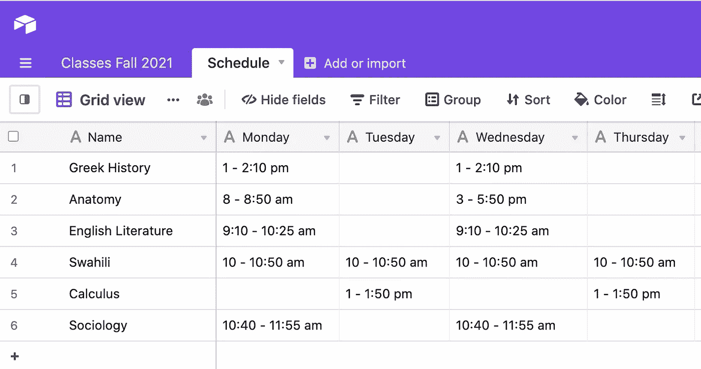
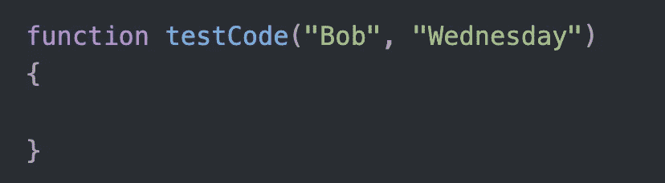
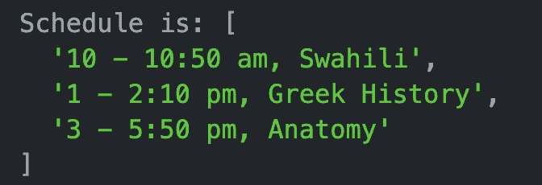
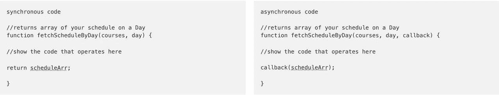
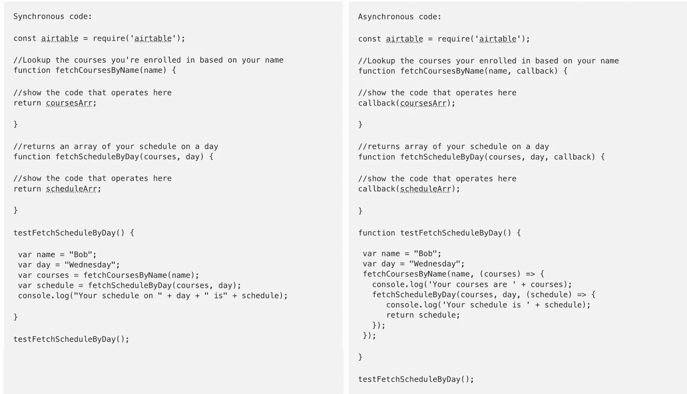

# 如何在 Node JS Airtable Lookup 中编写回调，初学者简易指南

> 原文：<https://medium.com/geekculture/how-to-write-callbacks-in-node-js-airtable-lookup-for-beginners-guide-ada552b1d2c9?source=collection_archive---------16----------------------->

我最近开始学习 Node.js，我对网上学习回调的所谓“基本”指南的难度和技术性感到失望。

*   [https://JavaScript sexy . com/understand-JavaScript-callback-functions-and-use-them/](https://javascriptissexy.com/understand-javascript-callback-functions-and-use-them/)
*   [https://stack overflow . com/questions/3458553/JavaScript-将参数传递给回调函数](https://stackoverflow.com/questions/3458553/javascript-passing-parameters-to-a-callback-function)
*   【https://zellwk.com/blog/nested-callbacks/ 
*   [https://www . jstips . co/en/JavaScript/passing-arguments-to-callback-functions/](https://www.jstips.co/en/javascript/passing-arguments-to-callback-functions/)
*   [https://www . plural sight . com/guides/JavaScript-callbacks-variable-scope-problem](https://www.pluralsight.com/guides/javascript-callbacks-variable-scope-problem)
*   [https://medium . com/@ foti OS . floros/explaining-JavaScript-callbacks-3d 5a 9 ad 52819](/@fotios.floros/explaining-javascript-callbacks-3d5a9ad52819)

像 setTimeout，Promises，foo，“承诺在现实生活中是一样的”所有这些其他的语言对于初学者来说是非常混乱的。

所以让我从基础开始。

# 为什么我们需要复试？

如果你像我一样，你习惯于编写*同步*代码，这意味着如果你想让函数 2 从函数 1 获取数据，你应该首先编写函数 1，让它计算一个变量，然后函数 2 将使用该变量运行。

```
Synchronous code: const airtable = require('airtable');//Lookup the courses you're enrolled in based on your name
function fetchCoursesByName(name) {//show the code that operates here
return coursesArr;}//returns an array of your schedule on a day
function fetchScheduleByDay(courses, day) {//show the code that operates here
return scheduleArr;}testFetchScheduleByDay() { var name = "Bob";
 var day = "Wednesday";
 var courses = fetchCoursesByName(name);
 var schedule = fetchScheduleByDay(courses, day);
 console.log("Your schedule on " + day + " is" + schedule);}testFetchScheduleByDay();
```

**以上代码在 Node.js** 上不起作用。原因是，如果您正在调用数据库或外部资源，那么在您尝试按天 (fetchScheduleByDay)查找您的课程表之前，获取您的课程列表(fetchCoursesByName) *的调用可能不会完成。事实上，因为节点 JS 基本上向下读取，并且在移动到下一行之前不等待一个函数完成，所以这将总是返回:*

```
Your schedule on Wednesday is undefined
```

如果你想得到一天的时间表，那就没什么用了。

# 让我们以一个数据库为例

假设我们想从两个表中查找数据。第一个是学生注册的课程名称列表。



第二个表格列出了一周内的授课内容和时间。



代码的目标是输入姓名和日期，例如“Bob”，“星期三”，并让它返回 Bob 在星期三的日程安排。让我们假设编写的代码也对讲座进行了排序，这样它们就有了正确的时间顺序。

输入:



输出:



这样一个程序的目的是，如果你是一个健忘的学生，你不记得你那天的课，你可以给一个托管这个代码的服务发消息，它会回复你一天的时间表。类似的东西可以扩展到任何需要查找给定输入数据的地方。

现在你已经知道我们想用 Node.js 做什么了，让我们来谈谈回调。

# 下面是如何为 Node.js 编写这个代码

要将本文开头的代码转换成异步代码，必须在所有函数中添加 callback 这个词。

现在互联网上有各种各样令人困惑的东西，关于如何写这段代码，所以我会尽量让它变得简单。

一次拿一块。要使一个函数“回调友好”,你需要做两件事。

1.  首先，在函数中添加一个名为“callback”的参数。
2.  然后，将您的返回声明从“return coursesArr”更改为“callback(coursesArr)”。

```
Asynchronous code:const airtable = require('airtable');//Lookup the courses your enrolled in based on your name
function fetchCoursesByName(name, callback) {//show the code that operates here 
callback(coursesArr);}
```

你在那个返回语句中告诉 Node.js 做的事情是，一旦函数 fetchCoursesByName 准备好了，就返回它，并使用它最终计算的值。

因为我们调用外部数据库，所以我们需要对第二个函数做同样的事情，

<fetchschedulebyday></fetchschedulebyday>

您将添加单词 callback 作为参数，并将函数中的单词 return 替换为单词 callback。

```
asynchronous code //returns array of your schedule on a Day
function fetchScheduleByDay(courses, day, callback) {//show the code that operates herecallback(scheduleArr);}
```

下面，大家可以对比对比一下区别。



我们所做的只是添加单词“callback”作为附加参数，并将单词 callback 替换为单词“return”。

现在，我们必须编写实际运行这些函数的代码。我们想首先获取学生的名字，然后返回他们的课程列表。然后，我们希望根据他们指定的日期查找他们的课程列表。

现在我们必须编写实际运行这些函数的 cod。我们希望首先获取学生的姓名，然后返回他们的课程列表。然后，我们希望根据他们指定的日期来查看他们的日程安排。我们什么都不需要他们的专业(top function)，但是我把它包含在顶部，以依次显示三个函数的回调。

```
function testCode(name, day) 
{**fetchMajorbyName**(name, (major) => {
  console.log('Your major is ' + major);
  **fetchCoursesByName**(name, (courses) => {
    console.log('Your courses are ' + courses);
    **fetchScheduleByDay**(courses, day, (schedule) => {
       console.log('Your schedule is ' + schedule);
       **return schedule**;
    });
  });
});
```

所以这段代码是可行的。这是告诉 Node 一次执行一个函数，在完成前一个函数之前不要执行下一个函数。这样你就可以先运行你的函数，然后是第二个，最后是第三个。

这里的语法是，无论你放在括号里的是什么，都是你想要返回的东西的名字。所以你是说当你调用 fetchCoursesByName 函数时，返回变量“courses”作为输出。

你可以很容易地给括号中的这些东西命名。下面的代码运行相同:

```
function testCode(name, day)
{fetchMajorbyName(name, (major) => {
  console.log('Your name is ' + name);
  fetchCoursesByName(name, (uggabugga) => {
    console.log('Your courses are ' + uggabugga);
    fetchScheduleByDay(uggabugga, day, (schedule) => {
       console.log('Your schedule is ' + schedule);
       return schedule;
    });
  });
});
```

这里的参数 uggabugga 将返回 fetchCoursesByName 输出的任何内容。我们知道 fetchCoursesByName 将为学生输出课程列表，所以这就是 uggabugga 中的值。基本上，无论你写什么作为最后一个参数，都是要被向前传递的。

以为你完事了？我也这么认为。这应该可以在您的计算机上本地运行。

但是如果我们想从外部调用这个函数，从另一个服务，我们想从另一个函数调用它，我们就有麻烦了，它会返回未定义的。我不知道为什么，但我认为这是因为它会在等待所有回调函数返回之前，遍历你的嵌套函数。所以你必须指示你的另一个函数等待，直到你得到所有的数据，然后再继续。为了做到这一点，我们需要做两件事。**首先**，我们需要重做我们的 testCode 函数，使其成为一个回调函数。

```
function testCode(name, day, callback)
{fetchNamebyId(id, (name) => {
  console.log('Your name is ' + name);
  fetchCoursesByName(name, (uggabugga) => {
    console.log('Your courses are ' + uggabugga);
    fetchScheduleByDay(uggabugga, day, (schedule) => {
       console.log('Your schedule is ' + schedule);
       callback(schedule);
    });
  });
});
```

我在这里所做的只是将参数“callback”添加到顶部，并使用“callback(schedule)”而不是 return 语句返回 fetchSchedulebyDay 中的数据。

既然 testCode 是一个回调函数，我们可以从另一个函数调用它，它将返回正确的信息。第二件要做的事情是**编写调用它的函数作为承诺**，这样它会等到 testCode 完成后再继续前进。

我正在使用的工具说执行程序的函数必须被称为“main ”,并且只能接受一个名为“params”的东西。这些就是我将要面对的限制。现在我添加这最后一段代码，以便调用上面的 testCode，并确保它返回正确的结果。

```
function main(params) {
  return new Promise((resolve, reject) => {
    params.name = "Bob"
    params.day = "Wednesday";
    testCode(params.name, params.day, (schedule)=> {
      resolve(schedule);
    });
  }).then((data)=>{
    console.log("The promise has been resolved");
    return data;
  });
}
```

你会看到上面这个符号是不同的，我们要用一个叫做承诺的东西，它与回调有关。我不知道它们之间的确切关系，但是上面的代码基本上会等到 testCode 运行并返回时间表，然后再进入“Then”部分。

[需要找出如何添加错误以显示“拒绝”部分]

这里的语法是，我从承诺的第一部分返回的东西被写成 resolve(schedule)。我认为这意味着 resolve 也是回调，但我可能错了。无论如何，你要用 resolve(schedule)这个词来把事情从承诺的第一部分退掉。

```
testCode(name,params.day,(schedule)=>{
      resolve(schedule);
    });
```

转移到“然后”的部分是你最终想要返回的东西。这里的语法基本上是你从括号中的第一部分得到的，你返回它。

```
}).then((data)=>{
    console.log("The promise has been resolved");
    return data;
  });
```

你也可以把它作为一个 JSON 对象返回，这是我必须为我正在使用的程序做的。因此，为了以 json 的形式返回函数，只需将上面的“返回数据”改为

```
}).then((data)=>{
    console.log("The promise has been resolved");
    return {result:data};
  });
```

这将返回一个带有一个名称-值对的 JSON，其中“result”是名称，“data”是值。这将返回到你的程序中:

```
{"result" : ["Art History 9:00 - 9:50", "Calculus 11:00 - 11:50", "Sociology 1:00 - 1:50"]}
```

现在你可以调用你的 main(params)函数，你可以在任何一天传递它。它可能是({"day":"Monday"})或({"day":"Thursday"})，并且将运行相同的代码

你可以传递两个主要参数，它会做同样的事情。({"day":"Tuesday "，" name":"Lisa"})它将返回 Lisa Monroe 的星期二日程安排。

我还没有把 Github 和所有这些代码放在一起，但是我很快就会了。希望有所帮助！

感谢 Jordan Soltman 在互联网和数小时数天的搜索都未能弄清楚这一点的情况下，他给了我宝贵的建议，向我解释了回电的基本知识。



This should work locally on your computer

# 常见问题解答

**如果我的函数最初没有任何参数呢？**

如果你有一个不带任何参数的函数，你可以通过添加一个参数来使用相同的语法。

```
synchronous version fetchAllCourses() {//code that returns a list of all courses at the Universityreturn listofCourses;}asynchronous version fetchAllCourses(callback) {//code that returns a list of all courses at the Universitycallback(listofCourses);}
```

基本上使用单词“callback”代替 return，并确保将其作为参数添加。

**什么时候需要让函数回调友好？**

我不太确定答案，但我认为答案是在您调用外部服务的任何时候，即使是非常快速的调用，因为会有一些未知的处理时间。

如何知道一个函数是否正在使用回调？

我寻找一种奇怪的符号，它使用一个括号，后跟一个花括号和一个分号。如果我在某个地方看到了，我就知道这部分代码是在调用外部的东西，因此我需要让我的函数“回调友好”。

**)}；**

**为什么我需要使用承诺？**

如果你从一个外部服务调用运行你的代码的函数，比如 AWS Lambda 或者 IBM Cloud 函数，你需要告诉你的程序在返回之前等待数据。你不能只调用运行代码的函数。你需要通过一个承诺来调用你的函数，函数必须做成回调，所以一切都知道要等有数据了再返回。本文前面的代码演示了 Promise 部分，并将 textCode 转换为回调。

## **沙盒区**

```
Asynchronous code:const airtable = require('airtable');//Lookup the courses your enrolled in based on your name
function fetchCoursesByName(name, callback) {//show the code that operates here
callback(coursesArr);}//returns array of your schedule on a day
function fetchScheduleByDay(courses, day, callback) {//show the code that operates here
callback(scheduleArr);}function testFetchScheduleByDay() {

 var name = "Bob";
 var day = "Wednesday";
 fetchCoursesByName(name, (courses) => {
   console.log('Your courses are ' + courses);
   fetchScheduleByDay(courses, day, (schedule) => {
      console.log('Your schedule is ' + schedule);
      return schedule;
   });
 });}testFetchScheduleByDay();
```

这就是一切。用 Promise 和 testCode 作为回调:

```
Asynchronous code:const airtable = require('airtable');//Lookup the courses your enrolled in based on your name
function fetchCoursesByName(name, callback) {//show the code that operates here
callback(coursesArr);}//returns array of your schedule on a day
function fetchScheduleByDay(courses, day, callback) {//show the code that operates here
callback(scheduleArr);}function testCode(name, day, callback)
{ fetchMajorbyName(name, (major) => {
   console.log('Your name is ' + name);
   fetchCoursesByName(name, (uggabugga) => {
     console.log('Your courses are ' + uggabugga);
     fetchScheduleByDay(uggabugga, day, (schedule) => {
        console.log('Your schedule is ' + schedule);
        callback(schedule);
     });
   });
 });
} function main(params) {
  return new Promise((resolve, reject) => {
    params.name = "Bob"
    params.day = "Wednesday";
    testCode(params.name, params.day, (schedule)=> {
      resolve(schedule);
    });
  }).then((data)=>{
    console.log("The promise has been resolved");
    return data;
  });
}
```