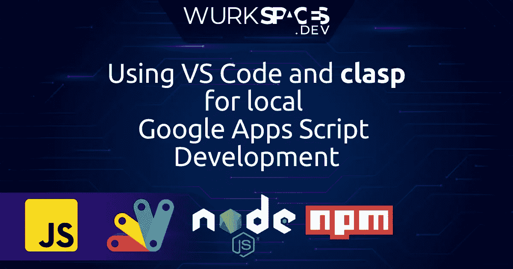

# 如何用 VS 代码在本地编写 Google Apps 脚本代码，并用 clasp 部署

> 原文：<https://medium.com/geekculture/how-to-write-google-apps-script-code-locally-in-vs-code-and-deploy-it-with-clasp-9a4273e2d018?source=collection_archive---------0----------------------->

Google Apps 脚本启动

# 为什么要在本地写 GAS 代码？

当新的 Google Apps 脚本 IDE 问世时，当然是一件大事。这比传统的要好得多。它带来了语法高亮、键盘快捷键、命令面板和更好的用户界面体验。