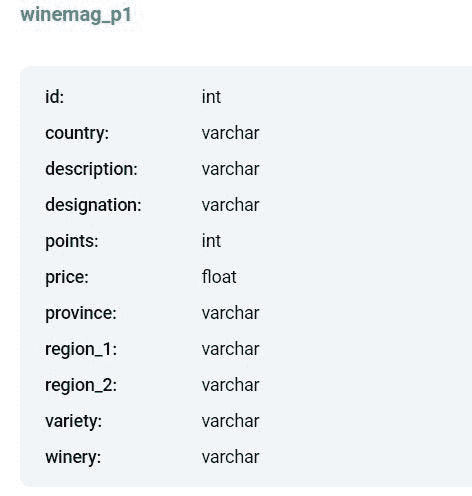
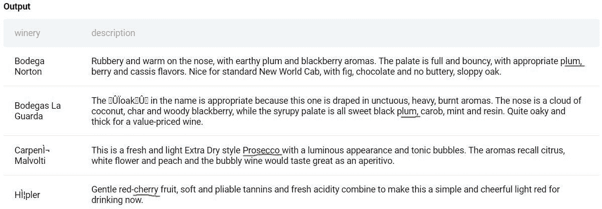
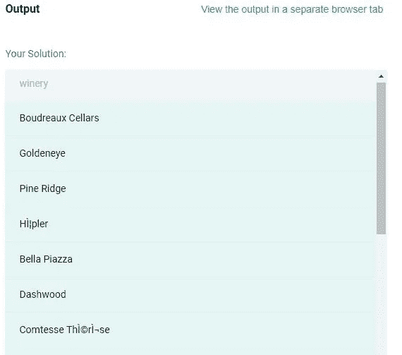

# 第 18 部分:如何编写 SQL 查询来查找所有含有特定香味的葡萄酒

> 原文：<https://medium.com/geekculture/how-to-write-sql-query-to-find-all-those-wines-which-contain-specific-aromas-9cc4d8f87242?source=collection_archive---------8----------------------->

数据科学家的角色非常广泛，这让候选人有些不知所措。SQL 是任何有抱负的数据科学家的必备工具。为了以最有效的方式学习 SQL，您必须练习如何解决查询。在本文中，我们将回答一个面试问题，并尝试使用多种方法来解决这个问题:**找出所有生产具有李子、樱桃、玫瑰或榛子香味的葡萄酒的葡萄酒庄。**

这个 SQL 问题来自 StrataScratch 平台，该平台提供了基于产品的公司在数据科学角色面试中询问的多种编码和非编码问题。你可以在这里查看问题[并跟着文章练习。Stratascratch 上的每一个编码问题，在 MySQL，和 Postgres 中都可以解决。](https://platform.stratascratch.com/coding/10026-find-all-wineries-which-produce-wines-by-possessing-aromas-of-plum-cherry-rose-or-hazelnut?code_type=1)


**我们来理解一下这个问题:**

我们被要求找出所有生产具有李子、樱桃、玫瑰或榛子香味的葡萄酒的酒厂。下表中的描述字段包含了葡萄酒香气的详细信息，因此，我们必须在描述字段中搜索相关的特定香气。我们必须只选择那些描述字段包含以下任何香味的葡萄酒厂名称:**李子、樱桃、玫瑰或榛子。**

您必须使用 table: winemag_p1 来解决这个问题。



winepag_mg1 表中几个字段的预览:



【LIKE 和 SIMILAR TO 运算符的问题:

*这个问题看似直白。如果您熟悉一些基本的 SQL 概念，那么您会认为可以使用类似于* *运算符的***或* ***来解决这个问题。以下查询返回酒厂“carpenìMalvolti ”,因为描述字段“Prosecco”包含子字符串“rose”。% sign round %rose%搜索那些以玫瑰为前缀或后缀的任意数量的字符或空格的记录，因此，与酒厂的描述字段 carpeníMalvolti '中的' Prosecco '匹配并返回它。****

```
****select distinct winery
from winemag_p1
where lower(description) like ‘%plum%’or lower(description) like ‘%cherry%’ 
 or lower(description) like ‘%rose%’or lower(description);****
```

**类似于* *的* ***运算符也没有提供正确的结果，并返回酒厂“carpenìMalvolti”，因为其描述字段包含“Prosecco”。****

```
****select distinct winery
from winemag_p1
where lower(description) similar to ‘(%plum%|%cherry%|%rose%|%hazelnut%)’****;**
```

*当香味与部分词语搭配时，问题就出现了，就像玫瑰与普罗塞克搭配一样。这个问题可以使用精确的全词匹配来解决，这可以通过在想要的香味周围创建词边界来完成。*

****什么是字界？****

*单词边界匹配其中一侧是单词字符(通常是字母、数字或下划线，而另一侧不是单词字符(例如，它可能是标点符号或空格字符)的位置。当您想要单独匹配一系列字母(或数字)时，或者当您想要确保它们出现在一系列字符的开头或结尾时，单词边界非常有用。*

*问题解答在下面的 MySQL 和 Postgres 中讨论。*

***MySQL 解决方案:***

**MySQL 中用于 regex 的单词边界可以使用元字符\\b 形成。regex****\ \ brose \ \ b****因此将与红玫瑰*中的*玫瑰匹配，但不会在*散文、prosecco 或 rosette *中匹配。当其中一个边界被移除时，****\ \ brose****将匹配玫瑰图*中的* rose，****rose \ \ b****将匹配散文中的* rose，*但不反之。然而，****\ \ brose \ \ b****将不会匹配* rose in _roset 或 rose21 *，因为下划线和字母之间或者字母和数字之间没有边界:这些都是 regex 定义为单词字符的一部分。**

**问题中给出了香气以单数形式出现，因此我们不需要检查香气的复数形式。因此，我们可以使用 MySQL 中的 word boundary:*编写查询来匹配任何李子、樱桃、玫瑰或榛子的香味*

```
****select distinct winery
FROM winemag_p1
where lower(description) REGEXP ‘\\b(plum|rose|cherry|hazelnut)\\b’;****
```

****另一种创建自定义字边界的方法:****

**我们可以通过限制模式来创建自定义的单词边界，使其不能以任何字母字符开头或结尾。我们可以在模式的开头和结尾使用正则表达式(^a-z)来指定这个条件，以便将指定的模式作为一个完整的单词来匹配:**

```
****select distinct winery
FROM winemag_p1
where lower(description) REGEXP ‘([^a-z])(plum|rose|cherry|hazelnut)([^a-z])’;****
```

***Postgres 解答:***

**在 Postgres 中，有两种方法可以解决问题。第一种方法是使用正则表达式解决问题，另一种方法是使用特定于 Postgres 的数据类型 tsvector 和 tsquery。下面将详细讨论这两种方法:**

***方法 1:使用 POSIX 正则表达式:***

*POSIX 正则表达式比 LIKE、SIMILAR TO 和 ILIKE 更强大。我们可以使用 POSIX 正则表达式进行精确的模式匹配。 ***约束解除*** *\y 可用于在模式周围创建单词边界，以匹配 Postgres 中单词的开头或结尾。使用 escape \y 约束，下面的查询将不会返回与部分单词匹配的记录。我们可以使用波浪符号~来匹配以下任何一种使用正则表达式的香味:* ***李子、樱桃、玫瑰或榛子。我们可以编写以下查询来获取酒厂名称:****

```
****SELECT DISTINCT winery
FROM winemag_p1
WHERE lower(description) ~ ‘\y(plum|cherry|rose|hazelnut)\y’;****
```

****创建自定义字边界的另一种方式:****

**这是另一种创建自定义单词边界的方法，和 MySQL 一样，如果我们可以限制模式，使其不能以任何字母字符开头或结尾。我们可以在模式的开头和结尾使用正则表达式(^a-z)来指定这个条件，以将指定的模式作为一个完整的单词来精确匹配:**

```
****select distinct winery
FROM winemag_p1
where lower(description) ~ ‘([^a-z])(plum|rose|cherry|hazelnut)([^a-z])’;****
```

***方法 2:使用 to_tsvector()和 to_tsquery():***

**PostgreSQL 提供了两种支持全文搜索的数据类型:tsvector 和 tsquery。tsvector 类型表示文本搜索优化格式的文档，而 tsquery 类型表示文本查询。要实现全文搜索，必须提供一个从文档生成 tsvector 和从用户查询生成 tsquery 的函数。**

****Postgres 中的 to_tsvector()和 to _ ts vector():****

**为了将文档转换为 tsvector 数据类型，PostgreSQL 提供了 to tsvector 函数。to_tsvector()函数将文本文档解析为标记，将标记转换为词位，并返回一个 tsvector，其中包含词位列表及其在文档中的位置。to_tsquery()是“文本搜索查询”的缩写，它将查询字符串转换成“标记”进行匹配。这一步非常关键，因为我们需要“模糊匹配”关键词。例如，如果用户搜索“eggs”，并且一列包含值“egg”，我们可能仍然会返回一个匹配。**

**当我们对 description 应用 to_tsvector()并对' plum | cherry | rose |榛子'应用 to_tsquery()时，我们得到 tsvector 和 tsquery 数据类型作为以下查询的输出。**

```
****select id,winery, to_tsvector(description), 
to_tsquery(‘plum|cherry|rose|hazelnut’) from winemag_p1;****
```

**

**对于全文搜索,@@符号代表“匹配”符号。它返回 to_tsvector()和 to_tsquery()结果之间的任何匹配。某些描述字段包含“/”，因此替换为空格。然后，我们将在 description 字段上使用 to_tsvector()和在 aromas* **上使用 to_tsquery()来匹配以下查询中的任何一个，以查找所有的葡萄酒厂:***

```
****select winery from winemag_p1 
where to_tsvector(replace(description, ‘/’, ‘ ‘) ) @@ 
to_tsquery(‘plum|cherry|rose|hazelnut’);****
```

****to_tsvector()和 to_tsquery()也可以搜索，即使香味*** *李子、樱桃、玫瑰或榛子以复数形式出现。**

***最终输出预览:***

**

# *结论:*

*在这篇文章中，我们看到了几种数据提取工具解决同一个查询的各种方法。由于 LIKE、ILIKE 和 SIMILAR TO 操作符都有问题，所以我们不能使用它们来产生预期的结果。因此，为了获得想要的结果，我们使用了正则表达式。*

*这篇文章的要点如下:*

***关键要点:***

*1.对于模式匹配，正则表达式比 LIKE、ILIKE 和 SIMILAR 操作符更强大。*

*2.在 MySQL 和 Postgres 的正则表达式中，可以使用单词边界元字符进行全词匹配。*

*3.Postgres 函数 to_tsvector()和 to_tsquery()使模式搜索比正则表达式更健壮、更快，因为它们在单个查询中搜索模式的多个变体。*

*正则表达式是一个强大的工具，可以在 SQL 函数中用来提取和匹配字段模式。它是强大的数据提取、清理和验证工具，尤其是在处理文本数据时。*

*如果你喜欢读这篇文章，请鼓掌，评论，并关注我的媒体，继续关注即将到来的文章。*