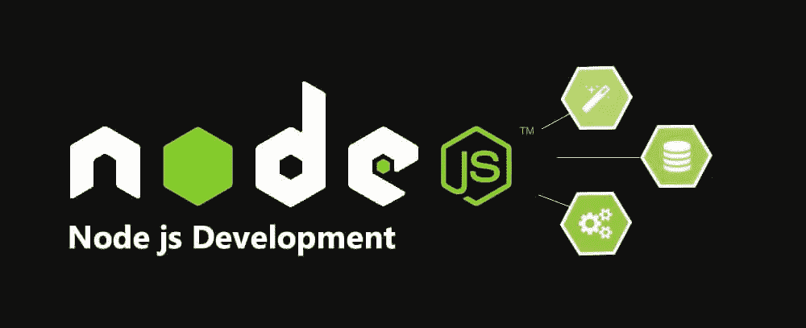
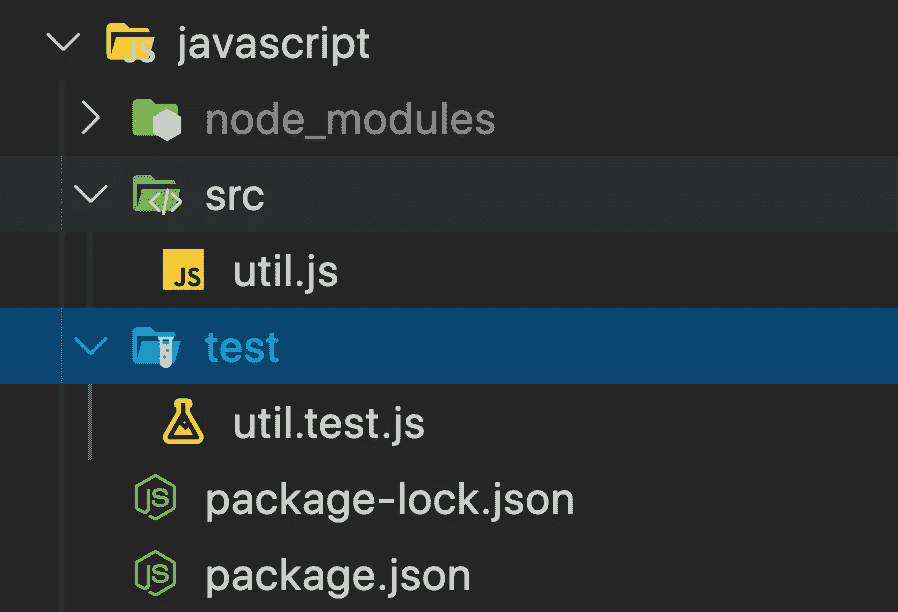
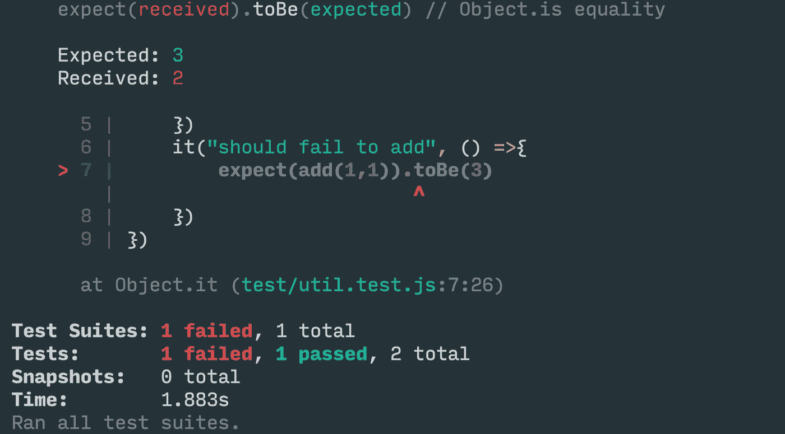

# 如何用不同的编程语言编写你的第一个单元测试？

> 原文：<https://medium.com/geekculture/how-to-write-your-first-unit-test-in-multiple-programming-languages-6d158d362b3d?source=collection_archive---------2----------------------->

在过去几年的经验中，我做过各种语言的编码。大多数时候(除了 POC)，我必须自己编写测试用例。有时，我不得不为其他代码编写测试用例[ **我真的很讨厌它]** 。

在建立测试框架时有许多挑战。这里我将解释如何为知名编程语言的单元测试建立一个基本的测试环境。


Photo by [Science in HD](https://unsplash.com/@scienceinhd?utm_source=unsplash&utm_medium=referral&utm_content=creditCopyText) on [Unsplash](https://unsplash.com/s/photos/testing?utm_source=unsplash&utm_medium=referral&utm_content=creditCopyText)

NodeJs/JavaScript:JavaScript 是当今使用最多的语言。由于 node js 生态系统及其简单性，我们有了许多框架/脚手架工具。设置任何一种环境都很容易。



要创建一个完整的工作设置，您可以使用像 [Yeoman](https://yeoman.io/) 这样的发生器。其他一些框架，如 React、Angular，为测试环境设置提供了生成的代码。对于 React，使用最多的生成器是 [create-react-app](https://reactjs.org/docs/create-a-new-react-app.html) 。您将整个设置作为默认设置。

但是，对于基本设置，您可以遵循下面提到的步骤。

## **先决条件:**

1.  [Nodejs](https://nodejs.org/)
2.  [npm/npx](https://www.npmjs.com/)

步骤:

1.  创建如下所示的文件夹结构:
2.  在`src`目录下创建 util.js 并添加函数
3.  在测试文件夹[名称应包含. test.js]中创建测试文件
4.  初始化`npm package`并安装`jest`测试框架

**文件夹结构:**



```
$ mkdir src test//util.js
exports.add = (a, b) => a+b$ npm init --y 
## install jest testing framework 
$ npm i --save-dev jest 
```

**添加基本测试并重新运行:**

```
//util.test.jsconst {add} = require("../")describe("Util.js", () => {    it("should able to add", () =>{ 
  expect(add(1,1)).toBe(2)    
 })    
it("should fail to add", () =>{        
  expect(add(1,1)).toBe(3)    
 })
})
```

## 运行测试用例:

**输出:**

```
$ npx jest
```



**更多:**[https://github.com/deepakshrma/unit-test-设置-所有语言/树/主/javascript](https://github.com/deepakshrma/unit-test--setup-in-all-languages/tree/master/javascript)

Java:使用第二多的语言是 Java。多亏了像 Gradle 这样的工具，设置变得如此简单。每当我想起过去的时光，我仍然会痛得发抖。

## **先决条件:**

1.  [Java](https://openjdk.java.net/)
2.  [等级](https://gradle.org/install/)【v 5 . 5 . 1 及以上】

**步骤:**

1.  创建一个文件夹，运行下面的命令，并按照指示

运行`gradle init`后，分别选择选项:

`3\. library -> 3\. java -> 1\. Groovy -> 1 Junit 4 <-| Enter <-| Enter`

```
## Create lib using gradle$ md java_code$ gradle init##  --> 3: library 
    --> 3: Java 
    --> 1: Groovy
    --> 1: JUnit 4
    --> enter <-|
    --> enter <-|
```

**运行测试:**

```
## run test case
$ ./gradlew test
```

**更多:**[https://github.com/deepakshrma/unit-test-设置-所有语言/树/主/java_code](https://github.com/deepakshrma/unit-test--setup-in-all-languages/tree/master/java_code)

Python:我曾经使用 python 作为脚本语言。我从来没有机会把 python 作为一门全功能语言来使用。在设置时，为一个简单的功能设置测试对我来说非常困难。直到现在，我仍然不知道一个合适的框架来建立。但我设法运行了一些基本的测试案例。

## **先决条件:**

1.  [Python](https://www.python.org/downloads/)【3.6 及以上】
2.  [Pip](https://pypi.org/project/pip/)【19 . 3 . 1 及以上】

**步骤:**

1.  创建一个文件夹并添加源代码。添加`util.py`和`test_util.py`

```
$ md project && md project/src && cd $_$ vi util.py// util.py
def add(a, b):
    return a+b$ vi test_util.py// test_util.py
import util 
def test_answer():
    assert util.add(1,1) == 2
def test_answerFail():    
    assert util.add(1,1) == 3
```

2.使用 pip 安装`pytest`模块

```
$ pip install -U pytest
```

**3。运行测试用例**

`$ pytest -q src/test_util.py`

**更多:**[https://github.com/deepakshrma/unit-test-设置-所有语言/树/大师/python](https://github.com/deepakshrma/unit-test--setup-in-all-languages/tree/master/python)

Rust:最近我开始在 [Rust](http://rust-lang.org) 上编程。它是一种强大的语言，同时又非常简单。不像 java，C，C++你不需要太多的仪式。我非常喜欢它。[货物](https://doc.rust-lang.org/cargo/)让一切变得简单。

## **先决条件:**

1.  [生锈](https://www.rust-lang.org/)
2.  [货物](https://github.com/rust-lang/cargo/)

**步骤:**

1.  使用货物创建库
2.  在同一个文件中编写测试代码
3.  运行测试用例

```
## Create lib using cargo
$ cargo new rust_lang --lib// src/lib.rs
mod util {   
  pub fn add(a:i32, b:i32) -> i32 {       
     a+b    
  }
}// test code in same file#[cfg(test)]mod tests {
 use super::*;    
 #[test]
 fn it_works() {
   assert_eq!(util::add(1,1), 2);    
 }    
 #[test] 
 fn it_will_works() {
    assert_eq!(util::add(1,1), 3);
 }
}
```

**运行测试用例:**

```
$ cargo test -- --nocapture
```

【更多:[https://github.com/deepakshrma/unit-test-设置-所有语言/树/主人/rust_lang](https://github.com/deepakshrma/unit-test--setup-in-all-languages/tree/master/rust_lang)

Go 是使用最多的语言之一。我在 GoLang 做过一些 POC。正如我提到的，在进行 POC 时，我避免(不)编写测试用例。但是，我努力了。设置测试环境对我来说非常痛苦。就连设置 GOPATH 都让人摸不着头脑。然而，我设法这样做了。以下是你可以遵循的步骤。


**步骤:**

1.  创建文件夹 util/并测试/
2.  将文件夹复制到路径模块
3.  运行测试用例

```
## Create folder util/ and test/// util/lib.gopackage util 
/// Test function Add
func Add(a int, b int) int { 
  return a + b
}//test/lib_test.go
package test 
import ( 
"testing"  
util "github.com/xdeepakv/go_lang/util"
) 
func TestAddPass(t *testing.T) { 
 got := util.Add(1, 1) 
 if got != 2 {  
   t.Errorf("Add not working properly") 
  }
}
func TestAddFail(t *testing.T) { 
 got := util.Add(1, 2) 
 if got != 2 {  
   t.Errorf("Add not working properly") 
 }
}
```

## Try1

```
cd go_lang
go test -v ./test/
```

检查`Go`路径，将文件夹复制到 go 路径模块

```
## Check go path$ echo $GOPATH## Default would be ~/go ## Copy folder to go path module$ cp -R ../go_lang $GOPATH/src/github.com/xdeepakv
$ cd $GOPATH/src/github.com/xdeepakv/go_lang
```

**运行测试用例:**

```
$ go test -v ./test/
```

**更多:**[https://github.com/deepakshrma/unit-test-设置-所有语言/树/主/go_lang](https://github.com/deepakshrma/unit-test--setup-in-all-languages/tree/master/go_lang)

**更新日期:11 月 13 日**

使用 swift [包管理器](https://swift.org/package-manager/)创建 swift 库很容易。然而，编写测试用例对我来说是一个挑战。我没用过`[XCTest](https://developer.apple.com/documentation/xctest)`。所以我很难找到正确的方法。要创建一个 util 库，您可以遵循以下步骤:

## **先决条件:**

1.  **Swift 5.1+**

**步骤:**

1.  使用 swift 包创建库
2.  tests/util tests/util tests . swift

```
## Create lib using swift package$ md util && swift package init --type library
// util/util.swift
public class Util {
public class func add(_ a: Int, _ b: Int) -> Int {
    return a+b
  }
}// Tests/utilTests/utilTests.swift
func testExample() {
 XCTAssertEqual(Util.add(1,2), 2)
}
```

**运行测试用例:**

```
$ swift test
```

**更多:**[https://github.com/deepakshrma/unit-test-设置-所有语言/树/主/swift_code](https://github.com/deepakshrma/unit-test--setup-in-all-languages/tree/master/swift_code)

**更好的例子:**[https://medium . com/quick-code/lets-build-a-command-line-app-in-swift-328 ce 274 f1 cc](/quick-code/lets-build-a-command-line-app-in-swift-328ce274f1cc)

我还在学习其他一些语言。稍后我将更新这些语言的步骤。如果你的`programming language`不在这里，请务必让我知道。我仍在努力寻找写`unit testing`的最佳方式。如果你有任何建议，请告诉我。

**#欢呼#KeepCoding**

> 所有的源代码都可以在 Github 上找到:

[](https://github.com/deepakshrma/unit-test--setup-in-all-languages) [## deepakshrma/单元测试—所有语言的设置

### 此时您不能执行该操作。您已使用另一个标签页或窗口登录。您已在另一个选项卡中注销，或者…

github.com](https://github.com/deepakshrma/unit-test--setup-in-all-languages)