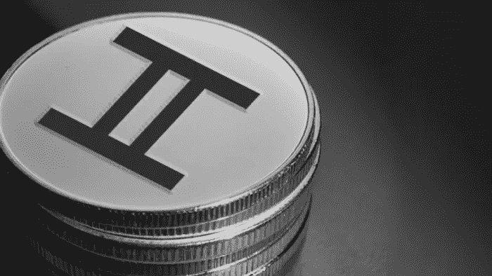

# 在 Hedera Hashgraph 平台上，标记化是如何工作的？

> 原文：<https://medium.com/geekculture/how-tokenization-works-on-hedera-hashgraph-platform-5dd7ad10920d?source=collection_archive---------23----------------------->

# 什么是标记化？

令牌化是将所有权和有形资产转化为称为令牌的数字资产的过程。这一过程被记录在分布式账本上，可以给多个万亿美元市场的运作带来变革。令牌化很容易在各种组织和分散协议中进行探索，用于稳定的内容、证券、数字艺术等。

令牌化的成功和持续增长依赖于支持主流采用所需的合规性、性能和成本的公共网络。Hedera Hashgraph 通过实现 Hedera 令牌服务来提供两种部署方法，从而消除了这些限制。让我们更深入地理解 Hedera 的标记化模型。

# 在 Hedera Hashgraph 平台上，标记化是如何工作的？

[Hedera Consensus](https://www.leewayhertz.com/create-hedera-hashgraph-tokens/)服务上的令牌化使许可网络允许构建者定义特定的网络参与者、用例、数据隐私和部署模型。这些网络是使用许可的节点运营商设计的，具有基于来自 Hedera Consensus Service 的同步消息用定制代码更新的数据库的本地副本。

在令牌化过程中，发送到 HCS 的消息包括在账户分类帐之间传输令牌的指令。当 Hedera Mainnet 设法与 Hedera Consensus 服务一起订购时，许可的节点网络维护状态。

令牌消息标准是使用 HCS 创建令牌的经过验证的规范和审核的实现。HCS 上用于实现令牌消息标准的令牌的主要组件包括:

*   定义令牌协定以安排令牌的角色和行为的应用程序逻辑。
*   运行逻辑的许可节点向用户公开令牌，并存储帐户的分类帐。HCS 事务排序确保安全可靠地保持节点同步。

称为令牌契约的应用程序逻辑从 Hedera Consensus Service 接收一条有序消息，该消息通过一个镜像节点进行流式传输，供其他方访问。令牌合约允许节点监听特定的 TopicID，针对该特定的 topic id 提交与令牌相关的所有消息。

然后，令牌协定验证收到的消息，确保它符合令牌定义中指定的角色和行为。它还验证交易详细信息，以确保帐户转账不会超过其持有的金额。

验证后，令牌契约根据交易细节改变许可网络的状态。它只是根据令牌转移更新新的帐户余额，或者更新控制令牌铸造和燃烧的密钥。它还可以根据用例的需求引入更复杂的逻辑，包括原子交换、引用外部 oracles 或自动事件触发。

然后，突变状态触发通知，告知用户已完成的交易、交易细节的缓存以及在许可网络上的数据库中的存储。

# 结论

Hedera Hashgraph 提供了各种模型来支持不同的标记化用例。这些模型有利于具有高吞吐量和低延迟的分散式 Hedera 网络。此外，其令牌服务提供了一个可信、透明的解决方案，令牌直接存在于 Hedera public ledger 上。