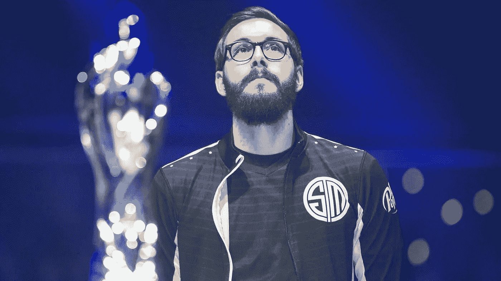

# TSM 是如何在 12 个赛季后辜负了 Bjergsen

> 原文：<https://medium.com/geekculture/how-tsm-failed-bjergsen-after-12-seasons-f50c63943704?source=collection_archive---------3----------------------->

Bjergsen 在 18 岁时被招募来取代 Reginald，成为 TSM 的明星中场。这是巨大的压力，因为它是团队 solo mid，而不是团队 solo bot 或团队 solo top，它是*团队 Solo Mid* 。

尽管 Bjergsen 和他无数次的 TSM 小队在国内表现出色，但 TSM 和 Bjergsen 在国际舞台上的表现一直很糟糕。