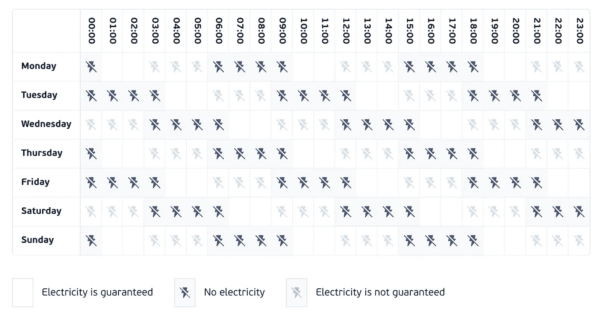

# 乌克兰人如何在停电的情况下继续工作

> 原文：<https://medium.com/geekculture/how-ukrainians-keep-working-with-electricity-outages-2b90ac941696?source=collection_archive---------4----------------------->

## 在没有电的情况下，我们如何在乌克兰全天候在线

Yeap, this is a typical electricity schedule for apartment buildings in Kyiv (the capital of Ukraine)

我是一名来自乌克兰的软件工程师，尽管俄罗斯对我们的电力基础设施进行了恐怖袭击，但我仍有义务为客户提供软件。正如你从日程表上看到的，我可能会断电 4-7 个小时。这就是我为了工作和 24/7 在线所做的。