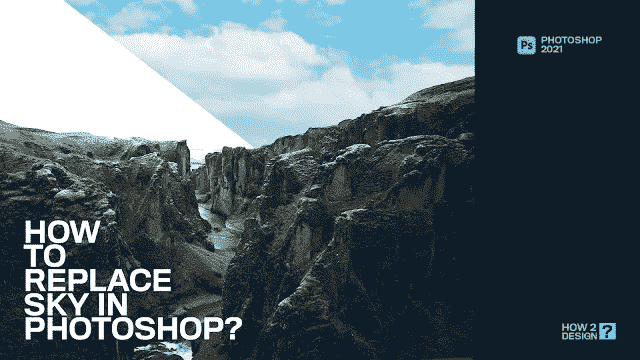
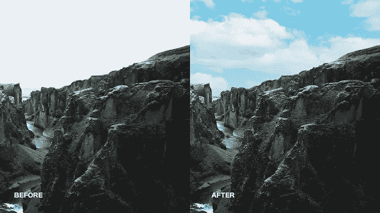

# 如何在 adobe photoshop 2021 中使用天空替换工具

> 原文：<https://medium.com/geekculture/how-use-sky-replacement-tool-in-adobe-photoshop-2021-d02a5f291f4e?source=collection_archive---------24----------------------->

Design from how to design youtube

通过使用 adobe photoshop 2021 中新的天空替换功能，这一新的天空替换功能将减少照片编辑工作流程中的步骤数。在过去，替换天空需要多个步骤和仔细的微调，才能实现无缝的外观。现在，通过让 Adobe Sensei 为您进行遮罩和混合，您可以节省时间并获得您想要的外观。按照下面 3 个简单的步骤开始。

看看下面的图片对比，如何通过三个简单的步骤快速替换天空，为你的风景图片增添戏剧性

Image Credit: Unsplash

如何操作步骤:

选择“编辑”>“天空替换”。

选择一片新的天空

*   将出现天空替换属性框
*   从包含的图像中选择一个新的天空，或者添加一个您自己的天空
*   调整设置以创建完美的图像

原始图像上的天空区域被自动选择和遮罩，允许根据您选择的选项显示新的天空。要获得无缝外观，请调整滑块来修改天空，并将前景与背景颜色混合。

详细检查我们下面的全过程教程:

video source: howtodesign YouTube

感谢阅读！

请关注，分享和订阅你的管道频道。