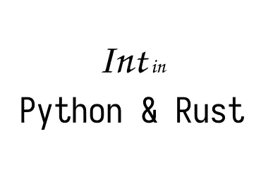

# 变量在 Python 和 Rust 中是如何保存的？并排 2: int / long

> 原文：<https://medium.com/geekculture/how-variables-are-saved-in-python-and-rust-side-by-side-2-int-long-8ff4d91569ed?source=collection_archive---------3----------------------->

## 展示变量如何在 Python 和 Rust 中工作的系列文章。让我们更好地理解这两种语言。这是第二篇关于 int/long 的文章。

Image by Author

# 背景