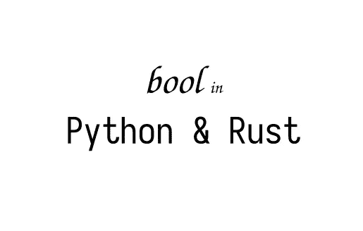

# 变量在 Python 和 Rust 中是如何保存的？并排 3:布尔

> 原文：<https://medium.com/geekculture/how-variables-are-saved-in-python-and-rust-side-by-side-3-bool-914718b1af0a?source=collection_archive---------7----------------------->

## 展示变量如何在 Python 和 Rust 中工作的系列文章。让我们更好地理解这两种语言。这是第三篇关于 bool 的文章。

Image by Author

# 背景