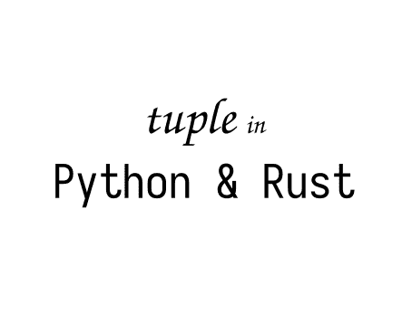

# 变量在 Python 和 Rust 中是如何保存的？并排 6:元组

> 原文：<https://medium.com/geekculture/how-variables-are-saved-in-python-and-rust-side-by-side-6-tuple-2da85549686d?source=collection_archive---------7----------------------->

## 展示变量如何在 Python 和 Rust 中工作的系列文章。让我们更好地理解这两种语言。这是关于 tuple 的第 6 篇文章。

Image by Author

# 背景