# 可视化如何帮助理解深度学习

> 原文：<https://medium.com/geekculture/how-visualizations-help-make-sense-of-deep-learning-a408ab00688f?source=collection_archive---------12----------------------->

深度学习提出了许多具有挑战性的问题。可视化通过其探索和解释能力，可以揭示其中的一些问题:

*   为什么—为什么模型有效(可解释性)
*   如何——模型的效果如何(针对不同的数据子集)
*   这个模型的性能如何

我们将看到一系列可视化工具、界面和技术，它们可以帮助探索、解释或诊断。

# 可解释性

除了像 SHAP 和莱姆这样的通用包，许多可解释性工具是领域特定的，因为跨领域的模型可能有非常不同的机制。

# 视力

**CNN 解说**

[CNN 解说](https://poloclub.github.io/cnn-explainer/)是一个标准的独立接口。它通过交互式图形解释了不同卷积层的一般工作原理。

Source: CNN Explainer

[**TF-解释**](https://tf-explain.readthedocs.io/en/latest/overview.html)

该软件包应用了各种图像模型解释方法，如梯度凸轮、遮挡敏感度、平滑梯度和综合梯度，并且可以在训练期间作为回调或在加载的模型上应用。

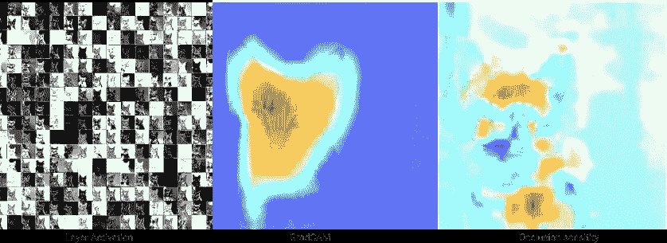

Source: [https://github.com/sicara/tf-explain](https://github.com/sicara/tf-explain)

[**清醒/透亮**](https://distill.pub/2017/feature-visualization/)

这些库使用 deepdream 样式优化提供 CNN 层的特征可视化。在[激活图谱](https://distill.pub/2019/activation-atlas/)中，作者详细阐述了激活可视化和特征属性。

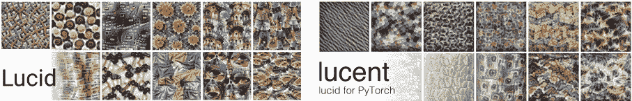

Source: [Lucid](https://github.com/tensorflow/lucid) (doesn’t support tf2 at the time of writing) / [Lucent](https://github.com/greentfrapp/lucent)

# 自然语言处理

**RNNvis**

RNNviz 是一个原型工具，通过对隐藏状态的二分图和单词空间进行共同聚类来理解 RNN 的隐藏状态。

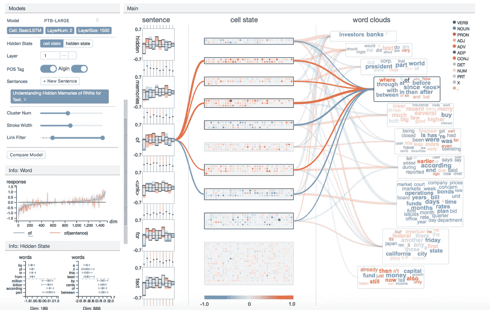

[https://github.com/myaooo/RNNVis](https://github.com/myaooo/RNNVis)

**伯特维兹**

一个 python 包，提供了跨层和头部的注意力鸟瞰图，以及特定注意力头部的查询和键值。作者杰西·维格对这一过程做了详细的报道。

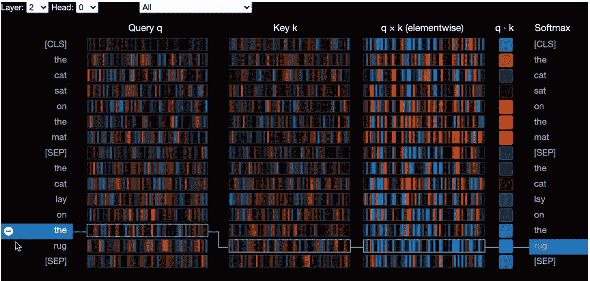

Source: [https://github.com/jessevig/bertviz](https://github.com/jessevig/bertviz)

[**Ecco**](https://www.eccox.io/)

Jay Alamar 的 python 包，其中包含对 transformer 模型的一些交互式解释，例如跨层排列输出令牌，或者下面的一个使用非负矩阵分解来可视化神经元组如何响应输入。

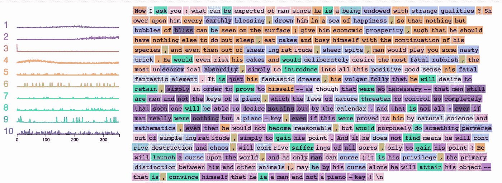

Source: [https://jalammar.github.io/explaining-transformers/](https://jalammar.github.io/explaining-transformers/)

[**Errudite**](https://idl.cs.washington.edu/papers/errudite/)

以问答系统为例，该工具通过查询语言和反事实检查展示了其在可扩展错误分析中的应用。

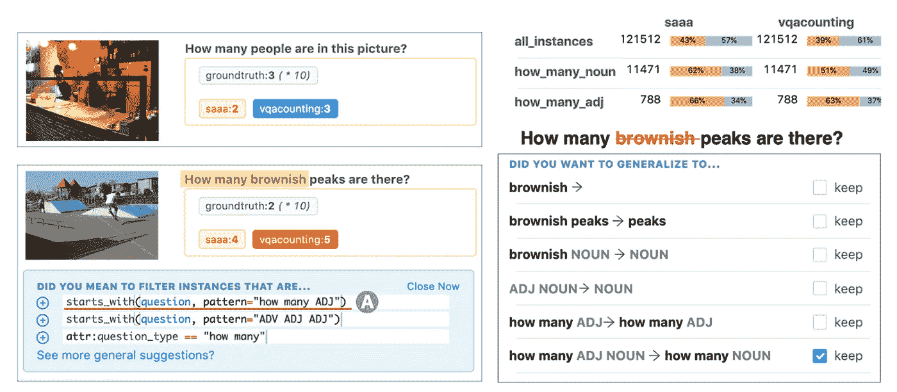

Source: Errudite by Tongshuang (Sherry) Wu et al.

[**点亮**](https://pair-code.github.io/lit/) **(语言可解释性工具)**
这种基于浏览器的界面可用于探索多个 NLP 模型的行为，了解 NLP 模型对哪种示例表现不佳，以及预测是归因于敌对行为还是归因于训练数据先验。它具有不同模型/示例的比较模式。它是框架不可知的，支持 Tensorflow/PyTorch 等。

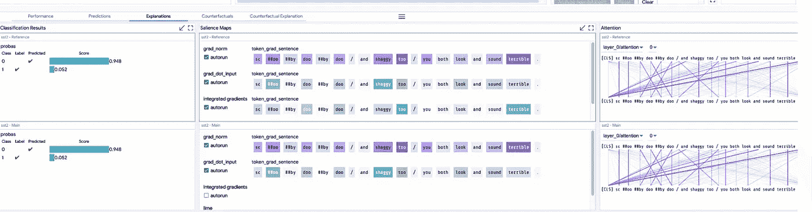

Source: [https://pair-code.github.io/lit/](https://pair-code.github.io/lit/)

# 这种模式会有多好？

这主要包括评估不同数据切片的模型、单个数据点、评估公平性和对抗性鲁棒性。

**假设分析工具**

当需要对数据进行分割时，可以使用假设分析来分析各种特征和推理分数。它集成了各种笔记本和 TensorBoard。为了公平起见，有一些功能需要优化。它为单个数据点提供了反事实，但这似乎不适用于数据组。

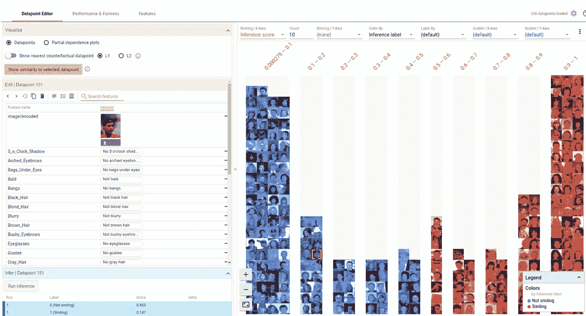

来源:https://pair-code.github.io/what-if-tool/

# 性能监控

**张量板**

除了测量性能指标，有插件，如嵌入投影仪，也有一个调试器模式，这有助于确定数字问题。

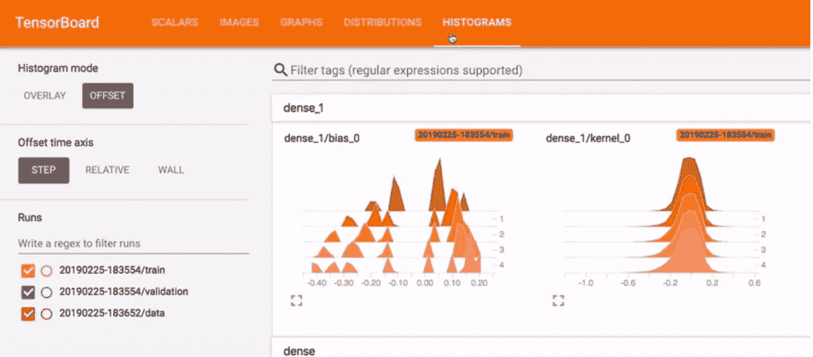

来源:https://www.tensorflow.org/tensorboard

**嵌入式投影仪**

**路德维希的即**

Ludwig 是一个 autoDL 工具，旨在通过消除样板文件使深度学习变得更加容易。除了大量受支持的模型，它还有一些独特的可视化选项。这些选项包括多种比较分类模型的方法，例如当两个模型都预测正确、两个模型都预测错误、一个模型预测正确时，以及其他显示每个类别预测的多类别概率或置信度阈值表面的图表类型。

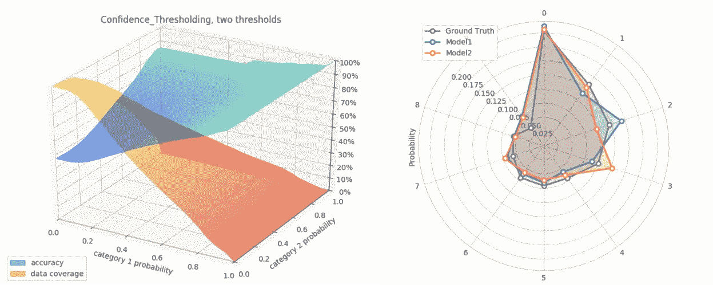

来源:[https://ludwig-ai.github.io/ludwig-docs/user_guide/](https://ludwig-ai.github.io/ludwig-docs/user_guide/)

**HiPlot**

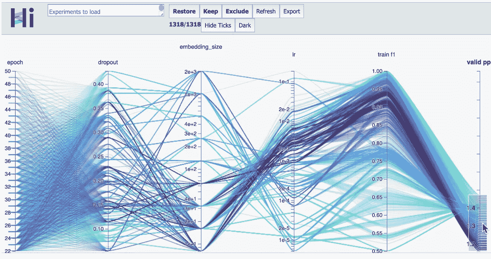

来源:https://github.com/facebookresearch/hiplot

# 可视化训练数据

由于模型的性能和稳健性很大程度上取决于高质量的数据，因此清楚地了解训练数据也很重要。这里有一个工具可以更好地理解数据集的特征。

**刻面**

这个工具的一部分是 Facets dive，这是一个交互式界面，用于通过属性可视化地探索数据。

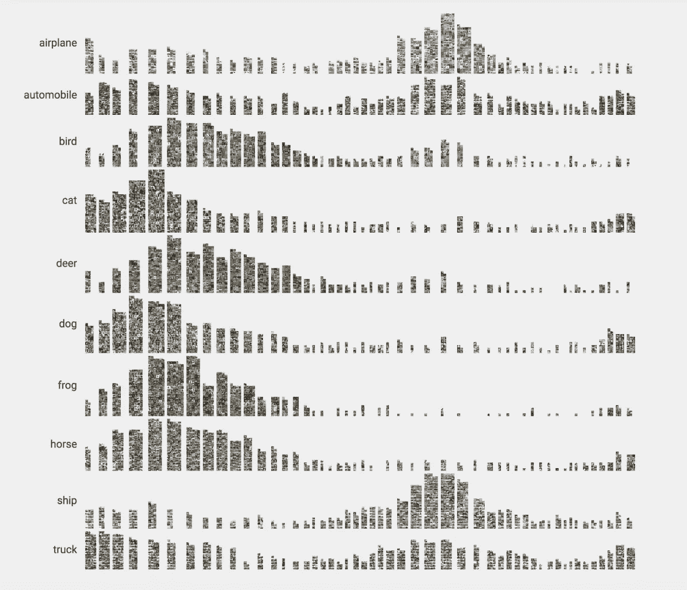

【https://pair-code.github.io/facets/ 

另一部分是 Facet overview，它可以通过 tf-data-validation package (tfdv)来可视化训练集的分布统计信息，并检测训练数据和服务数据之间的偏差。

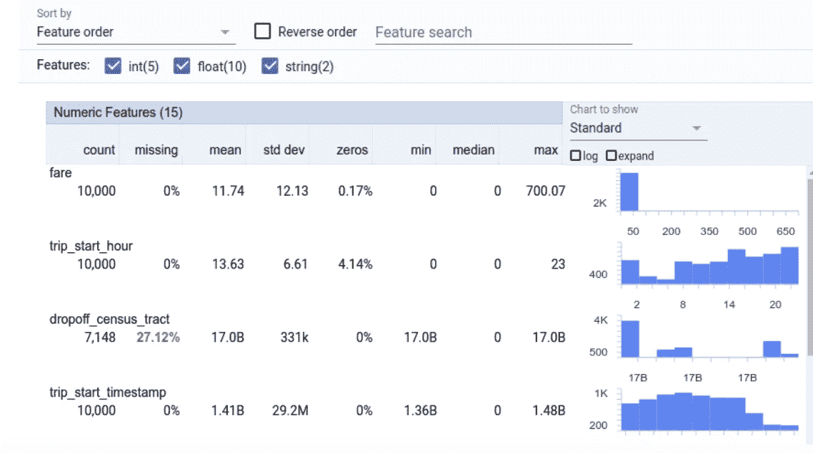

Source: [https://www.tensorflow.org/tfx/data_validation](https://www.tensorflow.org/tfx/data_validation)

我们看到了为揭示模型行为和数据特征而制作的各种工具，通过呈现域外数据来解决棘手问题，并促进可操作的错误分析。

虽然这些工具涵盖了常见的用例，但是其他特定的领域和模型可能需要更加定制化的可视化工具。可以想象，考虑到 ML 的细微差别，创建这些工具将面临独特的挑战。

当谈到伟大的可视化的一般品质时，Alberto Cairo 在《真实的艺术》一书中列出了 5 个。当我品味这些品质时，我意识到它们可以在 ML 的环境中重新诠释:

*   真实的:以有代表性和一致的方式显示结果，不会误导用户得出错误的结论
*   **功能**:直观灵活的界面，可浏览或查询潜在的非结构化数据，如图像或文本
*   **漂亮的**:易于理解的编码、清晰的颜色、最小化的混乱/遮挡，而不是庞大的数据量
*   **真知灼见**:关于如何优化模型的可行见解或对其性能的更深入理解
*   **启发性的**:潜在地揭示未知的未知

提到的工具列表并不是 DL 和 Viz 之间相互作用的完整列表。但希望能提供一些主要关注领域的一瞥😎

除了这些专注于模型的工具之外，还有许多可视化工具来说明特定的概念。更多的例子可以在:
[*蒸馏*](https://distill.pub/)[*对*](https://research.google/teams/brain/pair/)[*华盛顿互动数据实验室*](https://idl.cs.washington.edu/)[*快进实验室*](https://experiments.fastforwardlabs.com/)[*IEEE VISxAI*](https://visxai.io/)