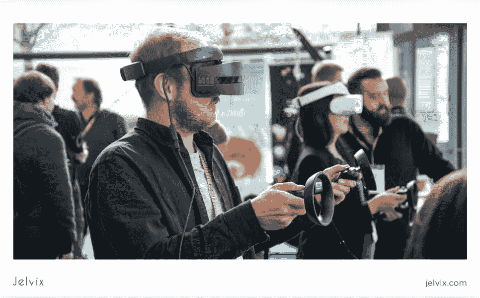

# VR 眼球追踪是如何工作的

> 原文：<https://medium.com/geekculture/how-vr-eye-tracking-works-d2d226e8d7b?source=collection_archive---------14----------------------->

## 了解更多关于虚拟现实眼球追踪及其对用户和科学的好处

## 所有对虚拟和增强现实感兴趣的人！了解 VR 眼球追踪及其对用户和科学的好处。

VR 眼球追踪是一种感官技术，可以收集人们如何与视觉刺激互动的重要数据。它决定了在场、注意力和注意力的水平，以及一些生物特征数据。这是通过连续测量瞳孔中心和角膜反射之间的距离来实现的，该距离随视角而变化。这种反射产生了人眼看不见的红外光。摄像机记录和跟踪运动。

观看我们的视频了解更多信息。