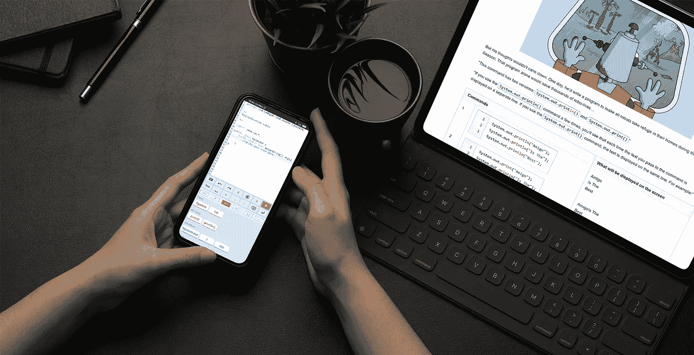
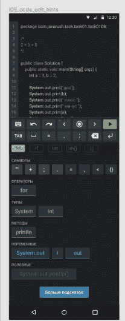
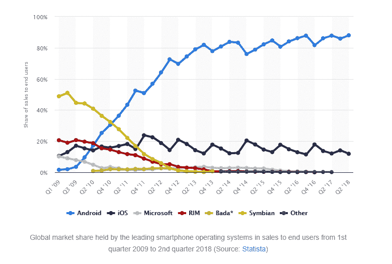

# 我们如何创建一个移动工具来编写代码，我们得到了什么

> 原文：<https://medium.com/geekculture/how-we-created-a-mobile-tool-to-write-code-and-what-weve-got-d77fa4757d1d?source=collection_archive---------7----------------------->

有没有可能在手机上写程序而不经历痛苦、仇恨、无力感？当我们创建 CodeGym(一个面向实践的学习 Java 编程的在线课程)时，我们对此表示怀疑。然而，时代在变，技术也在变。在这篇文章中，我们将谈论我们如何创建 CodeGym 的移动版本，以及它带来了什么。

# 缺乏流动性是一个问题

我们不断收到用户的反馈。他们对课程很满意，但是在 CodeGym 存在的 4-5 年间，用户开始申请移动应用程序。这样的请求并不多，但足以启动研究。据报道，很多 CodeGym 的学生在上班或学习的路上阅读讲座。晚上，他们从电脑上登录系统，通常是为了完成编码任务。这是我们的第一个提示，但是我们怀疑用手机编码是否方便。所以我们把这个想法推迟了几年。

然而，小额学习已经越来越成为我们生活的一部分。因此，MarketsandMarket 机构[假设](https://www.marketsandmarkets.com/Market-Reports/microlearning-market-127184631.html)到 2024 年，全球小额贷款市场将增长 13.2%，总额将达到 27 亿美元。

> 微学习(Microlearning)是一种呈现课程信息的格式，其中课程计划按照“1 模块— 1 思想— 1 技能”的公式划分成模块。每节课都是有用信息的浓缩，平均计算学生 10-15 分钟的时间。

顺便说一下，当 CodeGym 讲座最初创建时，它们非常适合微学习格式，并且被认为是简短的。现在，老实说，微型讲座被认为是一种更集中的形式。

为了赶上潮流，我们还发布了几个简短的视频，涵盖了一些 Java 主题，但这还不够。对移动应用程序的请求持续不断，过了一段时间，我们开始慢慢探索这个市场。

# 移动编程课程市场上有什么？

我们知道在网上阅读手机上的讲座很容易，所以不值得为讲座开发应用程序。所以主要问题是:有没有可能为学习编程创建一个真正方便的移动开发环境？不浪费时间，利用你在路上的 5-10 分钟的空闲时间，以一种方便的方式编写代码，这样学生就不会因为失望而想把手机砸向墙壁。

> IDE 或集成开发环境是一个应用程序，它包括程序员工作所需的一组工具。它用于编写代码、编译或解释代码、运行代码、调试代码以及自动化构建。在教育移动 IDE 的例子中，我们感兴趣的是编写和编译代码、启动程序以及发布验证器注释

首先，我们探索了其他编程课程的解决方案。基本上那时候都是选择题。因为我们是一门关于实践的课程，我们认为这样的测试是完全可选的。不过，我们发现了一些像样的移动 IDE，如 Grasshopper 和其他几个。

这个应用程序中的提示有一些令人兴奋的想法:你不用一个字母一个字母地写代码，而是有一些含有代码片段的拼图，并且它们必须以正确的顺序组装。这个想法真的很有趣，因为它允许你用一个手指来编码，但是我们很尴尬，因为只有适合特定任务的片段。这种方法对学好编程没有帮助:这是一个难题，但不是真正的程序创作。要知道，编程还是一个创造的过程，展示的不仅仅是知识，还有创造力和独创性。

# 移动 IDE:应该是什么？

因此，如果我们想出一个移动 IDE，并且从 UX 的角度来看它将是方便的，那么开发整个 CodeGym 应用程序是有意义的。适应课程的其余部分会容易得多，比如讲课和任务，我们已经知道如何做到这一点。

我们认为仍然需要从虚拟键盘上一个字母一个字母地输入代码。它只是不应该是主要模式，但补充拼图模式。然而，我们上面描述的纯谜题并不适合我们的课程，我们想出了如何改进这种方法。首先，部分代码被分成组(标点符号、操作符、方法等等)。其次，并不是所有的“难题”都适合这个解决方案。当然，如果按照这个原则加载所有可能的代码元素，搜索想要的元素会很不方便。因此，学生在手机屏幕上看到的场景因任务而异。重要的是，并不是所有的选项都是正确的，解决一个特定任务所需的代码要多得多，所以学生需要稍微从头开始。

嗯，如果一个学生在课堂上阅读之前突然学会了一些解决编码任务的新方法，而显示的代码元素并没有涵盖它，他们总是可以切换到通常的逐字母输入模式。因此，从一种模式切换到另一种模式给了用户灵活性和便利性。因此，从理论上讲，学生可以在旅途中或排队看牙医的 10 分钟内，思考问题并使用一根手指解决问题。

# 原型开发和测试

这种方法似乎很有前途，我们开发了一个可点击的测试原型。这个原型没有任何设计，只有一些可点击的卡片，上面解释了什么将位于哪里。我们选择了一组来自不同水平的 CodeGym 学生，并为他们准备了一份调查问卷。比如“你需要在应用中打开一个任务，你会怎么做？”。在收集了他们的答案后，我们修改了原型，并开始基于它创建 UI，并且测试了一个半月。

我将回过头来说，我们期望这个应用程序只是课程生态系统的一部分，它将被已经熟悉 web CodeGym 的人使用。因此，我们创建了第一个 UI，牢记这一点。

# 技术选择:Android

当开发开始时，我们仍然认为移动应用程序纯粹是一个附加组件，所以我们无法分配许多人来开发它。此外，我们并不着急，仍然在努力改进我们的移动 IDE 的想法。所以我们决定只开发一个 Android 应用程序，如果成功的话，以后再开发 iOS。

为什么是安卓？很简单。首先，我们已经有一个现成的 Java 开发人员团队，他们也非常了解 Kotlin 和 Android。其次，根据 [Statista](https://www.statista.com/) 等多家分析公司的数据，截至 2018 年，我们开始开发 app 的时候，安卓手机的市场份额超过了 80%。第三，该应用的测试场是东欧俄语版本，该版本的 Android 用户比例甚至更高。所以我们雇佣了另一个 Android 开发者，请来了一个 UX/UE 的设计师，然后开始工作。

# 第一个版本的开发和测试

从渲染布局到在 Google Play 上推出测试版，开发一款应用花了不到一年的时间。第一个移动 CodeGym 既不包含讲座，也不包含网站的其他部分。这是唯一可以访问编码任务和移动 IDE 的途径。对于封闭测试，我们选择了大约 2000 名 CodeGym 学生，在我们的网站上创建了一个特殊的小组，并发布了一个关于 UX、UI、便利性等问题的列表。他们积极地使用应用程序，回答问题，互相交流，与开发人员交流。两周后，我们收集了所有的问卷，将它们汇总成一个表格，并与最积极的参与者进行了面对面的交谈。我们还使用 Firebase Crashlytics 收集了各种设备的碰撞数据，Firebase crash lytics 是谷歌的一个轻量级碰撞报告器。

此外，我们跟踪了打开一个任务、解决它并发送解决方案以供审查的人的百分比。根据我们的内部指标，这个数字比我们预期的要高，这个过程发生得足够快，这无疑是一个很好的指标。我们担心使用移动应用程序会太单调乏味，会大大降低未来程序员实现目标的速度。幸运的是，我们错了。

在收集了所有这些数据、关于 UI、UX、bug 的评论后，我们对其进行了分类和优先级排序，并开始着手改进和修复 bug。之后，我们推出了 CodeGym Mobile 正式版。

# 移动应用的其他方面

移动 IDE 之后第二重要的任务是帮助部分的改编。我们需要让用户可以方便地通过手机点击提问。也就是说，就像 CodeGym 网站一样，如果用户不能解决某个任务，他们可以点击帮助按钮。该操作导致创建一个主题，并附加了代码和任务条件。所以用户应该只写一个标题问题，然后按发送按钮。

解决这个任务后，我们逐渐将整个课程转移到移动格式。

# 我们的错误

事实上，在战略层面上没有那么多严重的错误，因为我们行动谨慎，不着急。我们没有任务来快速发布应用程序，占据一些利基市场，或者类似的事情。

然而，一开始，我们显然太聪明了。为了了解界面是否有效，我们做了一些 UX 测试，但是因为我们的样本非常小，我们决定对所有可能的用户场景使用分析工具，实际上是对每一次点击按钮，每一次滚动。我们把所有东西都输入数据库并存储在那里。错就错在我们把所有这些数据搞得很复杂，收集了一堆统计数据，不太懂怎么用。我们事先没有考虑如何总结收到的信息。

当然，有很多技术上的错误。他们不在的话就怪了:)。

好吧，一个令人愉快的错误是，我们多少低估了移动应用的能力:事实证明，不仅那些已经知道我们网站的人，而且通过 Google Play 找到它的新用户也在尝试使用它。

# 最近的改进

我们认为一个没有网站的应用本身没有价值，它是一个生态系统的附加物。然而，事实证明，有些用户喜欢我们的方法，他们只在应用程序中学习。由于界面是为了解 CodeGym 的人定制的，我们开始研究新人可能无法理解的内容。

有相当多的人想通了一切，免费使用 CodeGym(在很长一段时间内，免费学习是可能的)。事实证明，一些用户甚至不知道有这样一个网站。

然而，我们稍微改变了界面，开发了一个 onboarding tour:用户进入应用程序，出现一个弹出窗口，解释位置和课程应该如何进行，并测试了它的不同版本。总之，我们在一开始就试图改进产品本身，让一个人更容易使用。

最近和最雄心勃勃的变化之一是推出了一个用户响应课程。这个特性出现在“大”CodeGym 上的时间稍早一些。当用户第一次进入应用程序时，他们会被问及他们想学习什么语言，学习的目标是什么(成为 android 开发人员、Java 开发人员等)。).现在建议用户做一个小的理论测试，如果之前没学过 Java 可以跳过。在这个过程之后，用户点击“获取课程”按钮，并且生成有条件的个人版本的课程。

此外，我们最近推出了“仅应用程序”订阅，其费用低于网站订阅(网站订阅，当然，包括访问移动应用程序)。事实证明，许多学生已经准备好只在手机上学习。

# 结果和未来计划

移动学习和微学习的趋势密不可分。移动学习是 EdTech 中增长最快的趋势(每年增长 23%)，所以当我们听取用户的意见并开始开发 CodeGym 应用程序时，我们做出了正确的选择。

我们设法开发了一个真正方便的移动应用程序，用于边做边学 Java。考虑到编程是代码的海洋，我们认为这只是一个很棒的结果。移动 CodeGym 确实加速了学生，提高了产品满意度。很重要的一点是，移动应用导致学习中的长时间(至少两周)休息变少了。正如我们所研究的，长时间休息是在线学习的最大敌人之一，也是大多数潜在程序员失败的根本原因。

我们不断地支持 Android 应用程序，倾听用户意见，修复错误，思考改进。我们目前正在开发一个 iOS 版的 CodeGym，现在正处于原型阶段。也许在未来，我们会开发一个短视频格式，并考虑在 IDE 中组织有效的语音输入。