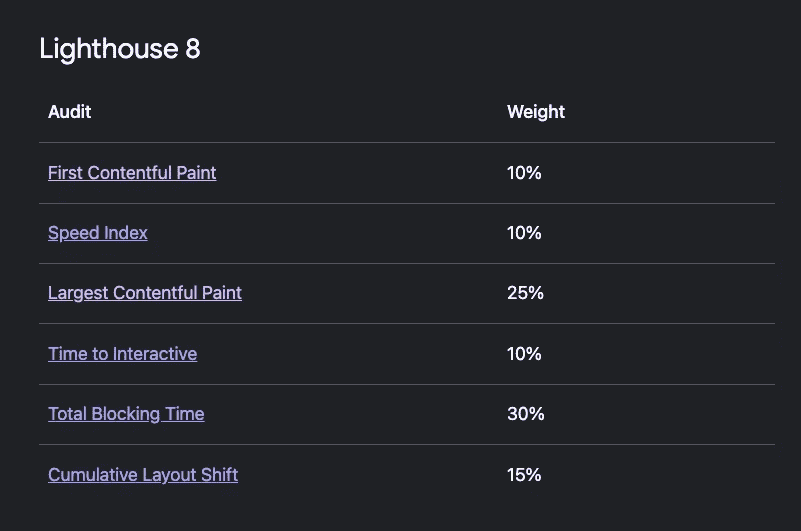
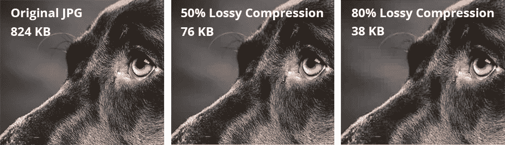

# 我们如何将移动灯塔的分数从 60 分提高到 95 分

> 原文：<https://medium.com/geekculture/how-we-improved-our-mobile-lighthouse-score-from-60-to-95-c72a412477c6?source=collection_archive---------6----------------------->

使用这些经过测试的方法提升你的网站性能。


Photo by [Marek Szturc](https://unsplash.com/@marxgall?utm_source=medium&utm_medium=referral) on [Unsplash](https://unsplash.com?utm_source=medium&utm_medium=referral)

在我的上一家公司，我们将旧的紧密耦合的 CMS 重构为[](https://jamstack.org/what-is-jamstack/)**【jam stack】，一个解耦的服务列表，以改善内容管理体验。这一旅程使我们的网站在其域名/类别**下的**前 5** 的谷歌搜索结果中排名。****

**在这次旅程中，我们定期研究和挑选最佳工具和方法，通过使用 [**Lighthouse 评分**](https://web.dev/performance-scoring/?utm_source=lighthouse&utm_medium=devtools) 来衡量我们的成功来改善我们的网页体验**

> **注意:Lighthouse 是 chrome 浏览器的一个工具，它对你的网站进行多项测试，并报告不同类别的分数。**

**灯塔得分分裂，在我们潜入实现更多的分数。让我们来了解一下 lighthouse 分数是如何计算的，以及分数是如何在不同的指标中进行加权的**

****

**Lighthouse score weight distribution**

**这就是 lighthouse 分数权重如何分配到这些指标中的。[详细了解这些指标会有好处](https://web.dev/performance-scoring/?utm_source=lighthouse&utm_medium=devtools#weightings)**

**因此，这里列出了我们所做的一些举措，这些举措在 Lighthouse 评分中产生了积极的结果。我还将提到哪些指标会受到实现的影响**

# **SSR 或 SSG**

**这将是最有回报的一步，它会让你的灯塔得分大幅提升。同样，如果你已经使用 React、Vue 或 Angular 等库编写了你的网站，这也不是一个可选的步骤。**

**单页应用程序在页面初始化后构建一次页面内容，这在页面加载到浏览器后需要相当长的时间。因此，它将呈现没有内容的初始空白屏幕，然后绘制整个屏幕。谷歌搜索引擎优化将惩罚你的网站没有内容。**

**大多数现代图书馆都支持服务器端渲染。只需几天时间，就能以最低成本或零成本安装并运行您的服务器。**

**SSG 类似于 SSR，但是它在构建期间预先呈现所有页面并路由到静态文件，并且在客户端请求时提供服务。与 SSR 相比，它要快得多，因为在客户端请求期间没有 API 调用。要了解更多详细的比较，请阅读 [SSR vs SSG](/nerd-for-tech/compare-and-contrast-csr-ssr-and-ssg-in-nextjs-58e3caf2e15e)**

****度量:第一次内容丰富的绘制，速度指数**当你的 DOM 不需要等待库来绘制内容就可以被渲染。**

# ****图像压缩，可访问性****

****

**网页上的高质量图像会对客户端产生严重影响。如果图像不是为移动优化，用户将离开网站，因为它需要更多的时间来加载图像。你可以使用一些**骨架**或**加载**动画来通知用户，这将是一个临时的修复，但仍然会导致一个糟糕的灯塔评分。**

**有多种服务可以提供不同质量和大小的图像的多个版本。(**内容丰富的图像优化**)**

1.  **[**Webp**](https://developers.google.com/speed/webp)**:**将您的图像转换为 [webp](https://developers.google.com/speed/webp) ，它在有损和无损压缩方面都很出色，比 PNG 更小**

**2. [**响应式图像**](https://developer.mozilla.org/en-US/docs/Learn/HTML/Multimedia_and_embedding/Responsive_images) :使用带有最近添加的 **srcset** 和**size**属性的图像标签来支持响应式图像。如果你有相同的手机分辨率的图像，添加它，浏览器会自动选择最佳版本。**

```

```

**3. [**图像模糊**](https://blurha.sh/) **:** 使用模糊图像作为替换，直到加载原始图像，这是最初在脸书使用的技术。(原文链接[https://engineering . FB . com/2015/08/06/Android/the-technology-behind-preview-photos/](https://engineering.fb.com/2015/08/06/android/the-technology-behind-preview-photos/))。在构建期间生成低质量的图像，并确保您的应用程序在初始加载期间使用它们。**

```
<image src="blurred.jpg"> 
<image src="original.jpg" style="display: none">// JS 
imageTagRef.onload(() => {
   imageTagRef.style = "display: inline";
   // Code to hide the blurred image.
})
```

**4: **尺寸很重要:**定义图像的尺寸会影响布局的大小。因此，尽量提前定义截面的宽度和高度，这样图像就可以填满空间。**

**4.**替代文本:**图像的替代文本提高了您的网站的可访问性得分。除了分数之外，你的内容可以通过一小步达到更广泛的受众，因为内容应该是所有人都可以访问的，这是一项基本权利。**

**如果你想知道更多关于可访问性和在你的网站中实现的步骤，请随意 [**订阅**](/subscribe/@amerrnath) 或**在这篇文章下面发表评论。****

****度量:累积布局移动**、**最大内容丰富的油漆**将推动分数更高，这些度量在分数分布中具有更大的权重。**

# ****脚本加载****

**就代码而言，脚本加载顺序将是最简单的实现。**

```
<script defer src="react.js"></script>
<script defer src="my-library.js"></script>
```

****延迟 vs 异步****

> ****defer** 异步加载脚本，但仅在文档解析完成后执行**
> 
> ****async** 异步加载您的脚本并立即执行。**

**script 标签上的两个属性具有相似的功能，除了第一个属性在 lighthouse 分数中起主要作用。**

**简短说明使用**延期**会提高第一次满意的油漆。这里已经提到了多种技术。**

**我们在推迟我们的脚本时做的一件常见的事情就是推迟第三方脚本，比如 **Google Tag。**因为除了你的框架之外，所有技术都普遍使用 Google analytics 和多个第三方库来跟踪和衡量网站性能和用户发现。这些脚本有时作用于 DOM，并干扰进一步的布局更改。**

****指标:第一次内容丰富的绘画，累积布局移位。****

# ****预载样式****

**样式表决定了每个部分的布局尺寸。如果您的样式甚至在 DOM 解析之前就被加载了，那么样式将在 DOM 解析阶段被应用([详细文章](https://web.dev/uses-rel-preload/))。**

```
<link rel="preload" href="my-styles.css">
```

****指标:累计布局偏移。****

# ****web 组件****

**我之所以把这个倡议作为最后一个倡议，是因为这是一个固执己见的倡议，可能你真的不需要这个，而且对你的技术堆栈来说可能是多余的。但是如果你有适当的资源和长期战略，那么这将是一个正确的赌注。**

> **Web 组件是一组 web 平台 API，允许您创建新的自定义的、可重用的、封装的 HTML 标记，以便在网页和 web 应用程序中使用。**

**在我之前的文章中，我已经解释了 Webcomponents 是如何工作的。我不会在这里解释利弊，我们已经看到了一个机会，经过多次尝试和迭代，我们已经看到使用 webcompoents for CMS 呈现的页面比 React 或任何 js 框架都有明显更高的分数。**

**下一个蹦出来的问题是关于开发者的生产力和学习曲线在 webcomponents 中，你不必依赖原生 API，有类似 **Stenciljs，Svelte** 这样的框架来解决这个问题，并且围绕它有很好的开发者生态系统。**

# **结论**

**我强烈建议从最简单的计划开始，测量你的灯塔得分。说服你的同事或经理推销其他计划是一种精益策略。**

**有几个方法我在这里没有提到，它们没有产生任何改进，有些导致了负的分数，如果你想知道更多关于它的信息，请留下评论，我将在我的下一篇文章中写一个详细的封面。**