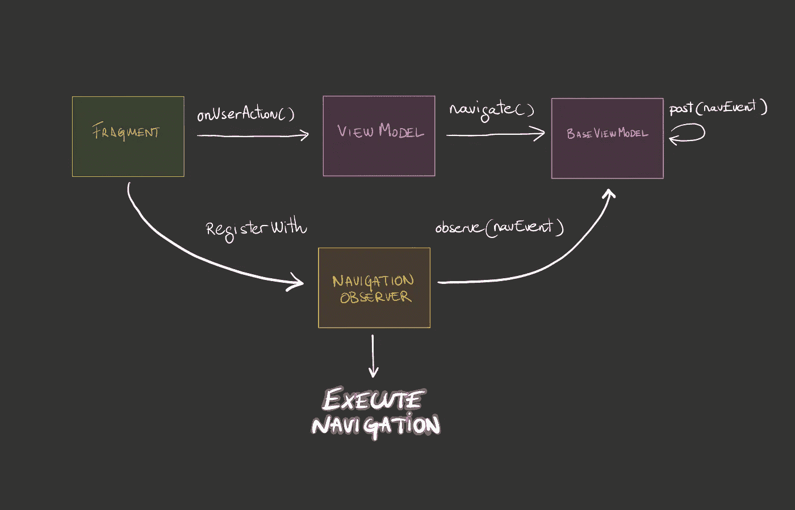

# 我们如何导航

> 原文：<https://medium.com/geekculture/how-we-navigate-b7a6196f49ec?source=collection_archive---------15----------------------->


在这篇文章中，我想分享我们在 Travleperk 的移动应用程序上导航的方法。

我们都知道在不同的屏幕之间导航很容易变得混乱。我们在导航方面的目标是尽可能避免重复发明轮子，并且能够以可靠和健壮的方式对其进行单元测试。

我们使用 [Jetpack 导航](https://developer.android.com/guide/navigation)，这是该项目的设置:

*   多模块:核心模块+功能模块。
*   Travelperk 的安卓应用遵循了[安卓架构组件](https://developer.android.com/jetpack/guide)推荐的 MVVM 架构。导航是由视图模型驱动的，所以它可以是类的单元测试的一部分
*   每个功能都遵循[单活动方法](https://youtu.be/2k8x8V77CrU)。例如，只有一个*预订*的活动，一个*聊天*的活动，一个*仪表盘*的活动，等等。
*   每个活动中都有片段。这些片段的 ViewModel 决定应该显示什么样的内容: [*加载、数据或错误*](https://youtu.be/De-DTnoroFA) 。
*   每个片段都是一个导航目的地:

```
<fragment
    android:id="@+id/trip_list"
    android:name=".TripsFragment"
>
<fragment
    android:id="@+id/itinerary"
    android:name=".ItineraryFragment"
>
```

# 我们有三个(典型的)问题

在本文稍后描述的方法之前，导航是通过发射定制事件从视图模型中触发的，这些事件由相应的片段观察到。

例如，我们发布类似于`NavigateToTripList()`或`BackToDashboard()`的事件。监听这些事件的片段通常会有一个`when`子句，根据导航事件类型执行不同的导航命令。每次导航如何执行都由每个片段决定。

这种方法主要有三个问题**:**

❌ 1.这些事件语义贫乏。从事件本身并不清楚`NavigateToTripList`是指向前还是向后导航。这使得你很难理解你从未做过的部分代码。

❌ 2.ViewModel 中没有定义导航目的地，因此没有进行单元测试。

ViewModel 可能会发出`NavigateToTripList`事件，您可以对发出的事件进行单元测试。但仅此而已。导航是分段执行的，因此不可能对事件和期望的导航目的地之间的连接进行单元测试

❌ 3.由每个片段决定如何执行接收到的导航指令。一些开发人员可能会决定使用`fragmentManager.popBackStack()`返回，而其他人可能会选择使用`activity.finish()`来完成容器活动

这造成了难以发现或调试的行为不一致。

# 现在

这是一个高级图表，展示了现在应用程序中导航是如何设置的。我们来详细看看主要概念。



## 常见导航事件

感谢 Gergely Orosz[的《大规模构建移动应用](https://medium.com/u/eedd1e8fdccb?source=post_page-----b7a6196f49ec--------------------------------)这本书[，我们找到了来自 David Vávra](https://www.mobileatscale.com/) 的这篇文章[并从中获得了主要概念:拥有一套通用的导航指令。我们称他们为`NavEvent`](/google-developer-experts/using-navigation-architecture-component-in-a-large-banking-app-ac84936a42c2)

我不会详细阐述`NavEvent`解决方案，因为链接文章已经深入讨论过了。如果你想了解背后的推理，我推荐你看一看。

TL；DR 是这样的:ViewModels 通过将一个**普通**类型`NavEvent`的[单个实况事件](https://github.com/android/architecture-samples/blob/dev-todo-mvvm-live/todoapp/app/src/main/java/com/example/android/architecture/blueprints/todoapp/SingleLiveEvent.java)发布到一个`LiveData`对象中来触发导航，有人监听并执行相应的底层导航指令。

所有这些都被方便地抽象到一个`BaseViewModel`中，并通过一个单独的函数`navigate(navEvent: NavEvent)`公开:

## ✅ 2/3 的问题得到解决

在我们遇到的三个主要问题中，这解决了第一个和第二个问题:

1.导航词汇表现在在应用程序的所有部分都是通用的:所有视图模型都用相同的术语描述导航，并且是从基类触发的(这在后面会很重要)

2.方向是强类型的，可以进行单元测试。如果一个单元测试通过，你知道当导航被执行时，正确的目的地将被选择。

为了解决问题三(每个片段不一致的导航实现),我们引入了一个`NavigationObserver`

## 导航观察者

在 Android 上，导航执行是必须发生在 UI 上的事情(片段或活动)。这是无可避免的。

我们的**第一个方法**是有一个`BaseFragment`来监听来自`BaseViewModel`的事件，并以一种通用的方式为每个片段执行必要的导航。

这很棒，解决了第三个问题，但也产生了另一个问题:它引入了**继承**，限制了我们对`Fragment`和`DialogFragment`使用这个解决方案的能力，因为它们需要从不同的父代继承。

## **✅解决问题 3:** `**FragmentLifeCycleCallbacks**`

解决方案是利用`[**FragmentLifecycleCallbacks**](https://developer.android.com/reference/androidx/fragment/app/FragmentManager.FragmentLifecycleCallbacks)`引入一个对象，该对象将附加到任何片段的生命周期，监听导航事件并以一种通用的方式执行导航指令:

这个观察者可以附加到任何片段或活动，而不需要任何继承性的改变。

*   它被注入了一个`BaseViewModel`的实例，这是我们所有视图模型扩展的基类。
*   它可以从视图模型中观察到`NavEvents`，而不知道它的具体实现，因为所有视图模型现在都处理相同类型的导航事件。
*   它提供了一致的导航执行。

现在，典型的屏幕设置看起来就像这样简单:

> 碎片

> 视图模型

> 单元测试

**结论**:要担心的事情更少，代码更少，引入错误的机会更少🎉

# 额外收获:自定义导航功能

这种解决方案在 95%的情况下都很有效，但是有时你需要偏离这条路。

例如，假设您的应用程序中有一个 WebView 和一个本地按钮，可以撤销用户在 WebView 中正在做的任何操作。

如果我们为这个动作发出事件`NavEvent.Back`，我们的`NavigationObserver`将执行`findNavController(fragment).popBackStack()`完全关闭 WebView。这不是我们想要的。我们需要的是在 WebView 中导航回来。

对于这个非常特殊的例子，我们需要将`NavEvent.Back`映射到其他东西。我们的解决方案是，如果需要，通过注入自定义导航功能，使`NavigationObserver`对扩展开放:

由于这一点，我们可以完全忽略大多数情况下`navigateBack`是如何工作的，但是如果我们需要，我们可以提供一个定制的实现:

```
private val navObserver by lazy **{** NavigationObserver(viewModel, navigateBack = **{** binding.webView.goBack() **}**) **}**
```

这是我们简化应用导航的尝试，因此我们可以专注于对用户真正重要的东西。
我很想听听你对此的想法和评论。在你的项目中你是如何做到的？