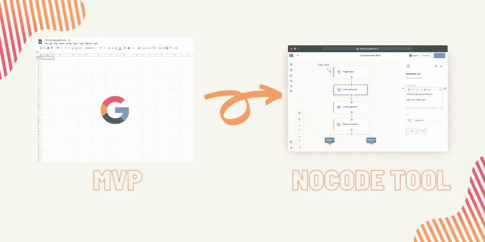
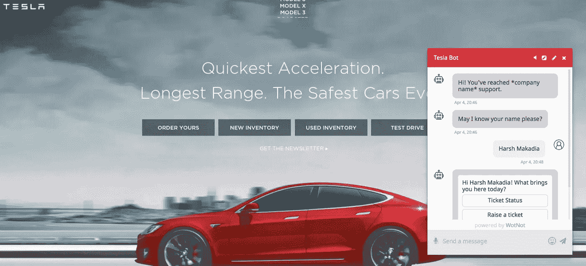
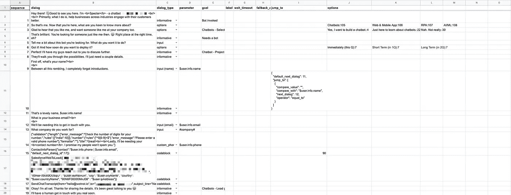
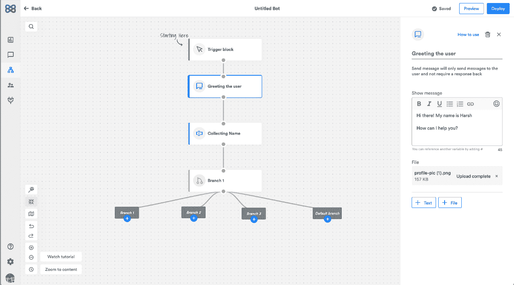
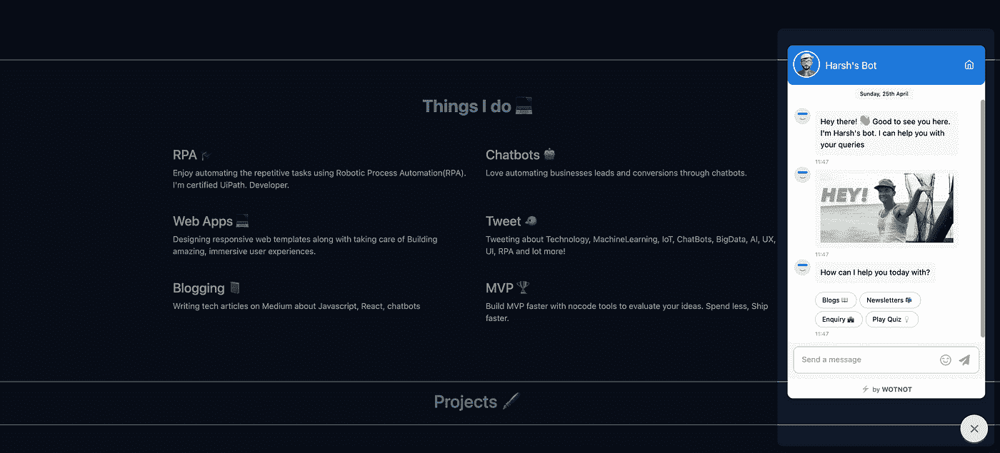
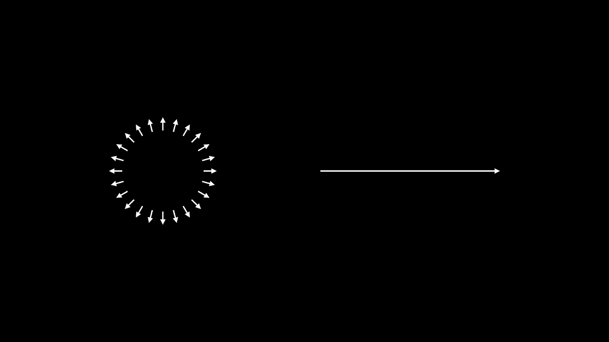

# 我们如何将我们的想法从一个 MVP 转变成一个有吸引力的无代码工具来构建聊天机器人

> 原文：<https://medium.com/geekculture/how-we-transformed-our-idea-from-an-mvp-to-an-attractive-no-code-tool-to-build-chatbots-b7d4551c6747?source=collection_archive---------9----------------------->

构建聊天机器人是一件很难完成的事情。几年前，我们开始了一个新的想法，为营销人员和开发人员提供最简单的方法来为消息服务创建有吸引力的机器人。虽然这个想法很棒，但我们的产品——wot not 并没有达到应有的水平。我们不得不几乎从零开始，从头开始建造一切。那么我们是怎么做到的呢？

MVP to Nocode tool

# 从问题到想法

我们的一个长期客户向我们提出了一个几乎所有企业都在努力解决的问题。由于他们有限的客户支持人员，他们无法及时接听所有电话，这使得客户感到不安，他们错过了这一潜在的收入。

我们提议建造一个聊天机器人来解决这个令人担忧的问题。在我们部署了这个聊天机器人之后，客户开始看到异常的结果，因此我们开始构思建立一个聊天机器人平台，企业可以使用它来获得类似的结果。这就是我们如何构思建立一个名为 [WotNot](http://wotnot.io/) 的聊天机器人平台

# 旅程

在构建聊天机器人的平台时，我们希望事情简单，所以我们没有走极端，并决定从 MVP 开始。为了减少创建 UI 的需求，我们想到了使用 google sheets 来创建和管理聊天机器人流。使用 Google Sheets 节省了我们很多时间，因为它有内置的功能，如版本控制、自动保存、多语言支持等。否则我们将不得不建造它。

我们的想法是从一个简单的机器人开始，它可以回答基本的问题并收集用户的详细信息，但很快我们就意识到 google sheets 是多么强大。所以事情变得非常简单。Google Sheets 又快又简单。

这是一个关于艰辛、努力和毅力的故事。这是一个故事，讲述了尽管有许多障碍和错误，我们最终能够推出 WotNot 并使之成为现实。我学到的是，如果我们共同努力，坚持不懈，即使最困难的任务也是可以克服的。WotNot 的发布对我们来说是一场旋风。

这是聊天机器人 v1 的样子:

First version

由于聊天机器人是由 Google Sheets 管理的，这为我们自动化开发过程铺平了道路。工作流程变得更加简化和高效，因为我们可以通过创建自定义插件直接在 Google Sheets 中创建自动化脚本。许多人都知道 Google Sheets 是一种组织表格或数据的方式，通过将元素分组在一起或进行一些修改来更新整个表格。下面是在 Google Sheets 中定义对话流的样子，

Google Sheet showing the flow

对于我们和我们的团队来说，这似乎是为聊天机器人设计流程最简单快捷的方式。我们的第一位付费客户对该产品非常满意，他们高兴地将聊天机器人部署到他们的网站上，为他们的业务捕捉更多的线索。随着时间的推移，我们开始接纳许多客户，结果，我们的公司蒸蒸日上。我们的增长率是惊人的。

# 问题是

这个通过 Google Sheets 控制聊天机器人流程的想法乍一看很好，因为它很容易管理，但是当你更新聊天机器人流程时，就很难跟踪流程了。如果我想对一个已经开发的流程进行更改，我需要弄清楚如何进行？因为整张表都需要更新。

新客户的加入是一个挑战，因为我们必须学习如何在 Google Sheets 上构建对话流，这让他们挠头。随着时间的推移，我们注意到，我们的许多客户不希望使用 Google Sheets 来管理流程，他们将这一难题传递给了我们的团队。

这个时候，我们想到要建立一个工具，可以帮助我们的客户轻松地控制流程，并通过一个更简单的可视化图表随时更新它。

# MVP 到 Nocode 工具

Google sheets 是一个杀手级的想法，但它在接纳新客户方面遇到了很多困难，因为客户无法自己构建一个机器人。客户会给我们一个类似异想天开的流程图工具，或者我们会为他们这样做。然后他们会同意。最后，我们将开始在谷歌表单上制作机器人。我们分析发现，客户可以创建流程图，因为他们可以直观地看到对话。这就是我们如何得到建立一个可视化构建器的想法，客户可以自己构建机器人。

我们决定建立一个易于使用的工具，帮助用户轻松设计聊天机器人。掌控工具，自己动手做事，这是每个人都喜欢的。为了从头开始构建一个有效的工具，我们必须考虑我们的受众以及他们想要什么。设计一个人们觉得容易使用的工具需要关注细节和执行。

我们花了大量的时间进行研究，并最终建立了一个 nocode 聊天机器人工具，帮助用户在几分钟内部署聊天机器人，没有任何麻烦。我们的 chatbot builder 解决方案允许用户自己构建、训练和部署机器人，而无需学习任何代码。多神奇啊。

Nocode chatbot tool

Chatbot deployed on website

部署在网站上的 Bot 构建了这个 nocode 工具，也给了我们一些额外的好处，比如

*   对话的 A/B 测试
*   支持多种渠道，如脸书，WhatsApp，短信
*   不同工具的第三方集成，如 Airtable、Salesforce、Hubspot、Slack、Twilio 和更多的工具。

从那以后，我们一直在帮助企业削减成本，改善客户体验。我们为我们简单的聊天机器人平台感到自豪，它在众多复杂和技术性的聊天机器人服务中脱颖而出。

# 结论

从 MVP 到 nocode 工具的转变是有史以来最好的决定。在这次旅程中，我们有很多经验(好的和坏的),这些经验帮助你消除错误，更快地完成工作。

Diversification vs. concentration. ([@visualizevalue](https://twitter.com/visualizevalue?ref_src=twsrc%5Egoogle%7Ctwcamp%5Eserp%7Ctwgr%5Eauthor))

*   我们一次专注于一件事，尽管我们从客户那里得到了很多其他的功能需求。
*   与真实的人一起测试，你的产品可能会工作，但它可以变得更好。你需要知道你的产品创意是否可行，客户是否真的会为此花钱。
*   不要只是制作和发布一个 MVP，要和你的用户一起建立和学习
*   通过缩短构建反馈循环，您可以更快地获得更好的输出，同时获得关键的用户反馈来改进您的产品。

就像其他旅程一样，漫长的旅程往往会被许多短暂的休息所打断。这是剩下的。感谢你的来访和阅读这篇文章。

请随意在 WotNot 注册，尝试自己制作一个机器人。我很乐意和你聊天— [链接](https://twitter.com/MakadiaHarsh)

我经常写技术博客和我们的产品之旅，请随时在 Twitter [(@MakadiaHarsh)](https://twitter.com/MakadiaHarsh) 上与我联系，了解更多更新。

快乐学习！