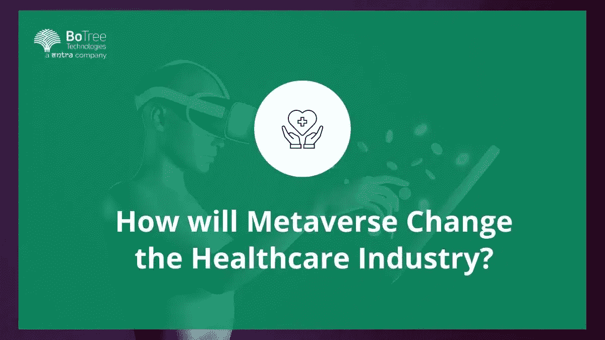

# 元宇宙将如何改变医疗保健行业？

> 原文：<https://medium.com/geekculture/how-will-metaverse-change-the-healthcare-industry-7dcf92f60ee3?source=collection_archive---------28----------------------->

这是一个数字时代，受益于技术创新的不仅仅是科技行业。随着新冠肺炎疫情加快对医疗保健创新的关注，医疗保健行业出现了许多新的机遇和商业模式。随着人们对未来工作的大元宇宙概念的兴趣日益增加，这对医疗保健的未来意味着什么？元宇宙在医疗保健市场有什么用途？让我们来看看。

# 元宇宙概念

元宇宙是一个广泛的数字工作空间概念，其中 3D 技术、增强现实和虚拟现实创造了我们工作和娱乐的新数字概念。尽管它可以彻底改变我们的工作和交流方式，但围绕元宇宙仍有许多问题。例如，ExpressVPN 对元宇宙工作区的研究显示，超过一半的员工担心他们的隐私，因为雇主可以更容易地访问他们的数据。这对于不断处理敏感患者数据的医护人员来说尤为重要。许多医疗保健应用开发公司已经在考虑平衡安全性、隐私和行业中新的数字增强机会的棘手问题。在未来的几年里，我们将会在这个领域看到更多的创新。

# 元宇宙将如何改变医疗保健行业？

在医疗保健中使用元宇宙有许多潜在的好处，从创新人们获得医疗保健的方式，到技术变革以及医生和其他相关方在医疗保健领域概念化、开发和创新的方式。目前，元宇宙市场的整体规模估计为 230 亿美元，预计年复合增长率将接近 40%。元宇宙[医疗保健公司](https://botreetechnologies.medium.com/top-15-healthcare-software-development-companies-you-should-know-4a37a483bf2f)已经开始扩张，元宇宙医疗保健市场规模目前为 68.5 亿美元，到 2030 年可能超过 720 亿美元。

# 将元宇宙应用于医疗保健行业

然而，无论数字空间有多么诱人，我们如何才能让依赖面对面互动的医疗行业转向类似的在线工作空间呢？对一家[医疗保健应用开发公司](https://www.botreetechnologies.com/healthcare-app-development)来说，拥抱新技术是一回事，但医药是完全不同的另一回事。医疗保健用例中当前的元宇宙是什么？

让我们野蛮一点。我们当前的医疗保健空间需要改进。我们面临着不断增长的长期护理和慢性病需求、人口老龄化、医疗保健人力资源的缺乏，以及资源严重受限而无法始终专注于正确的问题。再加上医疗保健领域不断增加的政治干预，就像我们在疫情看到的那样，这是未来创新和更好实践的良方。元宇宙概念有助于增强这一点吗？元宇宙在医疗保健方面有哪些[好处](https://www.botreetechnologies.com/blog/why-rpa-services-should-be-a-business-priority/)？

# 合作医疗

在疫情和后疫情时代，通信领域的技术合作是发展最快的领域之一。我们已经看到越来越多的工作人员将技术手段作为他们交流和互动的主要手段。因此，毫不奇怪，许多在医疗保健中使用元宇宙的例子已经实现，并且与工作场所中的其他技术创新有着显著的相似性。

因此，所有一般元宇宙工作场所的通常候选人都将被算作[医疗保健](https://www.botreetechnologies.com/blog/healthcare-app-development-cost-features-and-benefits/)的后台办公室和行政部门——想想办公室工作、员工教育和培训，以及在由沉浸式技术进步驱动的现实 3D 空间中举行的会议。然而，元宇宙在数字医疗方面的最大潜力之一是允许医疗工作者面对面“会面”,而不需要复杂的会议工具和场地。

同样，创造“数字双胞胎”的能力意味着新的机器、程序和系统可以在物理环境中进行试验之前进行漏洞和故障测试。例如，可以用高级分析测试更紧密的患者流，然后对近百万个潜在场景进行碰撞测试。在医疗保健的兽医方面，我们可以使用这些数字空间来模拟场景，以测试动物行为并促进动物福利计划。有了在 3D 中真实地创建和使用沉浸式模型的能力，创新和研究的新领域可以被揭开。

> **阅读更多:** [**治疗师搜索平台**](https://www.botreetechnologies.com/case-studies/therapist-search-platform)

# 保健教育

随着这些[数字双胞胎](https://www.ibm.com/za-en/topics/what-is-a-digital-twin)的出现，以及虚拟现实和增强现实技术的出现，一场医疗保健教育的革命也摆在了桌面上。这适用于新一代的医疗从业者，他们可以在“安全”的 3D 空间中学习和实验，学习患者遭遇、外科手术等，而不需要在实际的患者身上试验他们的经验。然而，它也适用于医疗保健计划和对患者的拓展。想象一下，对一名新诊断的糖尿病患者进行无风险的连续血糖监测训练。或者绕过贫困地区甚至国家缺乏本地基础设施的情况，将全面的基础医疗保健学习环境带入生活，所有需要的都是互联网接入点。医疗保健行业的元宇宙将被证明有助于让医疗保健[教育](https://www.botreetechnologies.com/blog/elearning-app-development/)变得更容易。

# 临床护理

在当前的医疗保健环境中，远程护理技术已经成为一件大事，这也是由疫情锁定公司推动的。远程医疗很方便，对于医疗基础设施差的社区来说，它可以改变游戏规则。AR 可以在保持无菌室的同时允许访问信息。外科专家已经在尝试“远程手术”来帮助发展中国家扩大救援工作，一种更加身临其境的体验可以极大地发挥这一作用。协作医疗程序和专家的投入可以大大降低成本，并且[人工智能可以授权](https://www.botreetechnologies.com/blog/ai-in-future/)临床决策过程。正如我们已经提到的，在[软件开发公司](https://www.botreetechnologies.com/)的帮助下，治疗计划可以变得更有针对性，围绕患者诊断结果的教育使其更容易获得，也更全面。

# 游戏化健康

虽然这是一个更具争议的医疗保健领域，但也值得考虑医疗保健游戏化和激励患者健康如何有助于影响健康结果。我们都知道，很少有人符合健康的最低建议锻炼指南。改变坏习惯很难。如果没有投资的医疗系统和病人方面的投资，慢性健康状况和人口老龄化的影响只会越滚越大。“游戏赚钱”、“移动赚钱”和“学习赚钱”都可以用来改善患者的依从性和健康结果。

然而，这也将围绕数据处理和谁可以访问我们的医疗记录等问题提出突出的问题。当然，任何[技术创新](https://www.tntra.io/blog/key-differentiator-in-healthtech-innovation/)都会引发这样的问题，这不是医疗保健或元宇宙所独有的。理论上，数字伦理应该和传统伦理一样。然而，干预和收集数据的能力越强，引发的伦理问题就越多，尤其是社区建设的空间和开源代码。

> **阅读更多:**[**12 大最受欢迎的医疗保健应用示例**](https://www.botreetechnologies.com/blog/most-popular-healthcare-applications-examples/)

# 结论

在医疗保健中使用元宇宙具有巨大的潜力，可以利用数字文化的力量在高端和社区福利和医疗保健领域取得长足进步。然而，这并不是没有道德难题。然而，医疗保健市场中的元宇宙确实有潜力成为现代世界中一个了不起的均衡器，并创新患者接受护理的方式和医护人员提供护理的方式。从更好的协作和沉浸式学习到激励人们更积极地参与他们的健康和福祉并改善患者教育和结果，数字和自然空间的交集可能会改变游戏规则。随着元宇宙概念的扩展，潜力也会随之增长。即使在 10 年前，告诉医疗从业者他们在医疗领域最大的合作伙伴之一可能是一家企业软件开发公司似乎也是不切实际的，这是我们面临的新现实。我们正站在医疗改革的风口浪尖。现在是时候看看它会把我们带向何方了。

*原载于 2022 年 12 月 15 日 https://www.botreetechnologies.com***。**