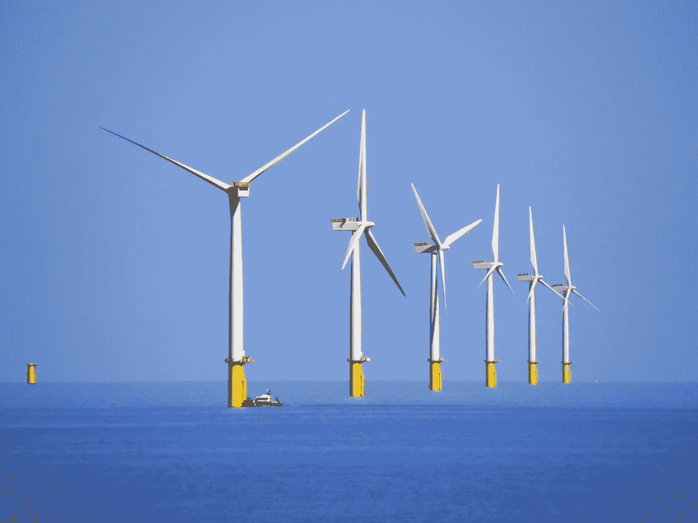

# 风能如何赢得能源战争

> 原文：<https://medium.com/geekculture/how-wind-is-winning-the-energy-wars-dc2bde6874c0?source=collection_archive---------2----------------------->

## 风能和太阳能农场就像乐高积木一样，咔嚓，咔嚓，咔嚓。这就是为什么气候危机可能——只是——被克服。

Walney Offshore Windfarm (source: [Wikimedia Commons](https://commons.wikimedia.org/wiki/File:Walney_Offshore_Windfarm_-_geograph.org.uk_-_2391702.jpg))

当英国首相在 2013 年 7 月为伦敦阵列揭幕时，它是世界上最大的海上风电场，以 2012 年的价格计算，耗资 30 亿美元。*位于泰晤士河口，有…