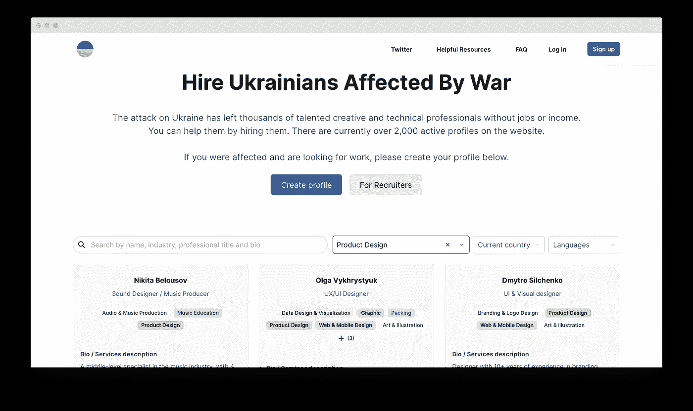

# 作为一名程序员，你如何支持乌克兰

> 原文：<https://medium.com/geekculture/how-you-could-support-ukraine-as-a-programmer-a04f5f669f97?source=collection_archive---------4----------------------->

我们都对俄罗斯发动的可怕战争感到震惊，我们关心乌克兰及其公民。作为一名开发人员，我曾经和许多有才华的乌克兰人一起工作(全世界都知道乌克兰程序员有多棒！)并在其中结交了很多朋友。我现在深深地同情他们，尤其是当我听到我朋友的故事时。其中一人必须和家人睡在地铁里，因为这是离他家最近的避难所。另一个失去了他在基辅附近舒适的小镇 Irpin 建造的房子。他和他的家人付出了这么多努力，花了这么多年创造了他们梦想的家园，现在它不见了，被俄罗斯军队毁了。他的孩子们都崩溃了，但他说:“至少我们还活着。”

我一听，心都碎了。自战争开始以来，我一直在帮助乌克兰，例如，捐款。但还是觉得不够。我认为世界对乌克兰和乌克兰人的问题不够重视。大概是因为我们无法想象他们在经历什么。我认为我们对他们的帮助还不够，我们可以做得更多。

所以，我决定收集不同的方式来支持这些为自由而斗争的伟大人民，并与你分享。如果你已经为来自乌克兰的难民捐过款或提供过帮助，但仍然觉得你可以做得更多(像我一样)，这个列表是给你的。

至于我，我决定免费给乌克兰人教书和做家教。让他们在一个新的领域有一个新的开始(因为他们中的许多人已经失去了以前的职位，也许是永远失去了)是我帮助乌克兰的方式。

# **1。雇一个乌克兰人**

不幸的是，在俄罗斯入侵开始后，许多人已经失去了工作。很难准确估计失去工作的乌克兰开发人员的数量，但总体而言，53%的乌克兰人在战争开始后失业(根据 Rating Group 在 3 月份进行的调查)。还有更多的要做。

在全球市场上备受赞赏的乌克兰开发商现在面临一个巨大的问题。由于泽伦斯基总统宣布的戒严令，18 岁至 60 岁的男性不能出境，导致开发商无法搬迁。但是他们能够并且愿意工作。此外，逃离该国的乌克兰妇女能够并且希望工作。如今为这些人工作不仅意味着支持他们自己，也意味着支持乌克兰的经济。他们中的许多人都是顶尖的专家。

许多公司认为乌克兰是高风险地区，并开始关闭一些涉及乌克兰人的外包项目。此外，乌克兰人加入创业团队意味着潜在的投资吸引力问题。如果公司不能保证员工的安全，对投资者来说就是额外的风险。

我认为这是不公平的，如果可以的话，我恳请你帮忙。例如，考虑雇用一名乌克兰开发人员或其他 IT 专家(在营销、设计、管理等方面)。)如果你有工作机会。

有几个网站可以让你找到你需要的人:

*   [**乌克兰招聘**](https://hireforukraine.org/)**——该网站上有超过 2000 个活跃的乌克兰专业人士简介**
*   **雇佣乌克兰人——如果你有人力资源相关的经验，你可以给他们发送职位空缺的信息或者成为志愿者**
*   **[**雇佣乌克兰**](https://employukraine.org/) —你可以贴一个职位描述，而且不会花你一分钱。目前，这里有 7000+名候选人和 2500+个职位。**

# ****2。使用乌克兰语应用程序学习****

**记得我告诉过你乌克兰的开发者很杰出吗？所以，当我说他们可以开发一个高质量的学习应用时，你可以相信我。例如:**

*   **[**CodeGym.cc**](https://codegym.cc/) —如果你读了我一段时间，你可能听说过这项服务。我认为它提供了一个学习 Java 的非常实用的方法，我很高兴地提到这是一个乌克兰项目。即使你以前从未尝试过编码，它也能帮助你成为一名 Java 开发人员。实际的任务，少量的理论，外加一个跟导师学习的选择。此外，该公司最近启动了一个项目，旨在为失去工作的乌克兰人提供 IT 方面的新职业。当你购买一个订阅，两个订阅给需要他们开始新职业的乌克兰人(详情— [**此处**](https://landing.codegym.cc/en/donation/) )。**

****

*   **[**Preply**](https://preply.com/)**——这项服务对于那些在跨国团队工作，想要学习一门新语言(或者几种语言)的开发者来说，可能会很有用。它提供寻找语言导师的帮助，一个便利的学习平台和一个虚拟教室。此外，你可以跟踪你的进步，看看你的口语和词汇是如何提高的。****

********

*   ****[**ReadLax**](https://www.readlax.com/)——通过训练大脑，帮助更有效地学习。有了这个应用程序，你可以更快地开始阅读，提高你的记忆力，并且更加专注于你此刻正在做的事情。****

****当然，这并不是值得你支持的乌克兰公司的完整名单。如果你认识其他人，请随意在评论中写下他们。****

****这里还有一个帮助乌克兰人的方法，这是我目前几乎所有业余时间都在做的事情:****

# ******3。使用乌克兰软件和服务******

********

****随着世界对战争更新越来越感兴趣，乌克兰企业和产品的知名度也在提高。这里有一些你可能从未听说过的(尽管依我拙见，你应该听说过):****

*   ****[GitLab](https://about.gitlab.com/) —一个 DevOps 平台，帮助公司最大化软件开发的整体回报。它使团队能够执行所有的项目任务:从计划到部署。****
*   ****[Readdle](https://readdle.com/)——这家公司的生产力应用程序可以在 iPhone、iPad 和 Mac 上运行。其中一些被苹果评为年度编辑选择和年度应用。****
*   ****[Lemon.io](https://lemon.io/) —乌克兰为初创公司寻找开发者的服务。这家公司为 24 小时后的开业推荐了一场比赛，并自称为“创业伙伴的专属社区”。****
*   ****该服务通过 ai 记录、转录和创建摘要来使会议工作。它与 Zoom、Google Meet、Teams 和 Webex 兼容。****
*   ****[Datuum.ai](https://www.datuum.ai/) —该数据管理平台有助于扩展贵公司的数据运营。正如该公司所说，使用其产品可以节省 80%的时间和金钱。****

# ******4。用你的专业技能帮助乌克兰人******

****例如，如果你是一名 IT 顾问，为有需要的人提供服务。如果你是一个高技能的专业人士，成为一个有抱负的乌克兰人在你的领域建立职业生涯的导师。如果你是一名教育工作者，开设一门免费的在线课程。如果你有一个网站，你可以在上面添加这个小部件。****

****我们有那么多可以付出的，现在不能吝啬。乌克兰没有挑起这场战争，但它必须为我们所有人赢得这场战争。世界需要乌克兰的胜利来继续相信自由仍然有意义，人们有权做自己，而不必担心因此被杀。****

******还有最后一点注意。**战争终将结束，乌克兰将面临下一个挑战:收复失地。乌克兰人将不得不重建国家，因此他们的经济需要大量支持。如果我们能做到，我们应该去做。****

****附:如果你有更多的想法，请在评论中分享！****