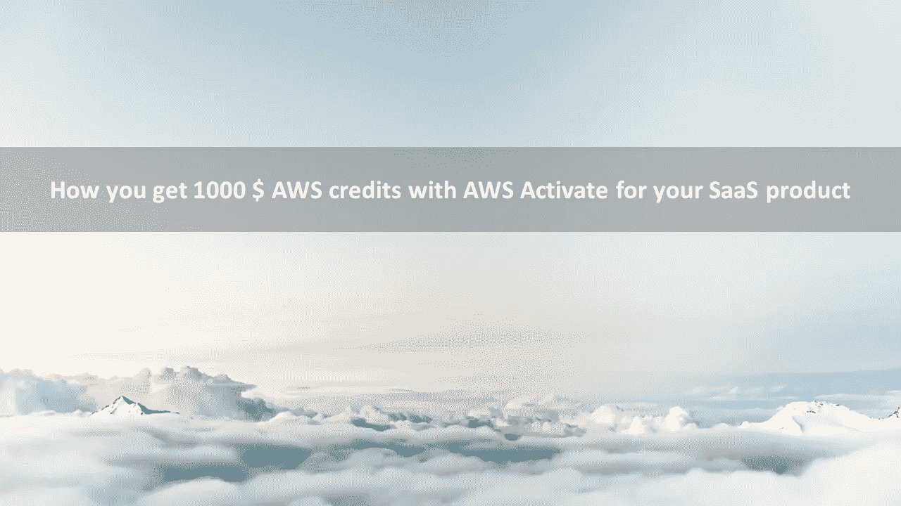
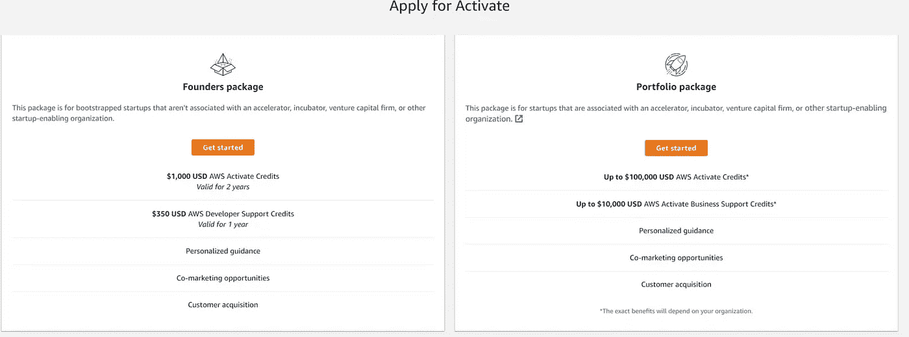
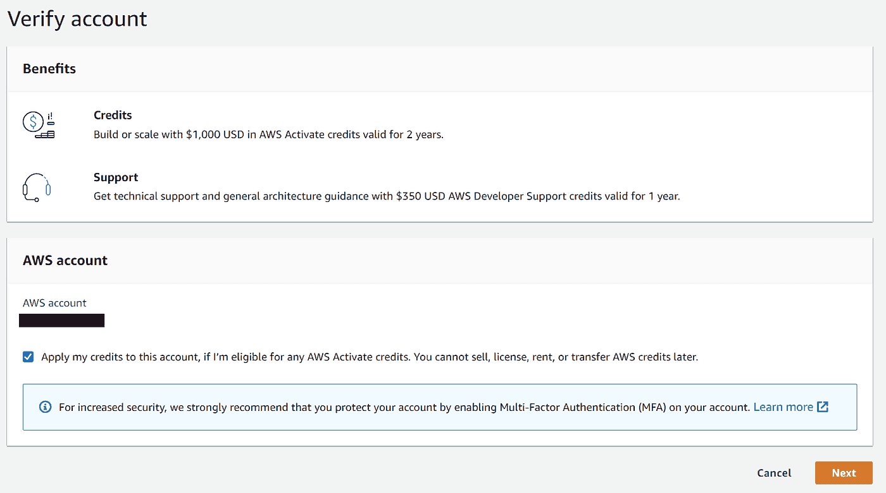
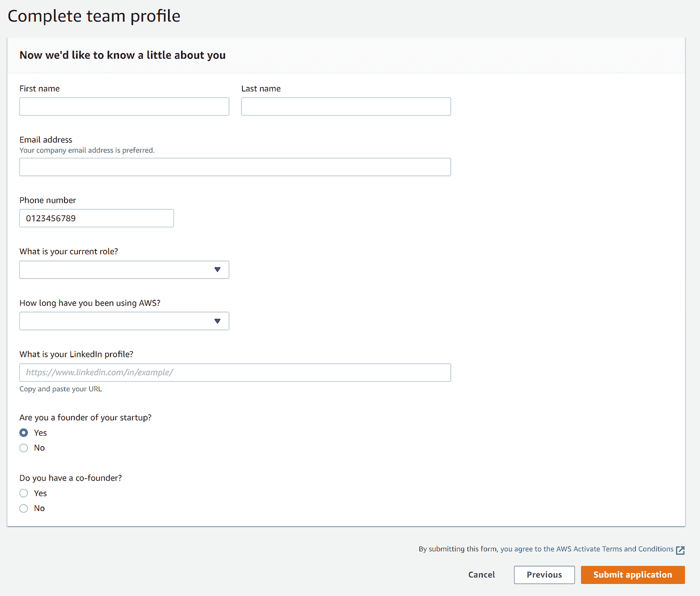
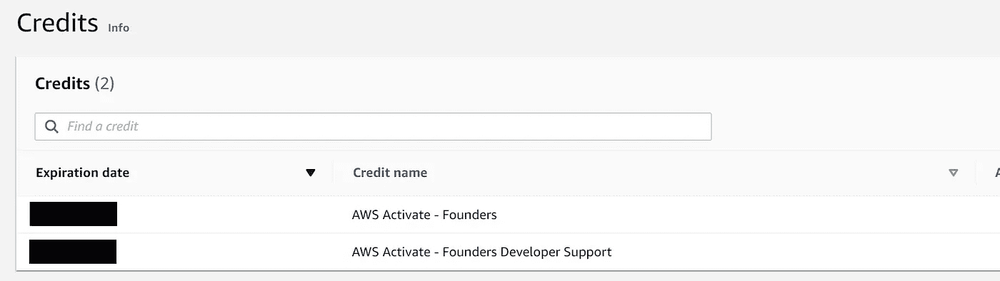

# 如何通过 AWS 激活为您的 SaaS 产品获得 1000 美元 AWS 积分

> 原文：<https://medium.com/geekculture/how-you-get-1000-aws-credits-with-aws-activate-for-your-saas-product-14797a9cb95b?source=collection_archive---------22----------------------->

当我们开始建造[deposure](http://deposur.de)时，从一开始就降低成本对我们来说就非常重要。为此，你基本上有两种方法

1.  降低成本(哇！)
2.  你不用支付费用(啊哈…)

由于我们的应用程序是完全无服务器的(除了全文搜索),成本已经相当低了。但有些还是会出现。例如，我们的弹性搜索和一些更大的数据摄取。由于 AWS 账单并不完全简单，所以知道你有一个小的资金缓冲以防你意外触发一些将花费很多的脚本也是一种很好的感觉(发生**几乎**一次)。

在这篇文章中，我将快速向你展示我们是如何通过 AWS Activate founders 计划获得 1000 美元 AWS 积分的，该计划正是为 bootstrappers 准备的。

# **什么是 AWS 激活？**

AWS Activate 是 AWS 为初创公司和创始人提供的在云中快速入门的计划。你可以申请两种不同的项目。一个是风投支持的初创公司，一个是典型的 SaaS 创业者。我说的是第二个，关于创业公司。

先决条件真的很低:

*   你的创业必须少于 10 年
*   你需要一个登陆页面
*   您需要有一个 AWS 帐户
*   您需要 LinkedIn 帐户

我认为登陆页面甚至是可选的，但我强烈建议它显示你打算做什么。

# **如何申请？**

1.登录您的 AWS 帐户，然后前往[https://console.aws.amazon.com/activate/home/#/apply](https://console.aws.amazon.com/activate/home/#/apply)

2.点击你想要的包→创始人包→开始

3.勾选“将我的点数应用到此帐户”并检查您是否在正确的帐户中😉

4.现在你会看到一个表格，你必须输入一些关于你公司的基本信息，比如

*   公司名称
*   公司描述
*   网站(全球资讯网的主机站)
*   行业(最多 10 个！)
*   以及一些你感兴趣的服务或领域的信息

5.最后一步是完成您的团队简介。在这里，只需输入您的基本信息，我建议添加所有创始人和团队成员的 LinkedIn 个人资料。

就是这样。点击提交申请，等待几天，并得到你的 1000 美元。对于 deposur 它花了大约 3 天，一切都设置好了。当您点击点数时，您将在 AWS 帐户的激活菜单或您的计费帐户中看到您的点数

# 利益

**学分**

我认为第一个很简单。你免费得到钱。几乎所有 AWS 服务都有 1000 美元的积分。最重要的例外是购买域名不包括在内。

**支持信贷**

你还可以获得 350 美元的 AWS 开发者支持。我已经和他们中的一些人有过接触，他们在讨论你的架构、想法和解决你的问题方面非常有能力。

**激活控制台**

最后一部分，可能不是最有趣的部分，是您可以访问 AWS 激活控制台，了解更多信息、研讨会和教程。你还可以从某些合作伙伴那里获得**独家优惠**，比如 AirTable、ZenDesk 或吉拉。TBH:到目前为止我还没有用过，但我相信他们也有一些不错的优惠。😉

就是这样。免费享受构建项目的乐趣！

如果你想了解我在 AWS 上构建无服务器 SaaS 产品的旅程，可以考虑关注我的[推特](https://twitter.com/sandro_vol)🙂