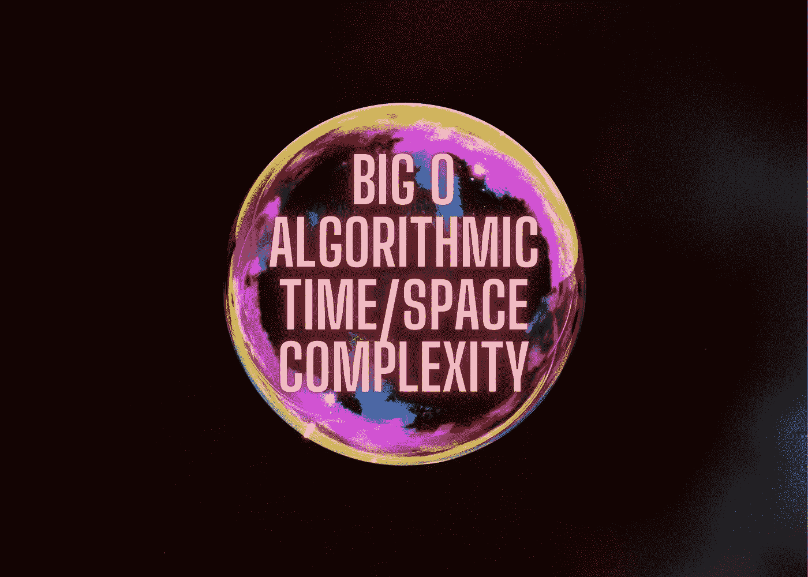
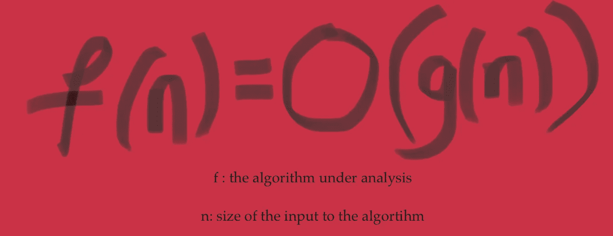
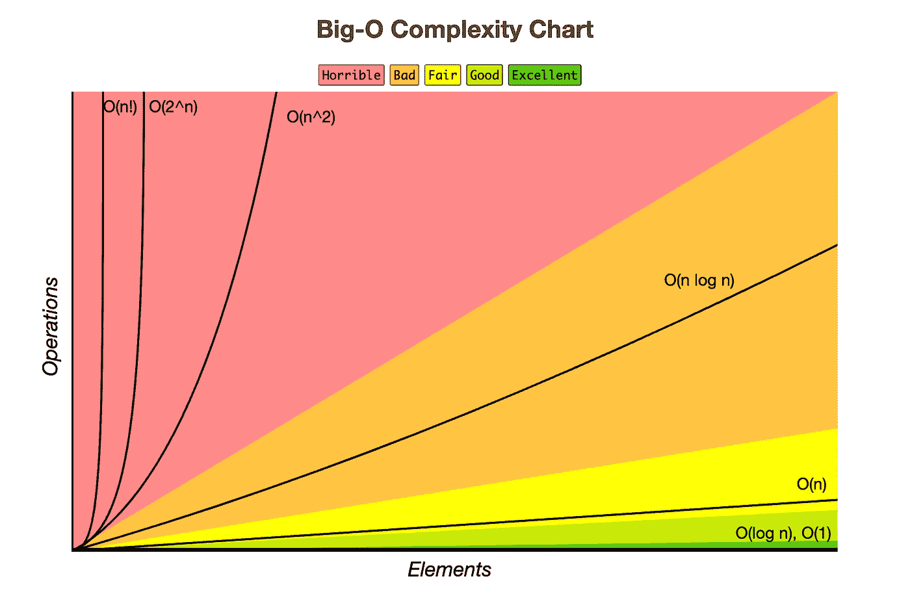
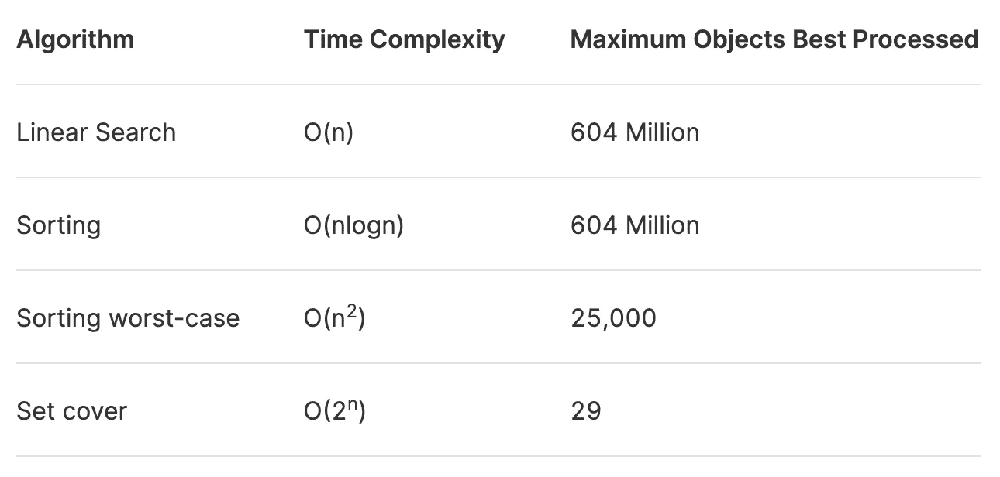

# 您的代码如何随着数据的增长而变慢

> 原文：<https://medium.com/geekculture/how-your-code-slows-as-data-grows-ad7d17541ebf?source=collection_archive---------44----------------------->

了解一项任务有多复杂将是决定这项任务是否值得去做以达到某种结果的一个重要因素。类似地，知道一个算法有多复杂将是一个强有力的指标，表明是否使用它来实现某种结果。在我们的日常生活中，我们可能会根据一项任务要花多少时间、我要走多远、我是否有完成这项任务的资金和资源等来决定它的复杂程度。我们如何决定一个算法有多复杂？我们用大 O 符号来表示。

# 输入大 O 符号

首先，大 O 符号只是一个符号。不要被使它读起来像一个函数的括号所迷惑。O 代表“的顺序”。你可以把它想象成一个附在算法上的标签，用来描述算法增长的速度有多快。

The Big O Notation

在大 O 符号中，函数‘f’就是我们正在分析的算法。并且输入‘n’是算法‘f’的输入的大小。现在我们有了一个框架来比较不同的算法 f 作为输入大小 n 的函数。

大 O 符号让我们了解算法有多复杂，因此我们可以比较不同的算法。当我们说“算法的复杂性”时，它指的是任何有限资源——时间、内存、网络输入/输出等——的复杂性。如果你想一想，任何有限的资源都与时间相关联——时间是终极的有限资源。

# 更正式地说，

把 f(n)和 g(n)想象成两个算法在 n 个输入上的运行时间。

假设 f(n)和 g(n)是从正整数到正整数的两个函数。我们写 f(n) = O(g(n))对于 n -> ∞当且仅当存在常数 N 和 C 使得，|f(n)| <= C |g(n)| for all n> N。

# 更直观地说，

f = O(g)表示 f 的增长速度并不比 g 快。

说“f=O(g)”就像说“f <= g”. Similarly, the are analogy for ‘> = '和' = '分别是大ω和大θ符号。

**大 O** : f=O(g)表示 f < =C*g(n)代表 n > N

**大ω**:f =ω(g)表示 g=O(f)

**大θ**:f =θ(g)表示 f=O(g)，f =ω(g)

# 抽象出实现细节

当我们编写算法程序并在计算机上实际运行时，很难确定处理器将执行的指令或机器周期的准确数量。查看源代码没有任何帮助。这是因为有太多的外部因素，如硬件、软件和编程语言细节，会影响程序运行的实际时间(以秒为单位)。

我们可以从这些实现细节中抽象出来，以简化我们对算法复杂性的推理。所以我们用*基本计算机步骤*来表示算法的运行时间。

假设一个算法在大小为 n 的输入上有 5n2+10n+3 个基本步骤，那么运行时间可以表示为输入大小的函数，即 f(n)=5n2+10n+3。由于 n -> ∞，最高阶项将决定算法运行时间的增长率。因此低阶项和系数变得可以忽略不计。我们可以说，那个 f=O(n^2)，说为*“f 是 n 的平方的大哦”*。

> *让我们来解决这个问题。*
> 
> *考虑，f(n) = O( f(n)2)*
> 
> *判定渐近非负函数 f 和 g 是否总是真、从不真或有时真，如果总是真或从不真，说明原因。如果它有时是真的，给出一个它是真的例子，和一个它是假的例子。*
> 
> *回答:有时候是真的。例:f(n)=n 反例:f(n) = 1/n.*

# 一些观点

假设我们有一周的预算，一个操作需要 1 毫秒。现在，一周有 604，800，000 毫秒。这大约是 6.04 亿毫秒。假设我们有一堆不同的任务，需要不同的算法。

例如，时间复杂度为 O(n)的线性搜索任务和最坏情况复杂度为 O(n^2).的排序任务对于任何算法任务，我们仍然只有一周的时间和相同的处理能力。下表显示了任何算法在一周内可以处理的最大输入大小。

Maximum Input Size Processed with respect to the Algorithm’s Time Complexity

为了详细说明，我们来考虑一下 set cover 任务。现在不要担心集合覆盖的细节问题，只要知道它有 O(2^n).的时间复杂度就行了在一周内，我们大约有 6.04 亿毫秒的处理能力。所以我们问，*“2^n 在 6.04 亿毫秒内的最大 n 是多少？”*。这个问题的答案是，

n = log2(604，800，000) = 29

在一周内，我们只能解决输入大小 n = 29 的集合覆盖问题。这就是指数时间复杂性的诅咒。

总之，我们用大 O 符号来推理算法的复杂性。算法的复杂程度决定了随着数据的增长，您的任务会如何变慢。

# 参考

*   [大 O 小抄](https://www.bigocheatsheet.com/)