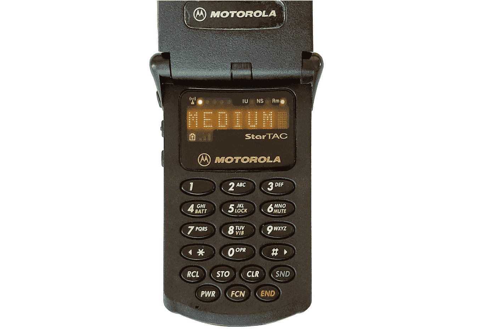

# 如何使用 1997 年的 1G 模拟电话

> 原文：<https://medium.com/geekculture/howto-running-the-1g-analog-phone-from-1997-3caec77a9df9?source=collection_archive---------0----------------------->

模拟手机在上世纪 90 年代很流行，最后一批运营商直到 2007 年才终止服务。现在可以运行这个电话吗？让我们弄清楚。

Motorola StarTAC 6000

# 安培数

高级移动电话系统(AMPS)标准是由贝尔实验室在 1983 年创建的，这些电话在 90 年代开始流行。这个标准是一种第一代蜂窝技术——语音…