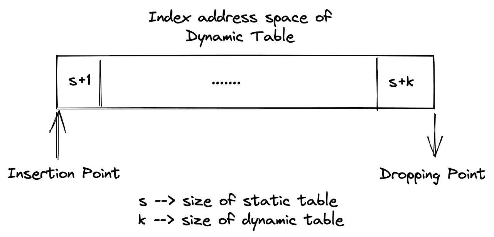
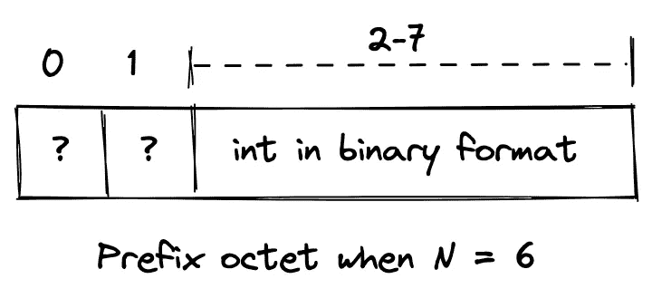
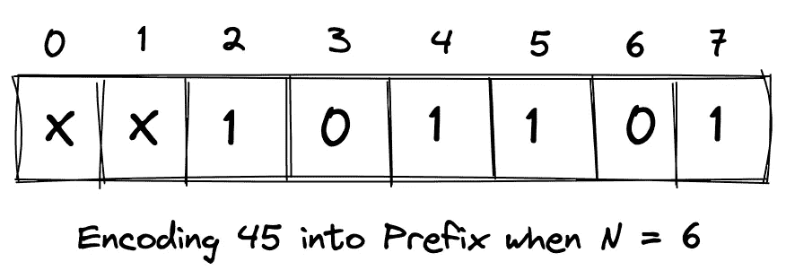
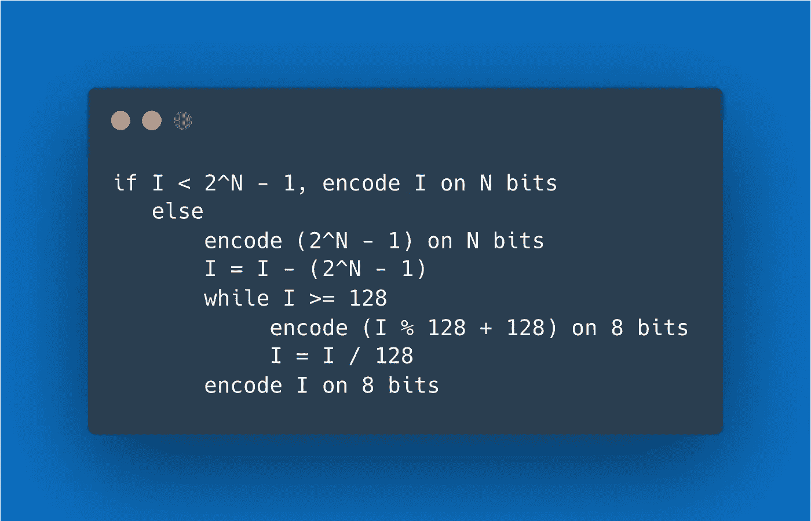
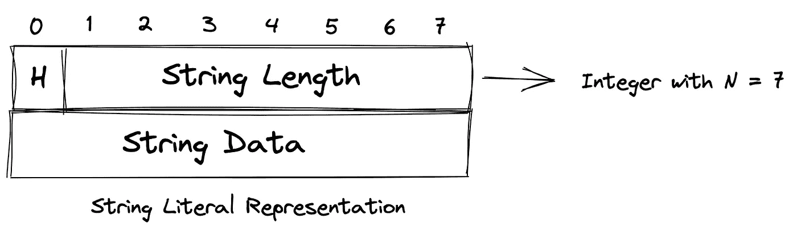
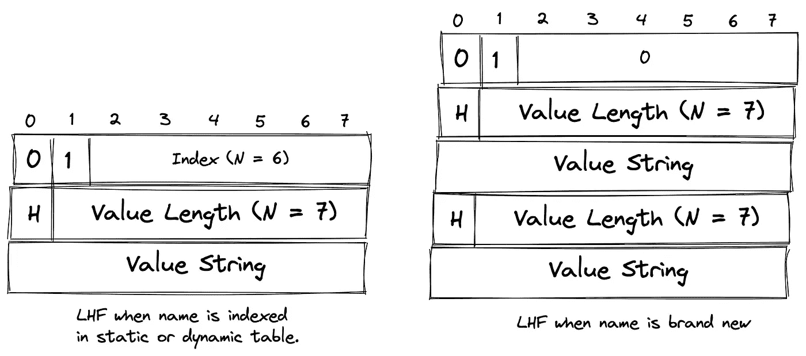
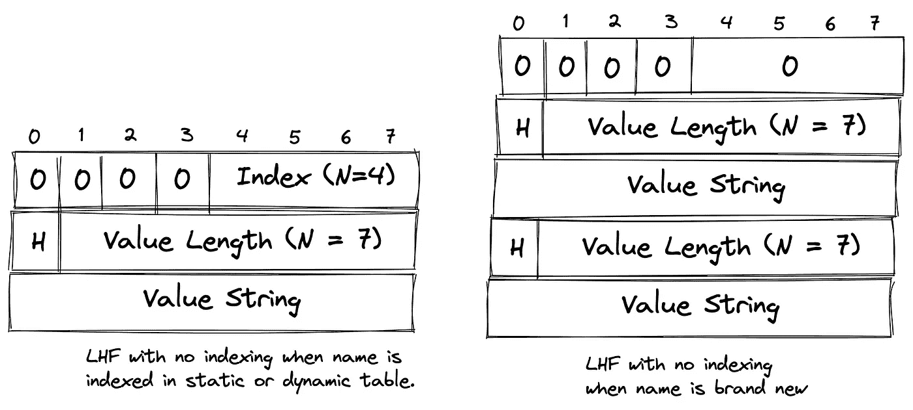
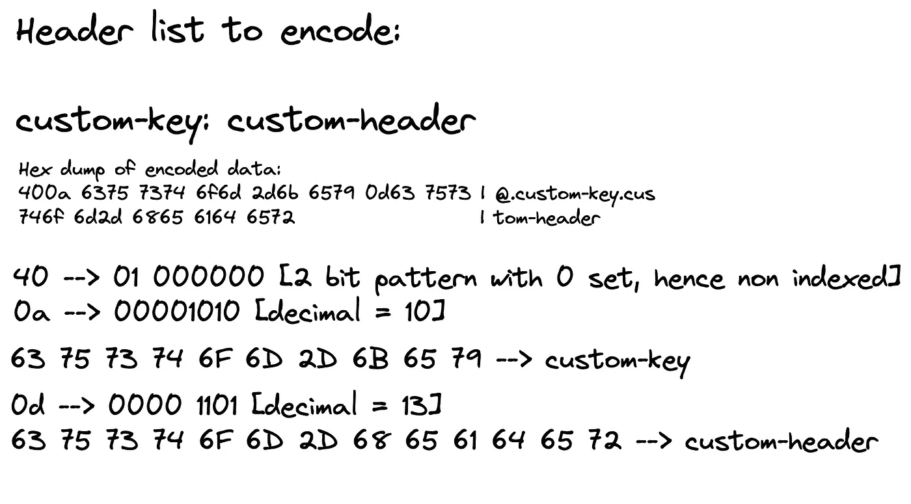
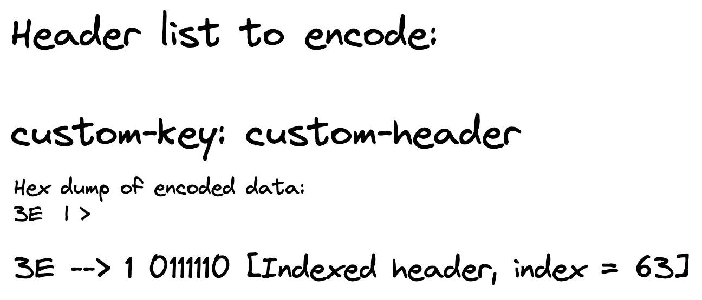

# h pack:HTTP/2 的头压缩格式

> 原文：<https://medium.com/geekculture/hpack-header-compression-format-for-http-2-155a0b4934f7?source=collection_archive---------3----------------------->

最近，我一直在探索是什么让 HTTP/2 和 HTTP/3 比它们的 1.1 前辈快得多。虽然很明显，像流复用这样的具体特性是它的核心，但有一个我们将在本帖中讨论的未言明的英雄。

HPACK 是 HTTP/2 中使用的头压缩技术，它对应于 HTTP/3，QPACK 在处理动态表方面略有不同(不要担心，我将在博客的后半部分详细解释)。

> **免责声明**:这篇博客或多或少是 RFC 的总结，上面还有一些额外的插图。请随意直接阅读 HPACK RFC[1]或 Cloudflare[2]提供的关于静态+动态表如何帮助压缩过程的摘要。这篇文章将关注如何在头字段表示中表示头字段，以及如何在头和解码器之间传递原始数据类型。

# 压缩法⏮

在 RFC 中要注意的一件有趣的事情是，没有具体的算法规范，因此，只要实现在运行期间确保以下属性，就可以让实现自由地找出它们自己的编码过程——

*   编码器必须**保持在原始报头列表中接收的报头块内的报头字段表示**的顺序，并确保解码器遵循相同的顺序。
*   标题块**的解压缩应该仅依赖于作为附加解码上下文**的动态表。
*   编码器必须维护几个**表**来将头字段与索引相关联。
    - **静态表:**静态表是由`accept`、`allow`、`authorization`等预定义表头字段和`:scheme`、`:status`等伪表头组成的表格。你可以在这里查看整个列表。
    - **动态表:**这是一个按照 FIFO 顺序遇到的头字段的动态表，并据此进行索引。这是一个严格的内存限制资源，由解码器和编码器共同商定。
*   在标题字段表示中，标题字段名称可以是按原样表示的**,或者可以引用上述任一表格内的条目**,而标题字段值是按字面表示的(值和字段的字面表示**可以是直接的或者霍夫曼编码的)**

# 动态表格🏗

动态表绝对值得详细说明，这些表最初是空的，条目是按照先进先出的顺序添加的。该表中最新的条目处于最低顺序，而最老的条目将处于最高顺序。在大小改变命令的情况下或者为了容纳较新的报头字段，旧的条目被驱逐。

它可以包含重复的条目，并且编码器将决定在更新/创建动态表时要使用多少内存。

# 数据表示法📑

## 整数

一般来说，在 HTTP 协议中，整数用于表示字符串长度，或者在这种特定情况下，表示头字段索引。根据 RFC，整数表示可以在八位字节内的任何地方开始**，但是为了优化处理，每个表示应该在八位字节的末尾结束。**

当我们说“从中间的任何地方开始”时，它到底是什么意思？正如我们所知，一个八位字节有 8 位，协议允许实现从第 2 位开始一个整数，第 0 和第 1 位可以是空的(或者可以以任何方式设置)在**前缀**中。

Prefix Octet Example

在整数为> `2 ^ N — 1`的情况下，整数由填充当前八位字节+附加八位字节的前缀**表示**

很简单不是吗？让我们通过几个例子来理解这一点。

**示例-用 N = 6 编码 45**

自 45 < 63 ( 【 ), we could encode 45 into a binary where the first bit started from the 2nd index. This is what it means to “Start from anywhere”. Had 【 was set, we could start the integer from the first bit itself.

**示例-用 N=6** 编码 458963

在这里，你可以看到，我们使用 4 个八位字节来编码这么大的数字。(1 个前缀，3 个附加)。**有趣的是，除了最后一个八位字节，其他八位字节的 MSB(最高有效位)都被设置为 1。**

将整数`I`编码到`N`位的通用伪代码如下:

## **字符串文字表示法**

在表和标题表示中，标题字段名称和值可以表示为字符串文字。它被编码为一个八位字节序列，并包括一个标志，表明字符串数据是字符串的文字八位字节，还是实际上，霍夫曼编码的八位字节。

这里，`H`位表示数据是否是霍夫曼编码的，而`StringLength`顾名思义，表示字符串八位字节的长度。详细说明一个单字符串文字的例子是没有意义的，直到我们了解了这些文字是如何在标题字段中表示的，然后，我们可以看看附录[4]中给出的几个例子。

# 标题字段表示💠

在 RFC 的“二进制格式”中有详细介绍，现在我们将探究这些文字表示实际上是如何工作的。利用不同的报头字段表示，一个编码器实现可以向解码器给出关于该表示实际上意味着什么以及是否应该将其保存到动态表中，以及是否应该改变动态表的大小的指令。

## 索引头字段表示

索引头字段以`1` 1 位模式开始，其余的八位字节由匹配头字段的索引填充(是的，你猜对了，它是 N=7 的整数)。这种表示识别静态或动态表中的条目。

## 文字头字段表示

文字头字段表示包含文字头值。这可能是一个字符串或对现有表条目的引用(静态或动态都无所谓。)

> 另外，让我们暂时将**文字头字段缩写为 LHF** (是的，我很懒)

## **带增量索引的 LHF**

这导致将头字段附加到“解码的头列表”并将其作为新条目插入到动态表中。

Literal Header Field with incremental indexing

它的二进制表示以一个`01` 2 位模式开始。如果**标题字段名**与静态/动态表中条目的标题字段名匹配，那么编码器可以简单地引用该条目的索引，并且该索引将被表示为具有 6 位前缀的整数。

否则，前缀八位位组被设置为 0，并且发送 2 个字符串值，每个表示**报头字段名称**和**报头字段值**，并且随后在成功解码时存储在动态表中。

## **LHF 无索引**

这导致将头字段附加到“解码的头列表”上，而动态表中没有任何变化。

它的二进制表示以`0000` 4 位模式开始，其余的规则类似于你刚刚读到的带有索引的 LHF 的规则，所以我在这里不再重复。

## 动态表格大小更新

它是一个简单的八位字节，以 3 位模式`001`开始，后面是一个新的最大大小，用 N = 5 的整数表示。这表示大小更新改变了动态表的大小。顺便说一下，它必须低于或等于在连接阶段由 HTTP/2 协议在`SETTINGS_HEADER_TABLE_SIZE`参数中确定的限制。

## 题头字段表示实施✍️

现在，让我们来看一个例子，好吗？我将选择附录 C.2.1 [5]中给出的例子，它讨论了在**头字段事先没有出现在任何表中的情况下，带有增量索引**的**文字头字段的情况。**

我们需要监控解码器如何处理图片中给出的 hexdump。让我们一个一个来看，如果你将`40`解码成一个八位字节，它将是`01000000`，这意味着它是解码器中动态表的一个命令，对它解码的任何内容进行索引，并且没有对任何现有索引值的引用。`0a`被转换为`0000 1010`，这意味着后面的字符串是**非霍夫曼编码的**并且长度为 10，那么 **63 75 73 74 6F 6D 2D 6B 65 79** 对应于头字段名称。

随后的`0d`被转换为`0000 1101`，其再次示出了随后的字符串是**非霍夫曼编码的**，并且长度为 13，则**63 75 73 74 6F 6D 2D 68 65 61 64 65 72**对应于报头字段值。

这个操作完成后，解码器内部的动态表将把`[1]custom-key: custom-header`作为一个键值对，它将能够在以后引用这个键值对。我强烈推荐这个 Cloudflare 的博客[2],以了解这个关键值对后来是如何被利用的。

# 但是节省了多少空间呢？🤔

这种压缩和缓存策略的全部目的是节省空间，对吗？让我们试着找出使用计数器请求节省了多少空间，让我们假设当条目**自定义键**已经存在于动态表中时，上面的例子将被编码。

When the header is in dynamic table

`3E`，这是编码器需要输入的所有内容，它将被解码为`1 0111110`，这意味着这是一个索引头字段，其索引号为`63` ( **为什么是 63？**因为有 62 个静态不可修改的标题列表，动态标题索引就在那之后开始。

因此，在第一个请求中，使用了 16 * 13 = **208 位**，而在具有相同报头的第二个请求中，仅使用了 **8 位**。在这个特殊的例子中，后续的缓存请求只使用了最初通过网络需要的的**到 3.8%的内存。然而，假设了以下条件:**

1.  动态表不会删除索引
2.  编码器使用索引表示，而不是添加/复制键值对。
3.  实际头的长度相当大，因此用索引代替它可以有效地通过网络进行传递。
4.  解码器和编码器之间有足够的内存来将这个键值对添加到动态表中。

# 结论

通过这个例子，我可以得出结论，如果初始条目是非霍夫曼编码的，并且其他条件是理想的，那么存在一个 96% 的压缩**。但是这是一个一次性的例子，以具体展示这种计算是如何工作的，Cloudflare 的博客[2]给出了对一个大得多的样本集的详细见解，他们注意到入口头中有一个 76%**的压缩。这是一个有趣的理解算法，你可以在帖子中随意指出任何不准确的地方。****

直到下一次:D

# 资源

*   [1][HPACK RFC:HTTP/2 的报头压缩](https://datatracker.ietf.org/doc/html/rfc7541)
*   [2][HPACK:HTTP/2](https://blog.cloudflare.com/hpack-the-silent-killer-feature-of-http-2/)的无声杀手(特性)
*   [3] [附录 A:静态标题定义](https://datatracker.ietf.org/doc/html/rfc7541#appendix-A)
*   [4] [附录 C:标题字段表示示例](https://datatracker.ietf.org/doc/html/rfc7541#appendix-C.2)
*   [5] [附录 C.2.1](https://datatracker.ietf.org/doc/html/rfc7541#appendix-C.2.1)