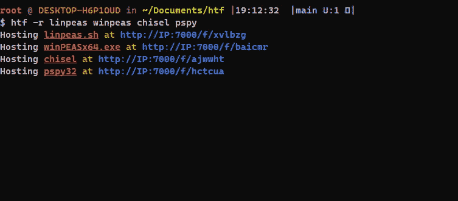

# htf:托管该文件

> 原文：<https://medium.com/geekculture/htf-host-that-file-e75c8daae80f?source=collection_archive---------13----------------------->

## 快速提供您最喜爱的 Pentest 工具的工具

你好，世界！在本文中，我将讨论这个简单但有用的(在我看来)工具，它是我在 Go 中编写的，用于快速提供您最喜欢的 pentest 工具，以转移到 pwned 机器上。这个工具叫做 **htf** ，代表“托管那个文件”，使用起来非常简单。在这篇文章中，我会告诉你如何安装和使用它…