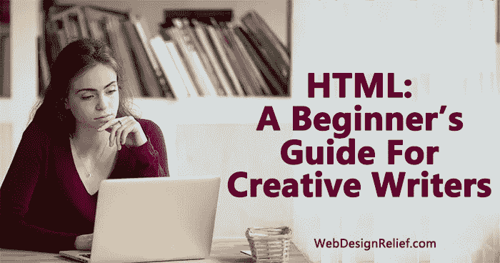

# HTML:创意作家入门指南

> 原文：<https://medium.com/geekculture/html-a-beginners-guide-for-creative-writers-99c19be3ec68?source=collection_archive---------47----------------------->

一个作者网站就像一个有创造力的作家的在线信息中心——在这里，读者、粉丝、文学代理和编辑将首先寻找关于你和你的作品的细节。如果你正在考虑建立自己的作者网站，但对逗号的了解比编码多，专家建议学习一些关于 HTML 的基础知识。这里有一个简单的初学者指南，关于创造性的 HTML 的来龙去脉…