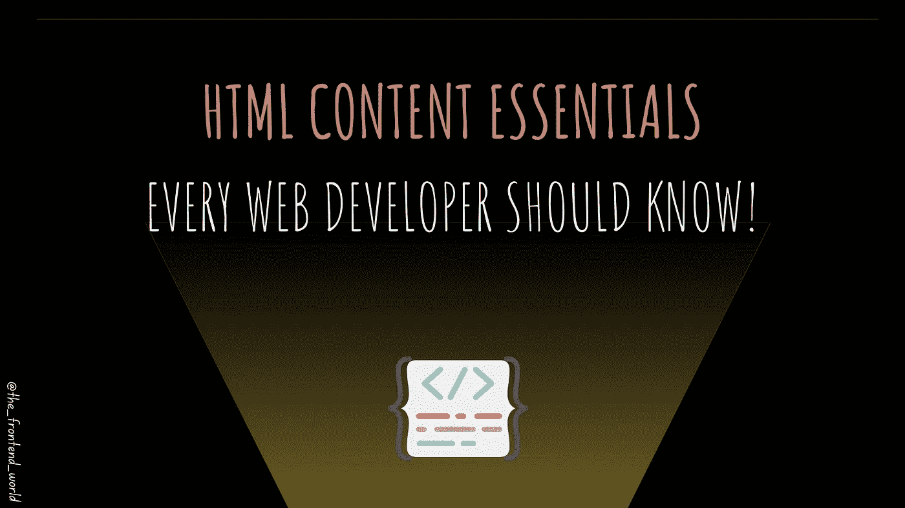

# 每个 web 开发者都应该知道的 HTML 内容要领！

> 原文：<https://medium.com/geekculture/html-content-essentials-that-every-web-developer-should-know-dcb8b8715125?source=collection_archive---------5----------------------->

## 有哪些必不可少的 HTML 标签？

By FAM

在了解了[每一个网页结构](https://javascript.plainenglish.io/the-foundation-of-any-web-page-78ebdcb6d874?source=your_stories_page----------------------------------------)及其支柱[(元素和属性)](https://levelup.gitconnected.com/what-are-elements-and-attributes-in-html-1cd709c3a418?source=your_stories_page----------------------------------------)之后，就到了它的内容支柱的时候了！

到目前为止，我们了解到: