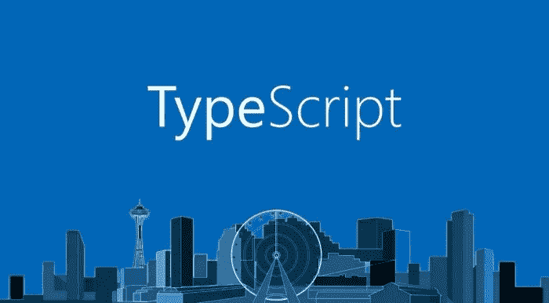

# TypeScript 中的 HTML 事件处理

> 原文：<https://medium.com/geekculture/html-event-handling-in-typescript-b9ca7178d912?source=collection_archive---------1----------------------->

TypeScript 是一种美丽的语言，与 JavaScript 相比，我个人更喜欢用它来编码。虽然有很多前端库和框架支持 TypeScript，但我最近尝试用纯 HTML 代码为一个项目编写 TypeScript 函数。我必须完成的一项任务是为一个元素编写一个事件处理函数。让我们来看看用 TypeScript 处理 HTML 事件。



Working with TypeScript

> [DOM 事件](https://developer.mozilla.org/en-US/docs/Web/API/Document_Object_Model/Events)被触发以通知代码可能影响代码执行的“有趣的变化”。

借用 [MDN Docs](https://developer.mozilla.org/en-US/docs/Web/Events) ，这个 DOM 事件的定义可能是最准确的。事件只是让我们知道 DOM 中发生了一些变化的一种方式。这允许我们使我们的网页互动，让他们对这些变化作出反应。让我们看看如何使用 TypeScript 编程语言来应对这些变化。

## 先决条件

这篇文章假设你知道如何使用 TypeScript 的基础知识。对我们的代码做了一些小的解释，但是没有详细说明。

此外，如果您已经安装了 Node.js 和 TypeScript，这将很有帮助。你可以试试网上的[打字稿游乐场](https://www.typescriptlang.org/play/index.html)。但是最好使用 Node.js 执行 TypeScript。

你可以参考以前的故事[迈向 TypeScript 的第一步](/@ruddha2001/first-step-towards-typescript-cb14e1b5728f)来学习如何开始使用 TypeScript。

## 创建简单的项目

我们今天的目标是学习事件处理程序是如何工作的。现在，要添加事件处理程序，我们有两个选择:

1.  使用 *addEventListener()*
2.  使用特定的 *onevent* 处理程序

这篇文章将讨论第一种方法，因为我总是觉得我们不应该在第一次学习某样东西的时候讨论具体的事情。

让我们写下一个简单的代码:

该代码将:

1.  通过 id“sample”获取元素
2.  添加一个监听“点击”事件的事件监听器
3.  将元素的背景颜色更改为“红色”

让我们更深入地研究一下代码。

## 理解代码如何工作

如果我们查找 *addEventListener* 的函数定义，我们会得到

```
(method) HTMLElement.addEventListener<K extends keyof HTMLElementEventMap>(type: K, listener: (this: HTMLElement, ev: HTMLElementEventMap[K]) => any, options?: boolean | AddEventListenerOptions | undefined): void (+1 overload)
```

我们看到第一个参数是*类型*，第二个参数是*监听器*。这个*监听器*本身就是一个函数，它接受一个 *HTMLElement* 和 *HTMLElementEventMap* 作为参数。

因此， *addEventListener("click "，listenerFunction)* 意味着我们希望侦听" click "事件(单次鼠标单击)，然后在遇到单击时执行 listenerFunction。很简单，对吧？

listenerFunction 是一个简单的函数，它接受两个参数， *this* 和 *ev，*分别具有“HTMLElement”和“Event”类型。因为我们得到了一个 HTMLElement，所以我们可以直接对它进行操作来改变我们想要的任何属性(在我们的例子中是改变背景颜色)。

我们在事件上使用 *"preventDefault()"* 来防止默认操作像通常一样发生。你可以在“未来”部分了解更多。

## 执行代码

现在让我们试着执行我们的代码。

**步骤 1:** 我们将使用一个非常简单的 HTML 文件来执行。

我们有一个单独的 *div* 元素，高度和宽度为 200px，背景颜色最初设置为蓝色。该元素的 id 为“sample”，我们的脚本将使用它来标识该元素。

我们还在 head 部分导入了我们的脚本，因为它非常小(您[不应该在 head](https://stackoverflow.com/questions/3531314/should-i-write-script-in-the-body-or-the-head-of-the-html) 中包含太多脚本)。我们正在执行 *initFunction()* 来将事件监听器附加到我们的 *div* 元素。

**Setp 2:** 但是等等？我们的文件在 TypeScript 中，但是我们正在导入一个 JavaScript 文件？嗯，我们只需要运行编译器！

```
npx tsc script.ts
```

这里， *npx* 确保了即使 TypeScript 没有被全局安装，我们也可以使用 *tsc* 来编译我们的文件。

现在一切都准备好了，我们只需要一台服务器。如果你在 Windows 上，你可以使用 IIS。像我这样的 Linux 用户会希望使用 nginx 或 apache。但是为了简单起见，我们将使用一个 VS 代码扩展， [Live Server](https://marketplace.visualstudio.com/items?itemName=ritwickdey.LiveServer) 。

安装完扩展后，按下键盘上的 *Alt + L* 和 *Alt + O* 。您的浏览器应该会打开一个显示蓝框的页面。


Initial state

点击蓝框，瞧！盒子现在是红色的。


After a single mouse button click

## 结论

这就结束了我们使用 TypeScript 处理事件的时间。只要正确地遵循参数的类型，附加事件侦听器并使用 TypeScript 中的元素是非常容易的。

除了 click 之外，您还可以添加任何事件。你可以在你的处理函数中加入任何逻辑，它会像热黄油切刀一样工作。您可以点击“未来”一节中的链接，了解有关各种主题的更多信息。

暂时，再见！

## 更远的前方

*   [各种事件类型| MDN](https://developer.mozilla.org/en-US/docs/Web/Events#event_listing)
*   [event . prevent default()| MDN](https://developer.mozilla.org/en-US/docs/Web/API/Event/preventDefault)
*   [event target . addevent listener()| MDN](https://developer.mozilla.org/en-US/docs/Web/API/EventTarget/addEventListener)