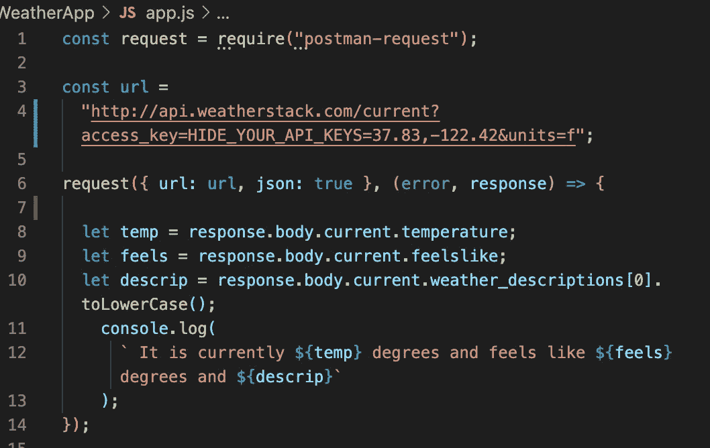

# Node.js 中的 HTTP 请求

> 原文：<https://medium.com/geekculture/http-requests-in-node-js-602903e3a54d?source=collection_archive---------48----------------------->

我一直在努力提高我的整体 JavaScript 知识，最近我一直在花时间学习 Node.js。为此，我一直在开发一个基本的天气应用程序。

与 API 通信是学习如何组织不同的请求并确定想要回哪些信息的好方法。为了使这个过程更容易，我安装了强烈推荐的 HTTP 客户机服务器 Request。

但是，从 2020 年 2 月 11 日起，请求 NPM 包已被弃用。令人欣慰的是，广受欢迎和信任的 API 测试服务 Postman 填补了这一空白，并修复了自弃用以来出现的任何错误。我之前写过一篇关于 Postman 和你可以用它做的一些事情的博客。

邮递员申请的[文档](https://www.npmjs.com/package/postman-request)强调了一些你可以使用他们的服务完成的更复杂的任务。

您可以使用 Request 发出各种 HTTP(s)请求，包括来自表单、定制头和 OAuth 签名的复杂 POST 请求。

为了简单起见，下面是一个简单的 GET 请求。

您可以看到，在请求本身中，我调用了 API 的 url，我将它赋给了一个名为 url 的变量。另一个友好的提醒隐藏您的 API 键！！不要在 GitHub 或其他地方公开它们。

我已经指定我希望信息以 JSON 形式返回，并且我已经为我希望返回的信息分配了几个变量，然后我在控制台语句中插入并返回这些变量。

我添加了 toLowerCase()，所以它以相同的格式返回。有些天气描述都是大写的，出于某种原因，我不喜欢大喊大叫。

这里我没有展示错误处理，但是一种方法是创建一个 if/else，例如，if(response . body . error)console . log(error)，else 返回上面显示的内容。

在 Postman 和 Request 的朋友的帮助下，这只是一个在 Node 中开始请求的好地方。