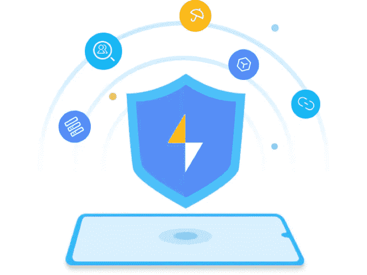

# 华为安全检测用户检测验证码验证 API 在 Laravel 验证规则

> 原文：<https://medium.com/geekculture/huawei-safety-detect-userdetect-captcha-verification-api-in-laravel-validation-rule-c60a4edf6102?source=collection_archive---------9----------------------->

使用 HMS 核心服务安全检测 SDK 保护来自 bot 的应用程序

# 什么是安全检测？

**安全检测**是 HMS 生态系统之一，为华为应用提供强大的安全功能和多种安全特性，同时不影响用户体验。有 5 个…