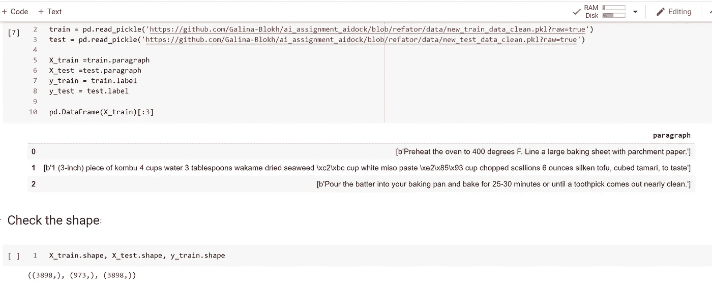
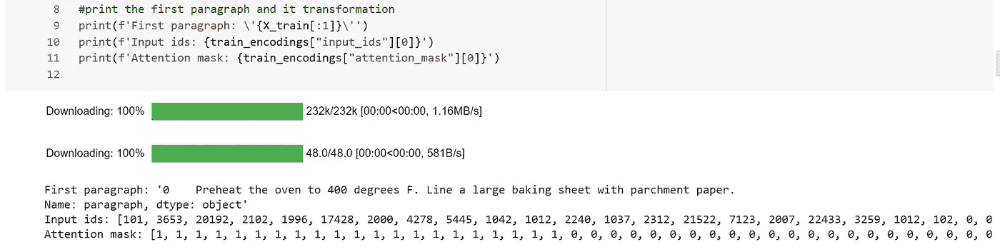

# 用于自定义文本分类的拥抱脸蒸馏和张量流。

> 原文：<https://medium.com/geekculture/hugging-face-distilbert-tensorflow-for-custom-text-classification-1ad4a49e26a7?source=collection_archive---------0----------------------->

## 逐步指南

## 如何通过 TensorFlow 的拥抱脸 API 微调文本二进制分类的 DistilBERT？


Photo by [Jason Leung](https://unsplash.com/@ninjason?utm_source=unsplash&utm_medium=referral&utm_content=creditCopyText) on [Unsplash](https://unsplash.com/s/photos/bookshelf?utm_source=unsplash&utm_medium=referral&utm_content=creditCopyText)

# 介绍。

在本教程中，您将看到一个使用[迁移学习](https://machinelearningmastery.com/transfer-learning-for-deep-learning/#:~:text=Transfer%20learning%20is%20a%20machine,model%20on%20a%20second%20task.)技术的二进制文本分类实现。为此，我们将使用 *DistilBert，一个来自拥抱脸*变形金刚*库的*预训练模型及其用于 *Tensorflow* 的 API。

# 为什么蒸馏。

> [更小、更快、更便宜、更轻:推出蒸馏版 DistilBERT。](/huggingface/distilbert-8cf3380435b5)

Medium 上的*拥抱脸*的评论文章标题给出了为什么我们应该在我们的任务中使用这个模型的完整解释。我们有一个小的数据集，这个模型可能是我们尝试的一个不错的首选。另外，[另一篇关于 Medium](https://towardsdatascience.com/bert-roberta-distilbert-xlnet-which-one-to-use-3d5ab82ba5f8) 的文章建议使用 *DistilBERT* 作为快速基线模型。 *DistilBERT* 可以在 *BERT* 的表现上达到一个合理的下限，具有训练更快的优势。这个 API 我们在一个写得非常好的 [*抱抱脸*文档](https://huggingface.co/transformers/master/model_doc/distilbert.html)和 [*Tensorflow* 博客](https://blog.tensorflow.org/2019/11/hugging-face-state-of-art-natural.html)。你会发现应用它是多么简单和直观。

> 一个更小的通用语言表示模型，称为 DistilBERT，它可以像它的更大对应物一样在广泛的任务上有良好的性能。

如果你还在犹豫从*抱脸*库中选择哪个模型，你可以用他们的[过滤器](https://huggingface.co/models?filter=en,tf&pipeline_tag=text-classification)按任务、库、语言等选择一个模型。 *DistilBERT* 是文本分类任务*列表中的第一个(*是[distil Bert-base-uncased](https://huggingface.co/distilbert-base-uncased)的一个微调检查点，在 SST-2 上微调)。所以我们选择了它——太好了！

# 对数据的回顾。

代码示例的数据来自我之前的项目。我从一个菜谱网站上收集的，拆分成训练集和测试集(拆分比例 0.2)。数据集包含一列源文本(你可以在这里阅读数据集[或查看这个](/codestory/nlp-text-pre-processing-and-feature-engineering-python-69338fa0372e)[笔记本](https://colab.research.google.com/drive/1YOZ60sdOjSbIiB3IiJVUYprQhJDEVxXB?usp=sharing))。还有一个带标签的列*。***业务目标**是确定每段的标签是*“配料”*还是*“配方说明”。*

让我们安装、导入库，并为模型的超参数定义常数:

```
!pip install transformersimport pandas as pd
import tensorflow as tf
import transformers
from transformers import DistilBertTokenizer
from transformers import TFDistilBertForSequenceClassificationpd.set_option('display.max_colwidth', None)
MODEL_NAME = 'distilbert-base-uncased-finetuned-sst-2-english'
BATCH_SIZE = 16
N_EPOCHS = 3
```

目前，我们只对“段落”和“标签”列感兴趣。看下图(图 1):“段落”中的文本是一个源文本，而且是用字节表示的。在 X_train 集合中，我们有 3898 行，X_test 集合有 973 行。在这些集合中没有 NaNs 或空字符串。



Pic.1 Load Train and Test data sets, a sample from X_train, shape check.

如果段落是“配方成分”，目标变量是“1”，如果是“说明”，目标变量是“0”。标签的比例大约是 20% 1 和 80% 0。现在，让我们进入下一步。

# 准备数据作为模型输入。

在文本成为模型输入之前，首先，我们应该对它进行标记化。[*distilbertokenizer*](https://huggingface.co/transformers/model_doc/distilbert.html#distilberttokenizer)接受“str”(单个示例)、“List[str]”(批量或单个预标记示例)或“List[List[str]]”(批量预标记示例)类型的文本。因此，我们需要将字节表示转换成字符串。Lambda 函数是一个很好的解决方案。

```
X_train = X_train.apply(lambda x: str(x[0], 'utf-8'))
X_test = X_test.apply(lambda x:  str(x[0], 'utf-8'))
```

DistilBERT 中最大支持的标记化句子长度是 512 个单词。

```
*#define a tokenizer object* tokenizer = DistilBertTokenizer.from_pretrained(MODEL_NAME)#tokenize the text
train_encodings = tokenizer(list(X_train.values),
                            truncation=True, 
                            padding=True)test_encodings = tokenizer(list(X_test.values),
                           truncation=True, 
                           padding=True)
```

我们传递给记号赋予器的参数 hold:我们的 set in "list[str]"表示，truncation=True，padding=True。如果标记化句子长度小于最大模型输入长度，标记化器将其截断到标记化句子最大长度。如果标记化的句子长度小于最大标记化的句子长度，标记化器用零填充，直到最大标记化的句子长度。在下图中，您可以看到结果示例:



Pic2\. An example of tokenized sentece by DistilBertTokenizer.

DistilBertTokenizer 引用超类`[**BertTokenizer**](https://huggingface.co/transformers/model_doc/bert.html#transformers.BertTokenizer)**.**`，它返回给我们一组输入[索引](https://huggingface.co/transformers/glossary.html#input-ids)和[注意屏蔽](https://huggingface.co/transformers/glossary.html#attention-mask)。现在，我们只需要将标签和编码转换成 Tensorflow 数据集对象:

```
train_dataset = 
tf.data.Dataset.from_tensor_slices((dict(train_encodings),
                                    list(y_train.values)))
test_dataset = 
tf.data.Dataset.from_tensor_slices((dict(test_encodings),
                                    list(y_test.values)))
```

# 使用 native TensorFlow 进行微调。

在下一步中，我们采用 TFDistilBertForSequenceClassification，并将模型的名称作为参数。设置学习率并定义损失函数。编译模型并运行 model.fit()方法进行训练。

```
model = TFDistilBertForSequenceClassification.from_pretrained(MODEL_NAME)*#chose the optimizer* optimizerr = tf.keras.optimizers.Adam(learning_rate=5e-5)*#define the loss function* losss = tf.keras.losses.SparseCategoricalCrossentropy(from_logits=True)#build the model
model.compile(optimizer=optimizerr,
              loss=losss,
              metrics=['accuracy'])# train the model 
model.fit(train_dataset.shuffle(len(X_train)).batch(BATCH_SIZE),
          epochs=N_EPOCHS,
          batch_size=BATCH_SIZE)
```

下面你可以看到我们的模型有多精确。在第二个时期，我们已经获得了 100%的准确度:

```
>>> Epoch 1/3
>>> 244/244 [==============================] - 131s 374ms/step - 
>>> loss: 0.1468 - accuracy: 0.9568
>>> Epoch 2/3
>>> 244/244 [==============================] - 95s 388ms/step - 
>>> loss: 3.1370e-04 - accuracy: 1.0000
>>> Epoch 3/3
>>> 244/244 [==============================] - 97s 396ms/step -
>>> loss: 5.7763e-05 - accuracy: 1.0000
```

# 模型评估。

Tensorflow 的拥抱脸 API 对任何数据科学家方法都具有直观性。让我们在测试集上评估模型，并在新数据出现之前进行评估:

```
*# model evaluation on the test set* model.evaluate(test_dataset.shuffle(len(X_test)).batch(BATCH_SIZE), 
               return_dict=True, 
               batch_size=BATCH_SIZE) >>> 61/61 [==============================] - 10s 147ms/step - 
>>> loss: 1.7124e-05 - accuracy: 1.0000
>>> {'accuracy': 1.0, 'loss': 1.7123966244980693e-05}
```

我们得到了相当好的结果！现在，对于其他文本段落的模型估计，我们创建一个函数来查看每个类别的预测概率(以查看我们的模型在预测中有多确定):

```
def predict_proba(text_list, model, tokenizer):   *#tokenize the text* encodings = tokenizer(text_list, 
                          max_length=MAX_LEN, 
                          truncation=True, 
                          padding=True)
 *#transform to tf.Dataset*    dataset = tf.data.Dataset.from_tensor_slices((dict(encodings))) #predict
    preds = model.predict(dataset.batch(1)).logits  

    #transform to array with probabilities
    res = tf.nn.softmax(preds, axis=1).numpy()      

    return res
```

我们这里取一个. txt 文件。这个文件包含 10 个食谱页面的 10 个 URL。我们的模型还没有看到来自它们的文本数据。假设您从第一个 [URL](https://www.loveandlemons.com/green-bean-salad-recipe/) 获取数据。您输入到预测模型中的字符串列表将类似于下面的单元格。(*第一串是配料，后面三串是说明):

```
strings_list =["""
                  1 pound green beans, trimmed
                  ½ head radicchio, sliced into strips
                  Scant ¼ cup thinly sliced red onion
                  Honey Mustard Dressing, for drizzling
                  2 ounces goat cheese
                  2 tablespoons chopped walnuts
                  2 tablespoons sliced almonds
                  ¼ cup tarragon
                  Flaky sea salt""", """Bring a large pot of salted water to a boil and                  set a bowl of ice water nearby. Drop the green beans into the boiling water and blanch for 2 minutes. Remove the beans and immediately immerse in the ice water long enough to cool completely, about 15 seconds. Drain and place on paper towels to dry. """, """Transfer the beans to a bowl and toss with the radicchio, onion, and a few spoonfuls of the dressing.""", """Arrange on a platter and top with small dollops of goat cheese, the walnuts, almonds, and tarragon. Drizzle with more dressing, season to taste with flaky salt, and serve."""]
```

当您为新数据调用 predict_proba()函数时，结果将是一个形状为(4，2)的 NumPy 数组。四个 n 数组(每个段落一个)，具有两个概率值(对于类 0 和类 1):

```
predict_proba(string1, model, tokenizer)>>> array([
>>> [1.63417135e-05, 9.99983668e-01],
>>> [9.99986053e-01, 1.39580325e-05],
>>> [9.99986053e-01, 1.39833473e-05],        
>>> [9.99988914e-01, 1.11078716e-05]], dtype=float32)
```

该模型的预测非常准确。

# 结论。

在本文中，您了解了如何在带有自定义小文本数据的二进制分类任务中，对 DistilBert(来自 Hugging Face Transformers 库的预训练模型)及其 tensor flow API 进行微调。

*本文的*[*Google collab*](https://colab.research.google.com/drive/14PtqRbrGa70M5NJnLfSllyJYyvl1nYnK?usp=sharing)*笔记本。*

*一个* [*抱脸文档页面*](https://huggingface.co/transformers/master/community.html#community-notebooks) *，其中重新组合了各地的资源🤗社区开发的变形金刚*。