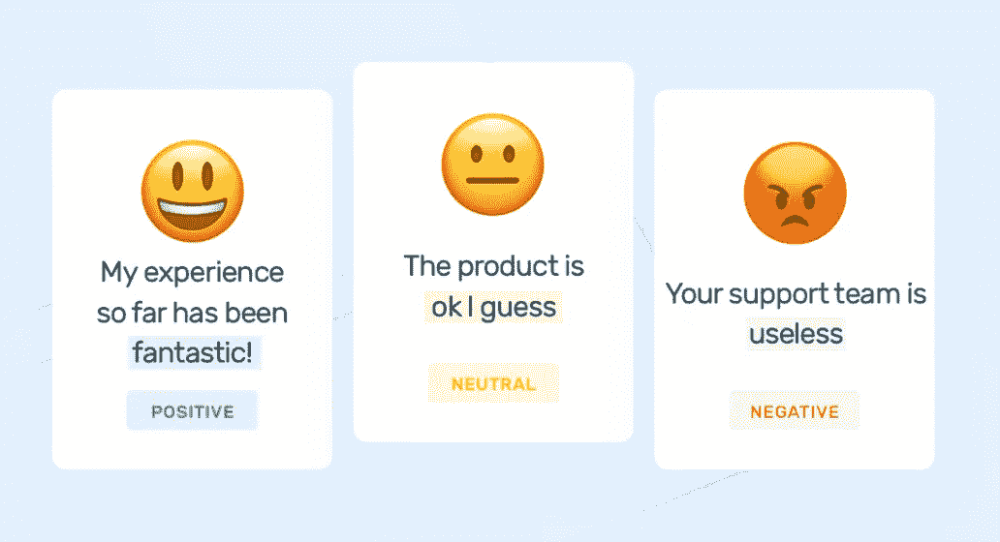
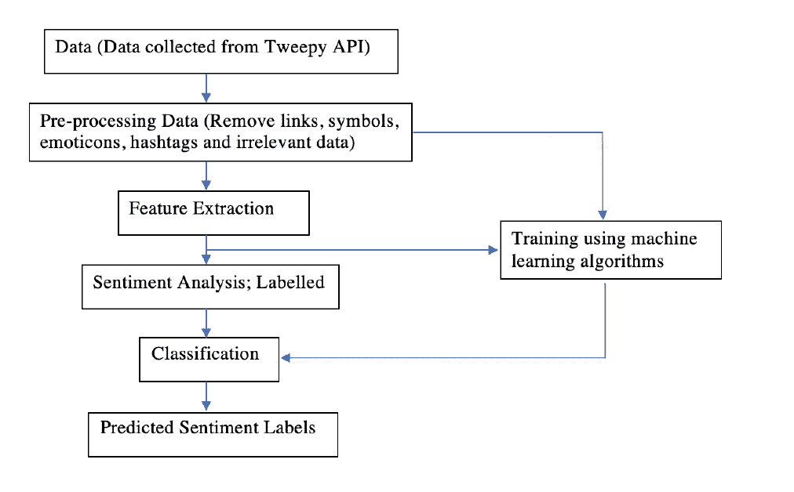
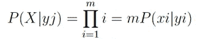
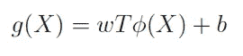
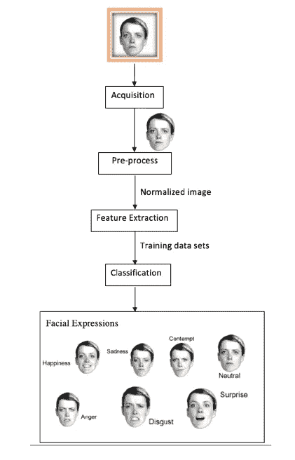

# 用于情感感知深度学习模型的通过面部表情和情感分析的人类情感识别

> 原文：<https://medium.com/geekculture/human-emotions-recognition-through-facial-expressions-and-sentiment-analysis-for-emotionally-aware-4a41d7f8b80e?source=collection_archive---------26----------------------->

情绪经常调解和促进人类之间的互动。因此，理解情绪通常会给看似怪异和/或复杂的社会交流带来背景。情绪识别可以通过各种方法来识别，如语音语调和肢体语言，也可以通过更复杂的手段，如脑电图。最可行和简单的方法仍然是观察面部表情。人类的七种基本情绪是快乐、恐惧、愤怒、悲伤、惊讶、鄙视和厌恶，这些情绪在世界各地的任何社会或文化群体中都很常见。当考虑这些事实时，可以看出人类的情绪对行动和对情况的反应有巨大的影响。

在开发像情绪感知深度学习模型这样的人工智能模型时，对情绪的识别对于为用户提供适当的响应非常重要。下图简单描述了根据用户情绪提供响应的重要性。

本文讨论了两种识别情感的方法(情感分析和人脸表情识别)。

## 情感分析

情感分析是 NLP 一个子领域，它试图提取给定文本的主观观点。情感分析跨越识别文本情感、意图和讽刺。简单地说，这给一个给定的文本分配极性。例如，句子“M&M 是我尝过的最糟糕的冰淇淋之一”，包含负极性。情感阶段是“最糟糕的冰淇淋”，并针对情感目标“M&M”。“运动鞋和火星明天将发布他们最新的巧克力口味”，这是一个关于运动鞋和火星的事实句子，因此它包含一个中性的上下文。“运动鞋冰淇淋成为去年最受欢迎和最畅销的冰淇淋”，有正面评价，因为它有“最受欢迎”和“最畅销”等词指运动鞋。

## 情感分析的挑战

人类语言包含某些传统上与语言相关的微妙之处，提取某一阶段的准确情感是一项具有挑战性的任务。

否定处理:——例如:——“你的办公室工作怎么样？不算太差！不过，我对最近的加薪不太满意。。. "虽然第一句包含中性极性，第二句包含积极的意见，但同时它有“太坏了”，这原本是一个消极的阶段。第三句话有一个否定的上下文，但包含了原本有肯定意见的“超级开心”。

讽刺:“这正是我今天需要的。。。太好了！”不考虑“棒极了”这个表达，这句话很可能是在讽刺，包含了一个负极性。

比较:——例如:——“我喜欢运动鞋和新的冰淇淋，它们比 M&M 的好得多”虽然“喜欢”和“好得多”有积极的一面，但在 M&M 看来，这不是一个好的说法。

上述所有例子都需要理解整个上下文的意思以及单词的意思。使用情感分析算法时，准确性和速度之间的权衡是一个必须面对的实际挑战。朴素贝叶斯、支持向量机和逻辑回归是一些被广泛用于大规模情感分析的传统 ML 技术，因为它们具有很好的扩展性。已经证明，DL 策略可以在各种 NLP 任务(如情感分析)中实现更高水平的准确性，但是它们的训练成本更高，并且通常更慢。

缺乏可用的人工注释数据导致了 NLP 任务的局限性。最近，twitter 作为一个微博平台在世界范围内获得了很高的人气。一些组织通过使用从 Tweepy API 收集的 Tweepy 进行数据挖掘研究。

## 情感分析方法

基于规则的系统和机器学习系统是情感分析的两种主要方法。

**基于规则的系统**

在基于规则的系统中，存在代表特定观点的极化术语和表达的预定义数据集。作为一个例子，这个预定义的数据集可以包含诸如“快乐”、“有趣”、“好”、“漂亮”的正面词列表和诸如“悲伤”、“糟糕”、“最糟糕”的负面词列表。然后，对于给定的相位，计算正项和负项的数量。基于规则的系统根据该计数定义句子的最终极性。如果句子包含肯定列表中较高数量的术语，则认为是肯定意见，反之亦然。

**机器学习系统**

对于机器学习系统，需要有一个训练数据集。该数据集包含具有不同表达方式的示例，如阳性、阴性和中性等。ML 算法用于这种技术。因为 ML 算法不直接理解文本，所以示例阶段被转换成向量。接下来，这些向量被用于通过朴素贝叶斯和 SVM 等算法来训练模型。然后，通过将文本转换成向量并将其馈送给分类器，使用训练好的模型来预测新句子的情感。这将返回包含该特定句子的表达式的标签。

**ML 系统情感分析阶段**

使用 twitter 数据集作为训练数据集具有可扩展性、实时分析和一致性标准等优点。下图是情感训练和预测的流程图。

Flow Chart of Sentiment Analysis Process

**数据采集**

Twitter 数据集可用于训练 ML 模型，并对测试数据运行实际的情感分析。twitter 数据主要有两种类型，即当前推文和历史推文。当前推文有助于跟踪最新的关键词和标签。这有助于用实时数据更新模型。而历史数据有助于训练具有大量阶段的模型。可以使用 twitter API、Tweepy API 等 API 和 Zapier、IFTTT、导出 Tweet、Tweet Download 等工具从 Twitter 中提取数据。

**数据预处理**

情感分析结果的可靠性主要取决于数据的质量。因此，需要清理数据。在预处理阶段，像符号、表情符号、标签、多余的空格、特殊字符等不相关的信息被删除。预处理还包括删除少于三个字符的 tweet 和删除重复的 tweet。

**特征提取**

在特征提取阶段，文本被转换成向量。这是通过使用表示给定文本的频率的维度向量来实现的。

=> ML 方法

机器学习分类包括监督学习和非监督学习两大类。标记的数据集被输入到模型中，并在监督学习中进行训练，而非监督学习根本没有提供任何目标或类别。下面描述了 ML 方法中使用的几个分类器，

朴素贝叶斯分类器

朴素贝叶斯分类器使用在特征向量中使用的大量特征。这些特征是独立的。朴素贝叶斯条件概率数学表示如下:

“X”代表由 X=x1，x2，…表示的特征向量。xm 和“yj”代表类别标签。独立特征分类使用朴素贝叶斯分类器进行有效分类。

(b) SVM(支持向量机分类器)

SVM 利用巨大的差距进行分类。以下功能用于 SVM、

“X”代表特征向量，“w”代表权重向量，“b”代表偏差向量。信息空间转换到高维特征空间的⏀denotes 非线性映射。

= >基于词典的方法

基于词典的方法是将文本消息的组块表示为单词包。对于这种表示，情感值被标记。像 average 或 sum 这样的函数用于识别最终的情感。在识别最终情感时，消息的本地上下文也被考虑在内。

## 人脸表情识别

可以通过分析诸如身体运动、声音、面部和其他生物信号之类的身体特征来收集对用户情绪的识别。从这些方法中，最可行、最有效的获取情感的物理特征是人脸。虽然人类可以毫不费力地理解情感，但计算机需要像 FER(面部表情识别)这样的技术。

自然语言处理中基于模式的识别是人脸识别和情感识别的基础。采集、预处理、特征提取和情感分类是 FER 的主要阶段。从输入图像中识别面部区域，并且在检测图像中的面部之后检测像鼻子、眼睛和嘴这样的标志。然后提取特征并分类以识别情感。

## FER 的主要阶段

**采集**

使用人脸定位过程来确定图像中的人脸。图像的位置和大小也通过使用人脸定位来捕捉。换句话说，就是划定脸部区域的过程。根据区别特征的使用，策略的分类被用于本地化。面部边缘用于整个面部限定。此外，人脸纹理的细节也用于定位。皮肤肤色具有独特的特征，并且肤色的信息经常用于定位，因为它在颜色空间中是独立突出的。

**预处理**

预处理的目的是为下一步处理增强图像的特征，并抑制不利的失真。预处理的主要阶段包括读取图像、图像大小的归一化、去除噪声(去噪)、分割和形态学(平滑边缘)。

**提取**

特征提取是从图像中捕获关键数据，如向量、符号和值。特征提取技术取决于应用环境和分类方法。局部二值模式(LBP)、Gabor 特征提取、Haar-like 特征提取、特征点跟踪和光流法等。当选择适当的特征提取方法时，需要考虑应用特定方法的适用性和可行性，因为这可能直接控制算法的性能，而算法的性能是 FER 应用的瓶颈。

**分类**

进行分类以识别图像的面部表情。选择合适的分类器对 FER 系统捕捉情感的准确性有重要影响。支持向量机(SVM)、贝叶斯、k 近邻(kNN)、概率神经网络(PNN)和基于稀疏表示的分类器(SRC)是 FER 应用中广泛使用的一些分类器。与其他深度学习方法相比，FER 方法相对较少依赖于硬件和数据，但是特征提取和分类不能同时优化。因此，需要将它们分开设计。FER 结果的准确性，取决于每个阶段的性能和准确性。

如上所述，SA 和 FER 方法可以用于识别与系统交互的用户的情绪，以便在像情绪感知深度学习模型这样的 AI 模型中更好地创建响应。这些方法仍然存在限制和不确定性。处理时间是不被评估的，它在 FER 是非常重要的。情绪可能急剧变化，并且如果 FER 技术花费更多的处理时间，则呈现的结果不是实时的，并且可能被认为是低准确度的结果。

此外，SA 只为英语开发，重要的是在其他母语上也有 SA，以表明机器具有情感智能。此外，在多语言阶段捕获情感的技术尚未开发，这些是研究空白，使得计算机人类对话交互限于英语和单语。