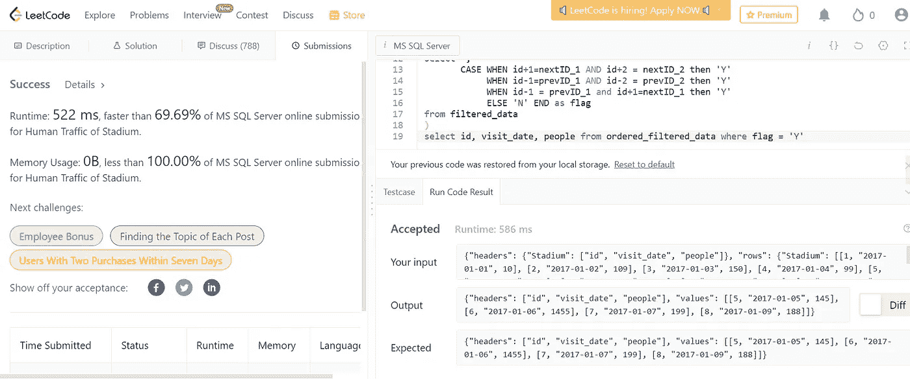

# 体育场的人流量:LeetCode

> 原文：<https://medium.com/geekculture/human-traffic-of-stadium-leetcode-beccaa98c83b?source=collection_archive---------1----------------------->

难度:难


Photo by [Caspar Camille Rubin](https://unsplash.com/@casparrubin?utm_source=medium&utm_medium=referral) on [Unsplash](https://unsplash.com?utm_source=medium&utm_medium=referral)

[***问题陈述:***](https://leetcode.com/problems/human-traffic-of-stadium/submissions/) 写一条 SQL 查询，显示三行或三行以上连续**`id`的记录，每一行人数大于等于 100。**

**按**升序**返回按`visit_date`排序的结果表。**

****输入:****

```
+---------------+---------+
| Column Name   | Type    |
+---------------+---------+
| id            | int     |
| visit_date    | date    |
| people        | int     |
+---------------+---------+
visit_date is the primary key for this table.
Each row of this table contains the visit date and visit id to the stadium with the number of people during the visit.
No two rows will have the same visit_date, and as the id increases, the dates increase as well.
```

****示例:****

```
**Input:** 
Stadium table:
+------+------------+-----------+
| id   | visit_date | people    |
+------+------------+-----------+
| 1    | 2017-01-01 | 10        |
| 2    | 2017-01-02 | 109       |
| 3    | 2017-01-03 | 150       |
| 4    | 2017-01-04 | 99        |
| 5    | 2017-01-05 | 145       |
| 6    | 2017-01-06 | 1455      |
| 7    | 2017-01-07 | 199       |
| 8    | 2017-01-09 | 188       |
+------+------------+-----------+
**Output:** 
+------+------------+-----------+
| id   | visit_date | people    |
+------+------------+-----------+
| 5    | 2017-01-05 | 145       |
| 6    | 2017-01-06 | 1455      |
| 7    | 2017-01-07 | 199       |
| 8    | 2017-01-09 | 188       |
+------+------------+-----------+
**Explanation:** 
The four rows with ids 5, 6, 7, and 8 have consecutive ids and each of them has >= 100 people attended. Note that row 8 was included even though the visit_date was not the next day after row 7.
The rows with ids 2 and 3 are not included because we need at least three consecutive ids.
```

# **解决方案:-**

****步骤 1 :** 我们将使用 WINDOW()函数来获取前向和后向值。**

**我们需要 LAG()和 LEAD()以及 used 过滤条件，这样我们就可以在人数大于 100 时获取连续的 id。**

```
with cte as (
select id, 
       visit_date, 
       people, 
       LAG(id,1) OVER(order by id) as prevID_1, 
       LAG(id,2) OVER(order by id) as prevID_2,
       LEAD(id,1) OVER(order by id) as nextID_1, 
       LEAD(id,2) OVER(order by id) as nextID_2
from Stadium 
where people>=100
)
```

****步骤 2 :** 使用 CASE 条件来分隔 3 个连续序列中的第一行、中间行和最后一行。**

**当 id+1=nextID_1 且 id+2 = nextID_2 ->第一行
当 id-1=prevID_1 且 id-2 = prevID_2 - >最后一行
当 id-1 = prevID_1 且 id+1=nextID_1 - >中间一行**

```
,cte2 as (
select *, 
       CASE WHEN id+1=nextID_1 AND id+2 = nextID_2 then 'Y' 
            WHEN id-1=prevID_1 AND id-2 = prevID_2 then 'Y' 
            WHEN id-1 = prevID_1 and id+1=nextID_1 then 'Y'
            ELSE 'N' END as flag
from cte
)
```

**步骤 3 : 现在合并两个 cte**

```
with filtered_data as (
select id, 
       visit_date, 
       people, 
       LAG(id,1) OVER(order by id) as prevID_1, 
       LAG(id,2) OVER(order by id) as prevID_2,
       LEAD(id,1) OVER(order by id) as nextID_1, 
       LEAD(id,2) OVER(order by id) as nextID_2
from Stadium 
where people>=100
), ordered_filtered_data as (
select *, 
       CASE WHEN id+1=nextID_1 AND id+2 = nextID_2 then 'Y' 
            WHEN id-1=prevID_1 AND id-2 = prevID_2 then 'Y' 
            WHEN id-1 = prevID_1 and id+1=nextID_1 then 'Y'
            ELSE 'N' END as flag
from filtered_data
)
select id, visit_date, people from ordered_filtered_data where flag = 'Y'
```

**[*查看此链接获取完整代码*](https://github.com/shefalibisht00/Leetcode/blob/main/601-human-traffic-of-stadium/601-human-traffic-of-stadium.sql) *..***

****LeetCode 问题输出:****

****

**如果你觉得这篇文章很有帮助，请与你的朋友和同事分享。如果还有其他问题，可以上[*Linkedin*](https://www.linkedin.com/in/shefali-bisht/)*找我。***