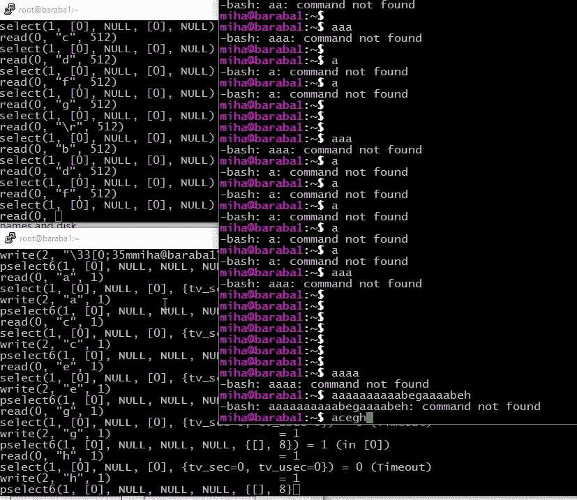

# 追捕吃击键 SSH 会话的神秘案例

> 原文：<https://medium.com/geekculture/hunting-down-the-mysterious-case-of-keystroke-eating-ssh-sessions-3ae7a9350200?source=collection_archive---------26----------------------->



Debugging SSH session with strace.

几周前，我的同事通知我，他在家里工作时，与其中一台服务器的 SSH 会话出现了问题。他解释说，当他用 Putty 连接到服务器时，他必须按几次字母才能在终端中显示出来。狩猎开始了。

# 核实事实

他连接的服务器是 CentOS 8。他使用 LTE 调制解调器连接，并使用 DirectAccess 连接到公司网络。他的连接有点慢且不稳定，但对于 RDP 和微软团队的会议来说已经足够了。这只发生在 Putty 上(检查版本 0.71、0.73、0.74)，而来自 Cygwin 或 cmd 的 ssh 工作得很好。

# 假设#1 —网络相关问题

过去，我们在 LTE 连接方面遇到过问题(MTU 大小、会话掉线……)，所以我检查了一下，看看是不是 LTE 的问题。我通过有线 LTE 连接将笔记本电脑和智能手机连接起来，确实遇到了同样的问题——按键丢失。我还尝试通过公司的 WiFi 和 LAN(没有 DirectAccess)连接到同一台服务器，我得到了相同的结果——击键丢失。我以前在使用 CentOS 8 服务器时没有遇到过这个问题，但我最近也没有使用它。

但是问题并不是一直存在的。它来来去去，或者看起来是这样。在 DirectAccess 上，它出现得更频繁。

# 被遗忘的事实

然后我开始检查服务器上的网络设置:两个网络设备连接到 802.3ad `bond0`和`layer2`哈希。这应该不会引起任何问题。

```
Bonding Mode: IEEE 802.3ad Dynamic link aggregation
Transmit Hash Policy: **layer2** (0)
MII Status: up
MII Polling Interval (ms): 1
Up Delay (ms): 0
Down Delay (ms): 0
...
```

# 假设#2 —端到端数据包路径上的问题

要检查两端的数据包，可以在 Windows 客户机上使用 Wireshark，在服务器上使用 tcpdump。

在服务器上，我运行 tcpdump，我可以看到流量。但这只是一半的流量，只是一个方向。当时我对 tcpdump 一无所知，所以我寻求帮助。事实证明，tcpdump 只抓取它发现的第一个接口的流量。我不得不加上`-i bond0`。现在，我可以看到双向的数据包。

在客户端，我只有一些奇怪的 TLSv1.2 流量，没有 SSH 流量。嗯……这肯定是 DirectAccess (IP-HTTPS 隧道)。我在这里看不到任何东西，因为“所有东西”在到达 npcap 拦截流量的接口之前都进入了隧道。我还发现了微软的网络监视器，这是一个非常好的工具，但同样，它不能在 IP-HTTPS 隧道吸收它们之前得到数据包(没有双关语)。

在被 IP-HTTPS 吃掉之前，在 VirtualBox 中运行一个 Windows 10 的实例并在那里捕获 ttaffic 怎么样？但是看起来这是不可能的，因为 VirtualBox 只部分支持 IPv6。

# 新希望

但我很幸运，击键掉落在 WiFi 上持续发生。这意味着没有直接访问，所以我终于可以用 Wireshark 嗅探数据包，但一切似乎都很好。因为我想做更多不同的包，我试图在 Windows 和 Centos 上得到相同的格式。所以我也在 Centos 上运行了 Wireshark 来比较数据包。

然后我找到了 tcpdump for Windows 的试用版，我终于可以做一些不同的和更仔细的检查。我所看到的是数据包从端到端传输没有任何问题。

有些事情我确实注意到了，但当时并不理解:

*   CRC 校验和仅用于装饰，以防实际的校验和计算被卸载到网络接口，
*   可以在末尾添加一些字节进行填充，但可以安全地忽略。

除此之外，这些包裹看起来都很好，在运送途中也没有发生什么可怕的事情。不同之处被标记为 ***粗体和斜体*** (我更喜欢一些颜色，但 medium.com 在这个简单的编辑器中不允许)。

传输击键时客户端捕获正常—客户端:

```
11:10:25.461774 IP 172.17.9.120.53014 > 10.122.12.185.22: Flags [P.], seq 836074285:836074349, ack 725649935, win 2052, length 64
0x0000:  4500 0068 7372 4000 ***80***06 ***0000***ac11 0978 # TTL and checksum
0x0010:  0a7a 0cb9 cf16 0016 31d5 7b2d 2b40 8a0f
0x0020:  5018 0804 ***cd16*** 0000 09f1 28f1 f9cf 79e9 # checksum
0x0030:  987d c52c c645 22d2 fdf1 5047 a68d 6aab
0x0040:  70f1 6d58 b6d5 975e e019 858c 7394 f368
0x0050:  8b29 cabd 3d86 8d58 40ae 9968 c794 1e52
0x0060:  ea0e f537 de51 c27d
```

服务器端的相同数据包:

```
12:10:25.448598 IP 172.17.9.120.53014 > 10.122.12.185.ssh: Flags [P.], seq 836074285:836074349, ack 725649935, win 2052, length 64
0x0000:  4500 0068 7372 4000 ***7b***06 ***bf61*** ac11 0978 # TTL and checksum
0x0010:  0a7a 0cb9 cf16 0016 31d5 7b2d 2b40 8a0f
0x0020:  5018 0804 ***0281*** 0000 09f1 28f1 f9cf 79e9 # checksum
0x0030:  987d c52c c645 22d2 fdf1 5047 a68d 6aab
0x0040:  70f1 6d58 b6d5 975e e019 858c 7394 f368
0x0050:  8b29 cabd 3d86 8d58 40ae 9968 c794 1e52
0x0060:  ea0e f537 de51 c27d
```

来自服务器的 ACK 服务器端:

```
12:10:25.448625 IP 10.122.12.185.ssh > 172.17.9.120.53014: Flags [.], ack 64, win 406, length 0
0x0000:  4548 0028 41e0 4000 4006 2bec 0a7a 0cb9
0x0010:  ac11 0978 0016 cf16 2b40 8a0f 31d5 7b6d
0x0020:  5010 0196 ***ccd6*** 0000
```

在客户端:

```
11:10:25.463026 IP 10.122.12.185.22 > 172.17.9.120.53014: Flags [.], ack 64, win 406, length 0
0x0000:  4548 0028 41e0 4000 3c06 2fec 0a7a 0cb9
0x0010:  ac11 0978 0016 cf16 2b40 8a0f 31d5 7b6d
0x0020:  5010 0196 ***afc3*** 0000 ***0000 0000 0000*** (ACK packet gets another 6 bytes)
```

TTL 再次降低，校验和不匹配，因为计算被卸载到网卡。我们在目的地看到额外的 6 个字节，但它们只是表示填充，可以忽略。

然后服务器用 SSH 数据包响应，客户端用 ACK 响应。服务器端捕获这两个数据包:

```
12:10:25.448879 IP 10.122.12.185.ssh > 172.17.9.120.53014: Flags [P.], seq 1:65, ack 64, win 406, length 64
0x0000:  4548 0068 41e1 4000 ***40***06 ***2bab*** 0a7a 0cb9
0x0010:  ac11 0978 0016 cf16 2b40 8a0f 31d5 7b6d
0x0020:  5018 0196 ***cd16*** 0000 c917 80ed e033 4956
0x0030:  36cd af86 a407 67bc 226a 7f55 21a2 2341
0x0040:  b0ef 1157 0163 46c0 1f70 ebbc 10dd 5d23
0x0050:  5b00 9d9f f68f 1efa 81a4 9d65 997f 6348
0x0060:  235d 2bb5 a95a a0af
12:10:25.503202 IP 172.17.9.120.53014 > 10.122.12.185.ssh: Flags [.], ack 65, win 2051, length 0
0x0000:  4500 0028 7374 4000 7b06 bf9f ac11 0978
0x0010:  0a7a 0cb9 cf16 0016 31d5 7b6d 2b40 8a4f
0x0020:  5010 0803 ***a916*** 0000 ***0000 6d85 99ab*** 
```

客户端捕获:

```
11:10:25.463026 IP 10.122.12.185.22 > 172.17.9.120.53014: Flags [P.], seq 1:65, ack 64, win 406, length 64
0x0000:  4548 0068 41e1 4000 ***3c***06 ***2fab*** 0a7a 0cb9
0x0010:  ac11 0978 0016 cf16 2b40 8a0f 31d5 7b6d
0x0020:  5018 0196 ***1c81*** 0000 c917 80ed e033 4956
0x0030:  36cd af86 a407 67bc 226a 7f55 21a2 2341
0x0040:  b0ef 1157 0163 46c0 1f70 ebbc 10dd 5d23
0x0050:  5b00 9d9f f68f 1efa 81a4 9d65 997f 6348
0x0060:  235d 2bb5 a95a a0af
11:10:25.516565 IP 172.17.9.120.53014 > 10.122.12.185.22: Flags [.], ack 65, win 2051, length 0
0x0000:  4500 0028 7374 4000 8006 0000 ac11 0978
0x0010:  0a7a 0cb9 cf16 0016 31d5 7b6d 2b40 8a4f
0x0020:  5010 0803 ***ccd6*** 0000
```

数据包再次按照预期通过网络。客户端和服务器的时间相差一个小时(时区之类的)。

## “丢失击键”数据包流

击键未返回时客户端的数据包捕获:

```
11:01:18.689650 IP 172.17.9.120.53014 > 10.122.12.185.22: Flags [P.], seq 836072861:836072925, ack 725648239, win 2050, length 64
0x0000:  4500 0068 7359 4000 ***80***06 ***0000*** ac11 0978
0x0010:  0a7a 0cb9 cf16 0016 31d5 759d 2b40 836f
0x0020:  5018 0802 ***cd16*** 0000 59f4 bbcf ada8 46a9
0x0030:  e4b2 5b5e 1895 a84e d4f5 7228 22da e8cc
0x0040:  4858 bc85 3582 5754 14f9 ebf0 b153 edd4
0x0050:  59a9 9e64 0514 03d6 7fe3 2270 22d3 eb4a
0x0060:  fa37 4a90 6fbc b902
11:01:18.730792 IP 10.122.12.185.22 > 172.17.9.120.53014: Flags [.], ack 64, win 383, length 0
0x0000:  4548 0028 41d5 4000 ***3c***06 ***2ff7*** 0a7a 0cb9
0x0010:  ac11 0978 0016 cf16 2b40 836f 31d5 75dd
0x0020:  5010 017f ***bc0a*** 0000 ***0000 0000 0000*** 
```

…并在击键未返回时在服务器端捕获:

```
12:01:18.676514 IP 172.17.9.120.53014 > 10.122.12.185.ssh: Flags [P.], seq 836072861:836072925, ack 725648239, win 2050, length 64
0x0000:  4500 0068 7359 4000 ***7b***06 ***bf7a*** ac11 0978
0x0010:  0a7a 0cb9 cf16 0016 31d5 759d 2b40 836f
0x0020:  5018 0802 ***06f7*** 0000 59f4 bbcf ada8 46a9
0x0030:  e4b2 5b5e 1895 a84e d4f5 7228 22da e8cc
0x0040:  4858 bc85 3582 5754 14f9 ebf0 b153 edd4
0x0050:  59a9 9e64 0514 03d6 7fe3 2270 22d3 eb4a
0x0060:  fa37 4a90 6fbc b902
12:01:18.717045 IP 10.122.12.185.ssh > 172.17.9.120.53014: Flags [.], ack 64, win 383, length 0
0x0000:  4548 0028 41d5 4000 ***40***06 ***2bf7*** 0a7a 0cb9
0x0010:  ac11 0978 0016 cf16 2b40 836f 31d5 75dd
0x0020:  5010 017f ***ccd6*** 0000 
```

TTL 和校验和正在做他们的事情，一些字节被添加，但除此之外一切看起来都很好。数据包流 ***按预期运行*** 。

> 嗯…看起来服务器因为某种原因没有返回数据包。

这是我开始深入研究服务器上发生的事情的地方。

# 假设# 3——sshd 进程中的角色不会到达 bash 进程并返回

```
root@baraba1: ~# tcpdump -v -i bond0 -n -nn -s 0 -x port 22
dropped privs to tcpdump
tcpdump: listening on bond0, link-type EN10MB (Ethernet), capture size 262144 bytes
10:12:39.176304 IP (tos 0x0, ttl 123, id 5962, offset 0, flags [DF], proto TCP (6), length 104)
    172.17.9.120.64157 > 10.122.12.185.22: Flags [P.], cksum 0x2ef8 (correct), seq 219111870:219111934, ack 2302703198, win 2053, length 64
        0x0000:  4500 0068 174a 4000 7b06 1b8a ac11 0978
        0x0010:  0a7a 0cb9 fa9d 0016 0d0f 61be 8940 765e
        0x0020:  5018 0805 2ef8 0000 0c3d 439e b8e6 226e
        0x0030:  9534 843e 4643 4b4d 2eae a27d 38f4 e415
        0x0040:  81ec 157e b252 a109 765e 8968 d477 bbb5
        0x0050:  24f2 aeae bf10 3560 bf22 2d3a fd30 3234
        0x0060:  6b64 50f0 c388 9fdc
10:12:39.217046 IP (tos 0x48, ttl 64, id 39444, offset 0, flags [DF], proto TCP (6), length 40)
    10.122.12.185.22 > 172.17.9.120.64157: Flags [.], cksum 0xccd6 (incorrect -> 0x788e), ack 64, win 298, length 0
        0x0000:  4548 0028 9a14 4000 4006 d3b7 0a7a 0cb9
        0x0010:  ac11 0978 0016 fa9d 8940 765e 0d0f 61fe
        0x0020:  5010 012a ccd6 0000
```

好的，客户端的 TCP 端口是 64157。我们可以在服务器上找到负责这个连接的进程。

```
root@baraba1: ~# netstat --ip -n -p | grep 64157
tcp        0      0 10.122.12.185:22        172.17.9.120:64157      ESTABLISHED 1276494/sshd: miha
```

SSH 服务器进程 ID 1276494 连接到我们的客户机。

```
root@baraba1: ~# ps axl
F   UID     PID    PPID PRI  NI    VSZ   RSS WCHAN  STAT TTY        TIME COMMAND
...
4     0 1276494 1102993  20   0 163700 10788 x64_sy Ss   ?          0:00 sshd: miha [priv]
5  1003 1276496 1276494  20   0 163700  5600 core_s S    ?          0:00 sshd: miha@pts/9
0  1003 1276497 1276496  20   0  25524  5348 core_s Ss+  pts/9      0:00 -bash
...root@baraba1: ~# pstree -p 1276494
sshd(1276494)───sshd(1276496)───bash(1276497)
```

但是`strace -p 1276494`没有给我们任何有用的见解。

下一个要检查的进程是 1276496。让我们检查一下，当在 Putty 提示符下键入字母“a”时，服务器上会发生什么——在 Putty 终端中输入“a”的情况下:

```
strace -p 1276496
) = 1 (in [5])
rt_sigprocmask(SIG_BLOCK, [CHLD], [], 8) = 0
rt_sigprocmask(SIG_SETMASK, [], NULL, 8) = 0
clock_gettime(CLOCK_BOOTTIME, {tv_sec=35176799, tv_nsec=820994472}) = 0
read(5, "\204\320\f\225\236\212N\355\340v\0\226s\20\266|\200\275\n`\320\343\376n\247hG/\320\242yP"..., 16384) = 64
clock_gettime(CLOCK_BOOTTIME, {tv_sec=35176799, tv_nsec=821198622}) = 0
select(21, [5 12 14 15 20], [16], NULL, NULL) = 1 (out [16])
rt_sigprocmask(SIG_BLOCK, [CHLD], [], 8) = 0
rt_sigprocmask(SIG_SETMASK, [], NULL, 8) = 0
clock_gettime(CLOCK_BOOTTIME, {tv_sec=35176799, tv_nsec=821329327}) = 0
write(16, "a", 1)                       = 1
ioctl(16, TCGETS, {B38400 opost isig -icanon -echo ...}) = 0
clock_gettime(CLOCK_BOOTTIME, {tv_sec=35176799, tv_nsec=821401615}) = 0
select(21, [5 12 14 15 20], [], NULL, NULL) = 1 (in [20])
rt_sigprocmask(SIG_BLOCK, [CHLD], [], 8) = 0
rt_sigprocmask(SIG_SETMASK, [], NULL, 8) = 0
clock_gettime(CLOCK_BOOTTIME, {tv_sec=35176799, tv_nsec=821482831}) = 0
read(20, "a", 16384)                    = 1
getpid()                                = 1276496
clock_gettime(CLOCK_BOOTTIME, {tv_sec=35176799, tv_nsec=821532968}) = 0
select(21, [5 12 14 15 20], [5], NULL, NULL) = 1 (out [5])
rt_sigprocmask(SIG_BLOCK, [CHLD], [], 8) = 0
rt_sigprocmask(SIG_SETMASK, [], NULL, 8) = 0
clock_gettime(CLOCK_BOOTTIME, {tv_sec=35176799, tv_nsec=821600705}) = 0
write(5, "\272v:\305\32\267\203\2329\363J\353\\6\vh\342\17\6\217\317\255\342\222a\3r[\376;\335\25"..., 64) = 64
clock_gettime(CLOCK_BOOTTIME, {tv_sec=35176799, tv_nsec=821662407}) = 0
select(21, [5 12 14 15 20], [], NULL, NULL
```

我们可以看到从 fd 5 中读取的加密字节片段:

```
"\204\320\f\225\236\212N\355\340v\0\226s\20\266|\200\275\n`\320\343\376n\247hG/\320\242yP" ... -> ***84d0 0c95 9e8a 4eed 
e076 0096 7310 b67c 80bd 0a60 d0e3 fe6e 
a768 472f d0a2 7950*** ...
```

…在服务器的 tcpdump 中:

```
11:33:38.224241 IP (tos 0x0, ttl 123, id 22407, offset 0, flags [DF], proto TCP (6), length 104)
    172.17.9.120.64157 > 10.122.12.185.22: Flags [P.], cksum 0x7ee8 (correct), seq 256:320, ack 65, win 2052, length 64
        0x0000:  4500 0068 5787 4000 7b06 db4c ac11 0978
        0x0010:  0a7a 0cb9 fa9d 0016 0d0f 934e 8940 b94e
        0x0020:  5018 0804 7ee8 0000 ***84d0 0c95 9e8a 4eed
        0x0030:  e076 0096 7310 b67c 80bd 0a60 d0e3 fe6e
        0x0040:  a768 472f d0a2 7950*** c353 1b78 318f 45b6
        0x0050:  034f d039 1370 6268 30c6 9428 efa1 9be2
        0x0060:  c81f aaa4 8582 79a3
11:33:38.224267 IP (tos 0x48, ttl 64, id 39782, offset 0, flags [DF], proto TCP (6), length 40)
    10.122.12.185.22 > 172.17.9.120.64157: Flags [.], cksum 0xccd6 (incorrect -> 0x03f7), ack 320, win 321, length 0
        0x0000:  4548 0028 9b66 4000 4006 d265 0a7a 0cb9
        0x0010:  ac11 0978 0016 fa9d 8940 b94e 0d0f 938e
        0x0020:  5010 0141 ccd6 0000
```

lsof 命令确认 fd 5 是 TCP 套接字:

```
root@baraba1: ~# lsof +E -p 1276496 | grep -v REG
COMMAND       PID USER   FD   TYPE             DEVICE SIZE/OFF     NODE NAME
...
sshd      1276496 miha    5u  IPv4           45494368      0t0      TCP 10.122.12.185:22->172.17.9.120:64157 (ESTABLISHED)
...
```

在跟踪中，我们看到字符“a”被写入 bash 的终端(fd 16 ),然后从 bash 进程的终端(fd 20)读取“a”。

```
root@baraba1: ~# lsof +E -p 1276496
COMMAND       PID USER   FD   TYPE             DEVICE SIZE/OFF     NODE NAME
...
sshd      1276496 miha   16u   CHR                5,2      0t0     1130 /dev/ptmx ->/dev/pts/9 1276497,bash,0u 1276497,bash,1u 1276497,bash,2u 1276497,bash,255u 1276525,dbus-laun,0u
sshd      1276496 miha   20u   CHR                5,2      0t0     1130 /dev/ptmx ->/dev/pts/9 1276497,bash,0u 1276497,bash,1u 1276497,bash,2u 1276497,bash,255u 1276525,dbus-laun,0u
...
```

它被加密并通过 TCP 套接字 fd 5 发送。

```
"\272v:\305\32\267\203\2329\363J\353\\6\vh\342\17\6\217\317\255\342\222a\3r[\376;\335\25" ... -> ***ba76 3ac5 1ab7 839a 
39f3 4aeb 5c36 0b68 e20f 068f cfad e292 
6103 725b fe3b dd15*** ...
```

…在 tcpdump 中:

```
11:33:38.225516 IP (tos 0x48, ttl 64, id 39783, offset 0, flags [DF], proto TCP (6), length 104)
    10.122.12.185.22 > 172.17.9.120.64157: Flags [P.], cksum 0xcd16 (incorrect -> 0x6fb4), seq 65:129, ack 320, win 321, length 64
        0x0000:  4548 0068 9b67 4000 4006 d224 0a7a 0cb9
        0x0010:  ac11 0978 0016 fa9d 8940 b94e 0d0f 938e
        0x0020:  5018 0141 cd16 0000 ***ba76 3ac5 1ab7 839a
        0x0030:  39f3 4aeb 5c36 0b68 e20f 068f cfad e292
        0x0040:  6103 725b fe3b dd15*** 9276 979a 93d3 d94b
        0x0050:  ff75 579e a2ac 8b9c 4eaa 4c88 ea5a 8d6a
        0x0060:  36c2 29a4 4439 f639
11:33:38.277762 IP (tos 0x0, ttl 123, id 22418, offset 0, flags [DF], proto TCP (6), length 40)
    172.17.9.120.64157 > 10.122.12.185.22: Flags [.], cksum 0xfcf3 (correct), ack 129, win 2052, length 0
        0x0000:  4500 0028 5792 4000 7b06 db81 ac11 0978
        0x0010:  0a7a 0cb9 fa9d 0016 0d0f 938e 8940 b98e
        0x0020:  5010 0804 fcf3 0000 0000 3fc0 0c30
```

现在我们面前有了整个机制。

# 当击键没有被传输时

当字母“a”被压入油灰中时，我们在服务器上看到的是:

```
strace -p 1276496
) = 1 (in [5])
rt_sigprocmask(SIG_BLOCK, [CHLD], [], 8) = 0
rt_sigprocmask(SIG_SETMASK, [], NULL, 8) = 0
clock_gettime(CLOCK_BOOTTIME, {tv_sec=35176791, tv_nsec=444673388}) = 0
read(5, "\"\241HT^\25\256\301\"\2473\315\\\244\346\354}\207g\251+S\256\252\256sL\30\330\243\205\241"..., 16384) = 64
clock_gettime(CLOCK_BOOTTIME, {tv_sec=35176791, tv_nsec=444778523}) = 0
select(21, [5 12 14 15 20], [16], NULL, NULL) = 1 (out [16])
rt_sigprocmask(SIG_BLOCK, [CHLD], [], 8) = 0
rt_sigprocmask(SIG_SETMASK, [], NULL, 8) = 0
clock_gettime(CLOCK_BOOTTIME, {tv_sec=35176791, tv_nsec=444938940}) = 0
write(16, "a", 1)                       = 1
ioctl(16, TCGETS, {B38400 opost isig -icanon -echo ...}) = 0
clock_gettime(CLOCK_BOOTTIME, {tv_sec=35176791, tv_nsec=445073242}) = 0
select(21, [5 12 14 15 20], [], NULL, NULL
```

我们看到来自客户端的加密数据包被解密并写入终端。

```
"\"\241HT^\25\256\301\"\2473\315\\\244\346\354}\207g\251+S\256\252\256sL\30\330\243\205\241" ... -> ***22a1 4854 5e15 aec1 
22a7 33cd 5ca4 e6ec 7d87 67a9 2b53 aeaa 
ae73 4c18 d8a3 85a1*** ...
```

我们可以在 tcpdump 中看到加密的有效负载:

```
11:33:29.848065 IP (tos 0x0, ttl 123, id 22383, offset 0, flags [DF], proto TCP (6), length 104)
    172.17.9.120.64157 > 10.122.12.185.22: Flags [P.], cksum 0xbea7 (correct), seq 192:256, ack 65, win 2052, length 64
        0x0000:  4500 0068 576f 4000 7b06 db64 ac11 0978
        0x0010:  0a7a 0cb9 fa9d 0016 0d0f 930e 8940 b94e
        0x0020:  5018 0804 bea7 0000 ***22a1 4854 5e15 aec1
        0x0030:  22a7 33cd 5ca4 e6ec 7d87 67a9 2b53 aeaa
        0x0040:  ae73 4c18 d8a3 85a1*** 0a4c 7a4d 6c23 69a7
        0x0050:  70a2 b76f 5025 2645 13b6 198f 046a 45c1
        0x0060:  a6c9 b8bc 1a51 2ac9
11:33:29.848090 IP (tos 0x48, ttl 64, id 39781, offset 0, flags [DF], proto TCP (6), length 40)
    10.122.12.185.22 > 172.17.9.120.64157: Flags [.], cksum 0xccd6 (incorrect -> 0x0437), ack 256, win 321, length 0
        0x0000:  4548 0028 9b65 4000 4006 d266 0a7a 0cb9
        0x0010:  ac11 0978 0016 fa9d 8940 b94e 0d0f 934e
        0x0020:  5010 0141 ccd6 0000
```

在向 bash 终端写入“a”之后，什么也没有发生。

# 理论 1——字符在伪终端中丢失

然后，我开始查看按键过程中的 bash 过程。从`ps`和`pstree`我们知道，这个会话的 bash 进程 ID 是 1276497。在 Putty 终端中键入“abcdefg”后，我们只看到:“beh”和

```
root@baraba1: ~# strace -p 1276497
strace: Process 1276497 attached
pselect6(1, [0], NULL, NULL, NULL, {[], 8}) = 1 (in [0])
read(0, "b", 1)                         = 1
select(1, [0], NULL, [0], {tv_sec=0, tv_usec=0}) = 0 (Timeout)
write(2, "b", 1)                        = 1
pselect6(1, [0], NULL, NULL, NULL, {[], 8}) = 1 (in [0])
read(0, "e", 1)                         = 1
select(1, [0], NULL, [0], {tv_sec=0, tv_usec=0}) = 0 (Timeout)
write(2, "e", 1)                        = 1
pselect6(1, [0], NULL, NULL, NULL, {[], 8}) = 1 (in [0])
read(0, "h", 1)                         = 1
select(1, [0], NULL, [0], {tv_sec=0, tv_usec=0}) = 0 (Timeout)
write(2, "h", 1)                        = 1
pselect6(1, [0], NULL, NULL, NULL, {[], 8}
```

那么，剩下的角色在哪里迷失了呢？

如果我们在最后再次检查`sshd`进程的`lsof`，它正在与另一个进程通信:

```
root@baraba1: ~# lsof +E -p 1276496 
COMMAND       PID USER   FD   TYPE             DEVICE SIZE/OFF     NODE NAME
...
sshd      1276496 miha   16u   CHR                5,2      0t0     1130 /dev/ptmx ->/dev/pts/9 1276497,bash,0u 1276497,bash,1u 1276497,bash,2u 1276497,bash,255u 1276525,dbus-laun,0u
sshd      1276496 miha   20u   CHR                5,2      0t0     1130 /dev/ptmx ->/dev/pts/9 1276497,bash,0u 1276497,bash,1u 1276497,bash,2u 1276497,bash,255u 1276525,dbus-laun,0u
sshd      1276496 miha   21u   CHR                5,2      0t0     1130 /dev/ptmx ->/dev/pts/9 1276497,bash,0u 1276497,bash,1u 1276497,bash,2u 1276497,bash,255u 1276525,dbus-laun,0u
...
dbus-laun 1276525 miha    0u   CHR              136,9      0t0       12 /dev/pts/9 1276494,sshd,10u 1276496,sshd,16u 1276496,sshd,20u 1276496,sshd,21u
```

看起来 dbus-laun 附属于同一个`/dev/pts/9`(伪终端从机)。实际上是 ID 为 1276525 的`dbus-launch`进程。

更好地查看`ps axl`输出会给我们更多的洞察力:

```
UID     PID    PPID PRI  NI    VSZ   RSS WCHAN  STAT TTY        TIME COMMAND
...
4     0 1276494 1102993  20   0 163700 10788 x64_sy Ss   ?          0:00 sshd: miha [priv]
5  1003 1276496 1276494  20   0 163700  5600 core_s S    ?          0:00 sshd: miha@pts/9
0  1003 1276497 1276496  20   0  25524  5348 core_s Ss+  ***pts/9***      0:00 -bash
1  1003 1276525       1  20   0  51804   404 -      S+   ***pts/9***      0:00 dbus-launch --sh-syntax --exit-with-session
1  1003 1276526       1  20   0  76300   464 do_epo Ss   ?          0:00 /usr/bin/dbus-daemon --syslog --fork --print-pid 4 --print-address 6 --session
...
```

所以两个进程都使用相同的`pts/9`。

# Q.E.D .理论 1

让我们在`dbus-launch`流程上运行`strace`，并在 Putty 中键入‘abcdefg ’:

```
root@baraba1: ~# strace -p 1276525
strace: Process 1276525 attached
select(1, [0], NULL, [0], NULL)         = 1 (in [0])
read(0, "c", 512)                       = 1
select(1, [0], NULL, [0], NULL)         = 1 (in [0])
read(0, "d", 512)                       = 1
select(1, [0], NULL, [0], NULL)         = 1 (in [0])
read(0, "f", 512)                       = 1
select(1, [0], NULL, [0], NULL
```

同时在`bash`:

```
root@baraba1: ~# strace -p 1276497
strace: Process 1276497 attached
read(0, "a", 1)                         = 1
select(1, [0], NULL, [0], {tv_sec=0, tv_usec=0}) = 0 (Timeout)
write(2, "a", 1)                        = 1
pselect6(1, [0], NULL, NULL, NULL, {[], 8}) = 1 (in [0])
read(0, "b", 1)                         = 1
select(1, [0], NULL, [0], {tv_sec=0, tv_usec=0}) = 0 (Timeout)
write(2, "b", 1)                        = 1
pselect6(1, [0], NULL, NULL, NULL, {[], 8}) = 1 (in [0])
read(0, "e", 1)                         = 1
select(1, [0], NULL, [0], {tv_sec=0, tv_usec=0}) = 0 (Timeout)
write(2, "e", 1)                        = 1
pselect6(1, [0], NULL, NULL, NULL, {[], 8}) = 1 (in [0])
read(0, "g", 1)                         = 1
select(1, [0], NULL, [0], {tv_sec=0, tv_usec=0}) = 0 (Timeout)
write(2, "g", 1)                        = 1
pselect6(1, [0], NULL, NULL, NULL, {[], 8}
```

在终端中，我们看到了“abeg”——只有进入 bash 的字符才能返回 Putty。

■

# 为什么，什么，如何，何时…

原来，当在 Putty 或任何其他客户端中启用带有 X11 转发的 SSH 连接时，`dbus-launch`是从`/etc/profile.d/ssh-x-forwarding.sh`运行的。

如果 X11 服务器(XMing 或 ReflectionX)运行在 Windows 10 上，这是没有问题的。如果没有运行，`dbus-launch`挂起并等待来自同一个伪终端的输入。

我发现包`dbus-x11.x86_64 1:1.12.8–12.el8_3`引入了一个变化，我在 5 月 4 日安装了系统升级，而我的同事在 5 月 6 日第一次抱怨。

这个包来自于 CentOS 8.3 的 Appstream repo，这让我很不爽。

# 解决办法

目前，我的服务器端解决方案是用`--exit-with-x11`替换选项`--exit-with-session`，如果 X11 没有准备好，现在`dbus-launch`将退出。

此刻工作文件`/etc/profile.d/ssh-x-forwarding.sh`:

```
# DBus session bus over SSH with X11 forwarding
[ -z "$SSH_CONNECTION" ] && return
[ -z "$DISPLAY" ] && return
[ "$SHLVL" -gt 1 ] && returnGDK_BACKEND=x11; export GDK_BACKEND
#eval $(dbus-launch --sh-syntax --exit-with-session)
eval $(dbus-launch --sh-syntax --exit-with-x11)
```

# 相关错误(RedHat/CentOS)

[**Bug 1940 348**](https://bugzilla.redhat.com/show_bug.cgi?id=1940348)**—dbus-launch 无意间消耗了 stdin。**

[**Bug 1940067**](https://bugzilla.redhat.com/show_bug.cgi?id=1940067)**—与 dbus 1 . 12 . 8–12 . el8 _ 3 ssh 会话执行单命令 hang【NEEDINFO】**

[**错误 1874282**](https://bugzilla.redhat.com/show_bug.cgi?id=1874282) **—当用户执行 ssh X11 显示转发时，dbus-x11 可以启动每连接会话总线**

# 经验教训

在这个过程中，我学到了很多东西。

## 跟着字节走

当调试像这个问题一样奇怪的东西时，慢慢地剥离处理层以接近问题的核心是一个好主意。要有效地做到这一点，您必须…

## …了解您的工具

我用过并探索过`tcpdump`、`strace`、`ltrace`、`frida-trace`来自 [Frida](https://frida.re/docs/home/) 、`gdb`、Wireshark、[微软网络监视器 3.4](https://www.microsoft.com/en-us/download/details.aspx?id=4865) (我发现它很好用但很遗憾它已经不开发了)、`lsof`。

## 阅读错误信息！

如果我在 Putty 登录开始时阅读并更加注意错误消息，我会注意到工作会话和非工作会话之间的区别。调试可能会更顺利、更容易。