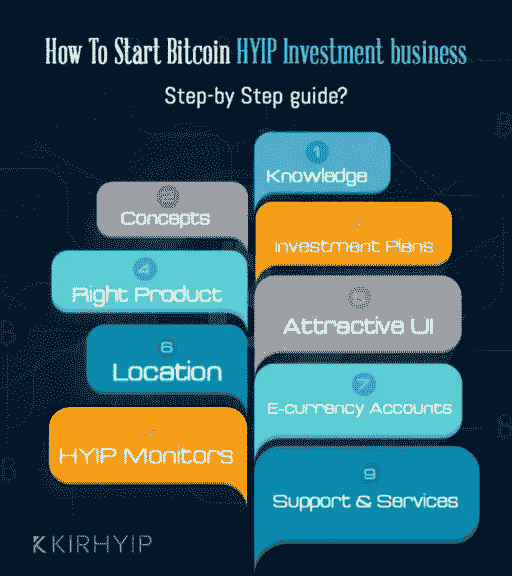

# HYIP 剧本& HYIP 是如何工作的？

> 原文：<https://medium.com/geekculture/hyip-script-how-hyip-works-2bf057e84ff1?source=collection_archive---------7----------------------->

## **关于**的信息指南

## 最佳 HYIP 脚本软件让你立即启动你的比特币投资网站！

对于在线投资行业的人来说，HYIP 并不是一个新名词，由于其高盈利性，长期以来一直被大量用户使用。

如今，它正在迅速发展，许多在线投资者都想参与这个利润丰厚的网站，因此互联网人群也在增加。

因此，人们希望通过选择具有所有高级功能的 [**最佳 HYIP 脚本**](https://www.kirhyip.com/hyip-software) 来定制它们，以便最有效地运营业务。

HYIP 是如何工作的？

许多投资者在外汇交易和/或其他方式的计划中设定了最低金额，以获得更高的投资回报。大多数项目要求每个投资者至少投资 10 或 20 美元。

项目经理每天交换整体或部分，以创造特定的利润率，保持一定的回报率。剩余收益第二天投资，第二天投入的初始金额或者投资人拿回来。这个收益一般是每天 1%。

所以，这对大家都是双赢。所以那里有很多钱可以赚。这就是本规划理念的理论 [**HYIP 脚本**](https://www.kirhyip.com/hyip-script) 模型。

高收益项目使用不同的投资策略。他们参与资本管理，如货币交易、股票市场、体育博彩和金属交易。也有投资其他 hyip 的 hyip。也有不投资的计划。高回报投资项目在互联网上进行日常运作。

如上所述，当提供高回报时，他们通常接受 10 美元或更少的投资。

小心 HYIP 骗局！

在实践中，由于多种因素，风险更高。由于这些基金通常是基于网络的，所以很容易有人开设网站，充当职业企业家。当他们有足够的钱，他们关闭网站，运行你的钱。

是的，很不幸！HYIP 世界到处都是不诚实的鲨鱼。另一个风险是，即使经理们真的兑换了他们的钱，也不意味着他们是专业人士。他们可能是业余玩家，有着世界上所有的美好愿望，却被迫赔钱，无论如何都要关门。

首先，警惕那些提供更高比例日收入的计划。如果一个网站每天为你提供 40%的投资，你需要问问自己支付这笔钱的资金从哪里来。

第二，虽然 HYIPs 经常付钱让你为他们的项目提名其他人，但这些报酬通常较低。如果一个推荐给了你 10%的分数，那就值得考虑了，因为继续这个系统的唯一方法是通过推荐，它可能是。

最后，看看这个网站及其设计和功能。

如果您发现大量内容似乎是简单地从另一个网站复制而来，或者如果您更喜欢布局和设计，尤其是免费的网页内容，组织者可能很清楚，只要组织者在场，这是没有必要的。

为他们赚钱是短期的事情。事实上，即使他们是真正的专业人士，他们受市场波动的支配，仍然会因不幸而亏损，所以诀窍是在网络上找到许多人。

> 但是，它们仍然是真正的 HYIP 项目，由真正有才华的交易者运营，他们能够长期成功。

所以最好的建议是永远不要把钱投资在一个地方。这样，你可以尽可能地降低风险。最后，在投资任何地方之前，一定要努力做到这一点。你真的要赚一大笔钱，但如果你不知道自己在做什么，风险也是难以置信的。

如果你正在考虑投资 HYIP，先努力做好调查。你需要学习 HYIP 技术和策略，以获得良好的投资回报。

在投资 [**HYIP 软件**](https://www.kirhyip.com/hyip-software) 的时候一定要非常小心，从业内最好的专家那里获得推荐是个好建议。祝你投资好运！

