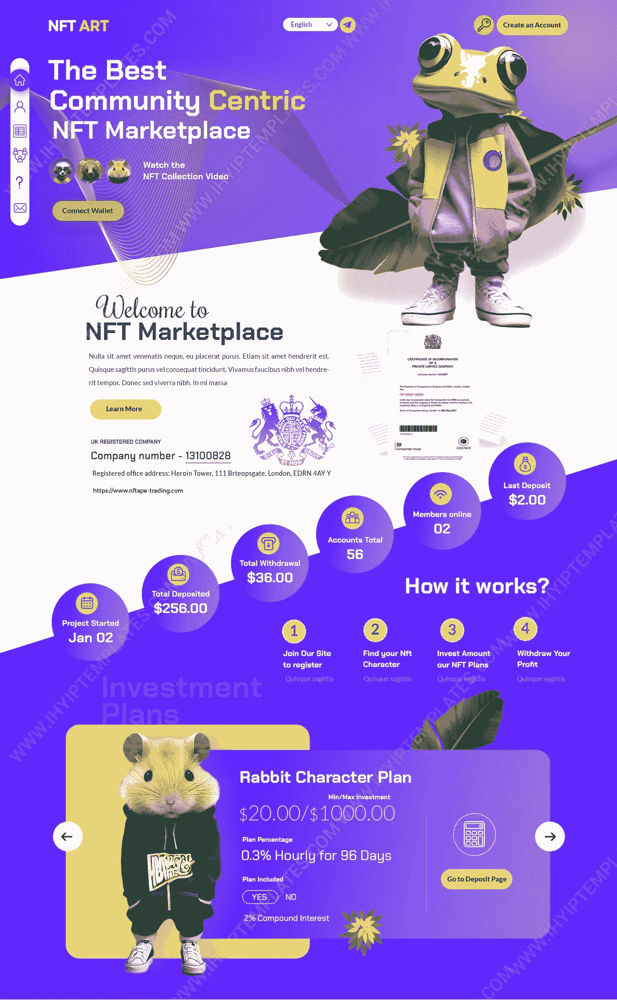

# 投资网站设计的 HYIP 模板！

> 原文：<https://medium.com/geekculture/hyip-template-for-investment-website-design-10bccde43b25?source=collection_archive---------13----------------------->

## **购买时要知道的小技巧**

一个外观清新时尚的 [**HYIP 模板**](https://www.ihyiptemplates.com/) 将永远是任何投资业务网站的资产。此外，它还能让他们在网上有更好的表现，帮助他们发展投资业务。

然而，强大的存在感、易用性、网页设计的频繁更新以及许多其他因素使得 HYIP 模板在过去十年中非常流行。

当你从专业提供商那里购买网页设计时，比如 IHYIP Templates，你会得到一个经过测试的设计包，帮助你根据自己的需求和喜好轻松定制网站。

所以看了下面的小技巧，选择模板似乎没那么有挑战性了。相反，它可以像在公园散步一样简单。这里有一些提示来指导你选择最好的模板。

慢慢来

始终寻找定制选项

选择移动响应模板

寻找一个搜索引擎友好的模板

在做出正确的决定之前，还有更多的因素需要考虑。但是这些建议足以帮助你为你的商业网站选择最好的模板。

另外很重要的一点是选择市场领先的网站模板提供商。然而，模板市场现在充满了供应商。并不是所有的模板都写得很好或者很有价值。

所以，确保你从可信的卖家那里购买模板。他们提供最好的 [**HYIP 模板**](/geekculture/best-hyip-templates-for-your-investment-business-website-1c39e8692688) ，非常容易使用，并且拥有所有必要的组件来立即启动你的网站。