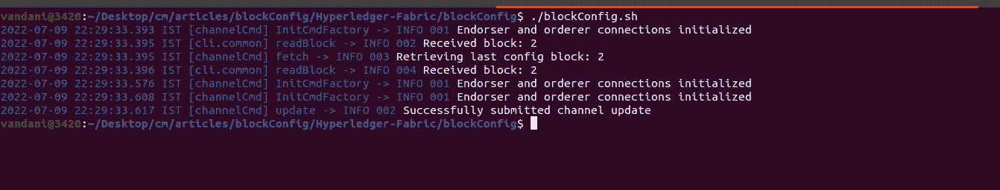

# Hyperledger 结构块配置和修改

> 原文：<https://medium.com/geekculture/hyperledger-fabric-block-configuration-5cd6281f7215?source=collection_archive---------5----------------------->


HLF

# 介绍

在本文中，我将演示如何在正在运行的 Hyperledger fabric 网络中配置/修改块设置。

# 观众

Hyperledger 结构操作员，管理员。这是一篇修改运行中的区块链网络的实践操作文章。对于初学者，我想建议你，请通过一些 Hyperledger 织物的基本概念。请访问[我以前的文章](/geekculture/hyperledger-fabric-blockchain-setup-from-scratch-21890e26aac7)，建立一个 HLF 网络。

> *注意:本文不建议 HLF 初学者阅读。*

# 先决条件

1.  中级了解 **Hyperledger Fabric 区块链**。
2.  基本了解 HLF CA，CouchDB。
3.  基本的外壳命令、外壳脚本等。

# 系统需求

1.  Docker —版本 17.06.2
2.  Docker Compose —版本 1.28.5 或更高版本
3.  Golang —版本 1.14
4.  Nodejs —版本 8
5.  Python 2.7

# 网络安装程序

*   具有 org1 和 org2 的 HLF 网络，每个都有 2 个对等体。
*   订购者群集(3 个订购服务节点)RAFT 作为一致算法(订购者、订购者 2、订购者 3)
*   组织 1、组织 2 和订购者的 CA
*   **CouchDB** 作为世界状态数据库。
*   面料最新版本 **2.3**

# 结构区块链设置

修改 hyperledger 结构网络非常复杂。如果结构网络已经在运行，则可以跳过这一步。

*   让我们克隆回购协议

```
**git clone** [**https://github.com/cmjagtap/Hyperledger-Fabric**](https://github.com/cmjagtap/Hyperledger-Fabric)
```

*   执行以下命令。

```
**export PATH=${PWD}/bin:$PATH
sudo service docker start
 cd org1
./1_enrollOrg1AdminAndUsers.sh
./2_generateMSPOrg1.shcd ../org2** ./**1_enrollOrg2AdminAndUsers.sh** ./**2_generateMSPOrg2.sh 

 cd ../orderer** ./**1_enrollAdminAndMSP.sh
./2_artifact.sh

 cd ../org1**
.**/3_createChannel.sh

 cd ../org2**
.**/3_joinChannel.sh**
```

Hyperledger fabric 区块链 2.3 已准备就绪。

# 块配置

*   批量大小和批量时间是超格织物获得高产量的重要因素。
*   这些因素决定了区块链网络的每秒交易量(TPS)。

## **块配置组件**

*   **批量大小:-** 这些参数规定了块中交易的数量和大小。任何块都不会比`absolute_max_bytes`大，也不会有超过`max_message_count`个事务出现在块内。如果有可能在`preferred_max_bytes`下构造一个块，那么一个块会被过早的切割，大于这个大小的事务会出现在自己的块中。
*   **批处理超时:-** 在第一个事务到达后，在切割一个块之前等待其他事务的时间。减小该值将会改善延迟，但是减小太多可能会降低吞吐量，因为它不允许块填满其最大容量。
*   **块验证**。该策略指定了块被视为有效的签名要求。默认情况下，它需要来自订购组织的某个成员的签名。

## 块更新过程

通常，我们使用对等配置和组织的管理员身份来更新通道。但是在这里，块配置是由订购者管理员控制的。因此，我们使用订购者的管理员身份来执行更新过程。

在上面的资源库**block config**/**block config . shshell 脚本中。shell 脚本执行以下步骤。**

1.  我们需要导出环境变量，在我们的例子中，我们导出 order 2 env 变量，也可以导出其他 orderer env 变量。

```
export FABRIC_LOGGING_SPEC=INFO
export CORE_PEER_TLS_ENABLED=trueexport ORDERER_CA=${PWD}/../orderer/crypto-config-ca/ordererOrganizations/example.com/orderers/orderer.example.com/tls/tlscacerts/tls-localhost-9054-ca-orderer.pemexport CORE_PEER_TLS_CERT_FILE=${PWD}/../orderer/crypto-config-ca/ordererOrganizations/example.com/orderers/orderer1/tls/server.crtexport CORE_PEER_TLS_KEY_FILE=${PWD}/../orderer/crypto-config-ca/ordererOrganizations/example.com/orderers/orderer1/tls/server.keyexport CORE_PEER_LOCALMSPID=OrdererMSPexport CORE_PEER_TLS_ROOTCERT_FILE=${PWD}/../orderer/crypto-config-ca/ordererOrganizations/example.com/orderers/orderer1/tls/ica.crtexport [CORE_PEER_MSPCONFIGPATH=${PWD}/../orderer/crypto-config-ca/ordererOrganizations/example.com/users/Admin@example.com](mailto:CORE_PEER_MSPCONFIGPATH=${PWD}/../orderer/crypto-config-ca/ordererOrganizations/example.com/users/Admin@example.com)/mspexport CORE_PEER_ADDRESS=$domain:$port 
```

2.从通道中获取最新的配置块。 **getConfig()** 函数从订购服务中获取最新的配置块。

```
peer channel fetch config config_block.pb -o $domain:$port  -c $channel --tls --cafile $ORDERER_CA
```

3.将块从 protobuff 转换为 JSON。 **convertBlockToJSON()** 函数将照片 buff 解码为 JSON。

```
configtxlator proto_decode --input config_block.pb --type common.Block | jq .data.data[0].payload.data.config > config.json
```

4.在这一步，我们可以修改 **BatchTimeout、BatchSize 和其他块**配置参数**。**

4.1**modifyBatchTimeout()**函数根据环境变量中给定的***BatchTimeout****修改 batch time out。*

```
jq  ".channel_group.groups.Orderer.values.BatchTimeout.value.timeout = $batchTimeout " config.json > modified_config.json
```

> 注意:目前有一些问题与 JQ。命令，你可以跳过这个函数或者手动编辑 modified_config.json 文件中的 **batchTimeout** 。

4.2 **modifyBatchSize()** 函数根据环境变量中给定的***BatchSize****修改 batchSize。这里我们修改了单个块中的最大事务限制。*

```
jq ".channel_group.groups.Orderer.values.BatchSize.value.max_message_count = $batchMessageSize " config.json > modified_config.json
```

5.之后，我们需要计算原始配置和新配置之间的差值。 **computeDelta()** 函数计算增量。

```
configtxlator proto_encode --input config.json --type common.Config --output config.pbconfigtxlator proto_encode --input modified_config.json --type common.Config --output modified_config.pbconfigtxlator compute_update --channel_id $channel --original config.pb --updated modified_config.pb --output config_update.pb
```

1.  **convertconfigfdeltatojson()**将现有的 proto buff 转换为 JSON，然后创建其信封。

```
configtxlator proto_decode --input config_update.pb --type common.ConfigUpdate --output config_update.jsonecho '{"payload":{"header":{"channel_header":{"channel_id":"mychannel", "type":2}},"data":{"config_update":'$(cat config_update.json)'}}}' | jq . > config_update_in_envelope.jsonconfigtxlator proto_encode --input config_update_in_envelope.json --type common.Envelope --output config_update_in_envelope.pb
```

1.  **signEnvolope()** 函数用身份给信封签名。根据您的政策，您可能需要在其他订购者的信封上签名。

```
peer channel signconfigtx -f config_update_in_envelope.pb
```

1.  **updateChannel()** 函数用符号包络更新通道配置。

```
peer channel update -f config_update_in_envelope.pb -c $channel -o $domain:$port  --tls --cafile $ORDERER_CA
```

在成功执行 shell 脚本后，我们应该会看到下面的输出。



Block Updation

# 打扫

执行以下脚本来清理所有 docker 容器和加密证书。

```
.**/clean.sh**
```

# 摘要

我们已经看到，在运行 hyperledger fabric 区块链网络时，如何更新 **BatchTimeout** 、 **BatchSize** 来配置块设置。