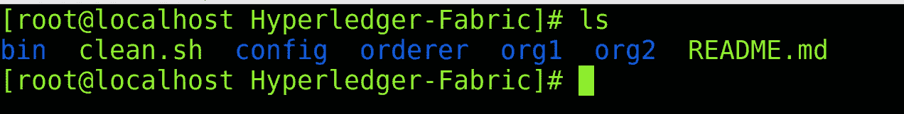
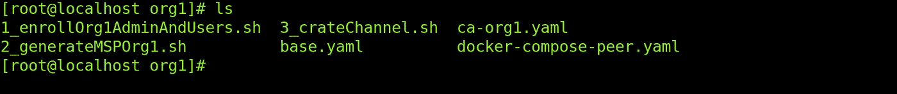
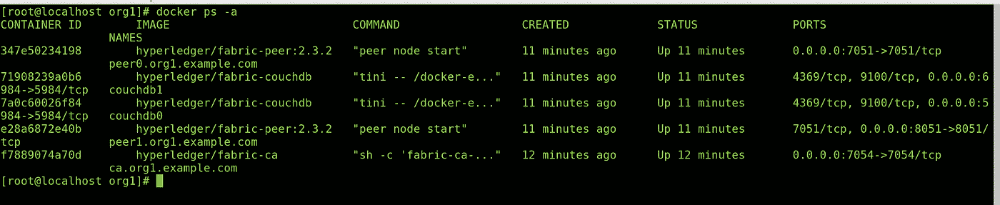
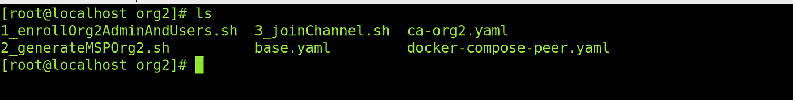
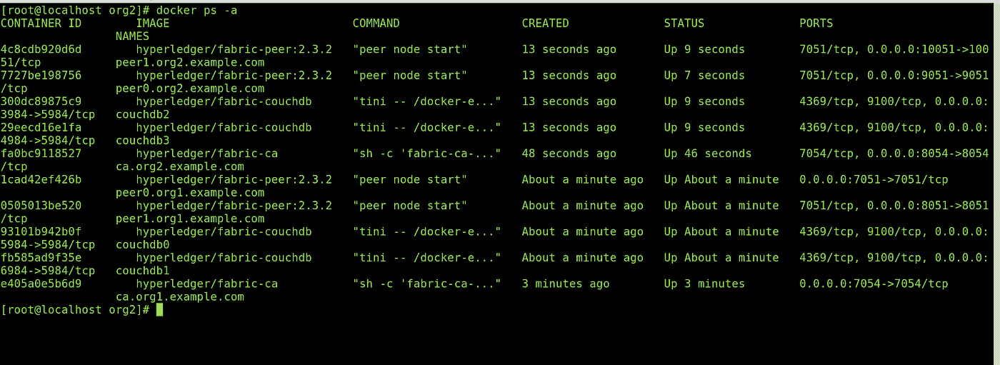
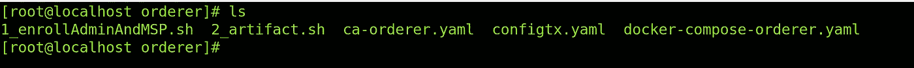
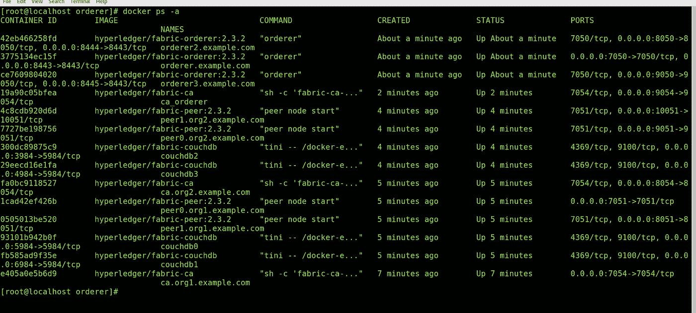
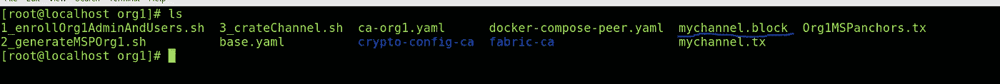

# 从头开始设置 Hyperledger Fabric 区块链

> 原文：<https://medium.com/geekculture/hyperledger-fabric-blockchain-setup-from-scratch-21890e26aac7?source=collection_archive---------9----------------------->


Hyperledger Fabric

## **简介**

在本文中，我们将建立一个超分类帐结构区块链网络。

## 观众

Hyperledger fabric 初学者、操作员和管理员。这是一篇设置结构网络的实用实践文章。对于初学者，我想建议请通过一些基本概念的超帐织物。在我之前的[作品](https://cmjagtap.medium.com/introduction-to-hyperledger-fabric-1ce0a1d67494)中，我已经解释了一些重要的概念。

## 先决条件

1.  Docker —版本 17.06.2
2.  Docker Compose —版本 1.28.5 或更高版本
3.  Golang —版本 1.14
4.  Nodejs —版本 8
5.  Python 2.7

## 网络安装程序

*   每个组织的证书颁发机构(CA )(订购者 CA、组织 1 CA、组织 2 CA)
*   订购者群集(3 个订购服务节点)RAFT 作为一致算法(订购者、订购者 2、订购者 3)
*   两个组织 **Org1** 和 **Org2。**
*   每个组织有两个对等方**对等方 0** (认可/提交对等方)和**对等方 1** (锚定对等方)
*   **CouchDB** 作为世界状态数据库。
*   面料最新版本 **2.3**

## 设置步骤

*   组织 1 设置。
*   组织 2 设置。
*   订购集群设置。
*   应用程序渠道创建和将组织加入渠道。

## 文件夹结构

*   让我们克隆包含源代码的 repo。

```
**git clone** [**https://github.com/cmjagtap/Hyperledger-Fabric**](https://github.com/cmjagtap/Hyperledger-Fabric)
```

下图显示了克隆的存储库的目录结构。



Fabric network folder structure

*   **bin:** 包含 fabric 二进制文件。
*   **clean.sh:** 这个脚本有助于清理 fabric 网络。
*   **配置:**光纤核心配置文件。
*   **order:**order 包含必要的 docker 文件和脚本来设置订购服务。
*   **Org1:** 包含 Org1 必要的设置文件。
*   **Org2:** 包含 Org2 必要的设置文件。

## Org1 设置

让我们建立第一个组织。在继续之前，我们必须导出 fabric 二进制文件路径。

```
**export PATH=${PWD}/bin:$PATH**
```

使用以下命令检查 docker 状态。

```
**sudo service docker status**
```

如果 docker 没有运行，那么您可以使用下面的命令启动它。

```
**sudo service docker start**
```

将目录切换到 org1 并执行下面的脚本。



Org1 Folder Structure

```
*#org1*
 **cd org1
./1_enrollOrg1AdminAndUsers.sh
./2_generateMSPOrg1.sh**
```

*   **1 _ enroll org 1 adminandusers**脚本启动 org1 CA。
*   **ca-org1.yaml** 文件包含一个 docker 脚本。
*   我们使用 **fabric-ca-client 将管理员用户注册到 CA 中。**
*   然后创建组织单位(OU)并将用户注册到 org1 CA。
*   **2_generateMSPOrg1.sh** 脚本为每个成员资格服务提供者( **MSP** )生成加密材料。
*   **docker-compose-peer . YAML**文件包含了一个用于 peers 和 CouchDB 的 docker 脚本。
*   成功设置后，我们可以看到正在运行的 docker 容器。



Org1 docker containers

*   上图显示了两个名为**peer0.org1.example.com、peer1.org1.example.com**的对等容器，以及关联的两个 **CouchDB** 容器和一个 **CA** 容器。

> 不执行脚本 **3_createChannel** 。我们将回到这个话题。

## Org2 设置

让我们着手建立第二个组织。将目录切换到 org2 并执行以下脚本。



Org2 Folder Structure

```
*#org2
***cd org2** ./**1_enrollOrg2AdminAndUsers.sh** ./**2_generateMSPOrg2.sh**
```

*   这些脚本执行与组织 1 中所述相同的操作。
*   成功设置后，我们可以看到 org1 和 org2 docker 容器。



Docker containers

*   上图显示了两个名为**peer0.org2.example.com、peer1.org2.example.com**的对等容器，以及关联的两个 **CouchDB** 容器和一个 **CA** 容器。

> 不执行脚本 **3_joinChannel** 。我们会回到这个话题。

## 订购者设置

让我们建立订购者组织。将目录切换到 orderer 并执行下面的脚本。



Orderer Folder structure

```
*#orderer* **cd orderer** ./**1_enrollAdminAndMSP.sh
./2_artifact.sh**
```

*   在中，**1 _ enroladminandmsp**脚本调出订购者 CA。
*   **ca-orderer.yaml** 文件包含一个 docker 脚本。
*   我们使用 **fabric-ca-client 将管理员用户注册到 CA 中。**
*   然后创建组织单元(OU)。
*   向 CA 登记了三个订购者。
*   为所有三个订购者和订购者管理员生成 MSP。
*   **2_artifact.sh** 脚本生成一个 genesis 块，这是区块链中的第**块**。
*   在创世纪块之后，我们生成了频道块，锚对等更新。
*   如果设置成功，我们应该看到所有 docker 容器都启动了。



> 注意:我做了一些策略更改 itno configtx.yaml，这样我们就不需要其他组织的批准了。

## 渠道创建

让我们使用下面的脚本从 org1 创建一个应用程序通道。

```
*#Org1 
***cd org1**
.**/3_createChannel.sh**
```

*   创建通道脚本导出 org1 环境变量并创建通道。
*   成功创建通道后，我们可以看到生成了 **mychannel.block** 文件。



*   每个组织都需要加入渠道。
*   让我们从第二个组织加入渠道。

```
*#org2* **cd org2**
.**/3_joinChannel.sh**
```

*   脚本从订购者处获取**通道块**并加入通道。

Hyperledger fabric 2.3 区块链已准备就绪。现在我们可以部署任何链码(智能合约)。

在下一篇文章中，我们将创建示例链代码(智能契约)。会将它们部署在这个区块链系统上。

## 打扫

执行以下脚本来清理所有 docker 容器和加密材料。

```
.**/clean.sh**
```

## 摘要

我们已经完成了两个组织和三个订购者的结构区块链设置。RAFT 是一个共识算法，也是一个应用渠道。