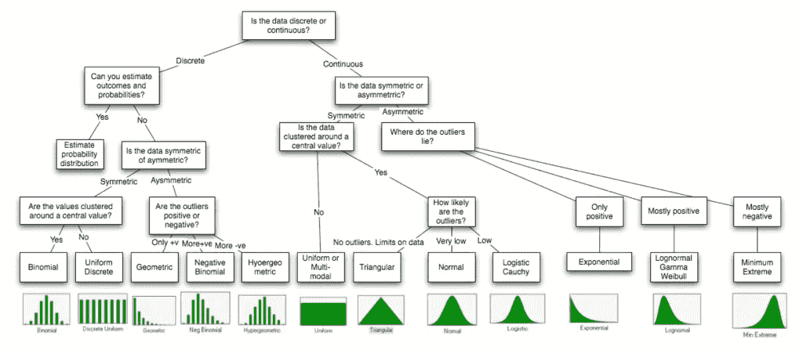

# 数据科学中的假设检验

> 原文：<https://medium.com/geekculture/hypothesis-testing-in-data-science-9183ba39086e?source=collection_archive---------37----------------------->

Diagram on how to choose a statistical test according to the data

# 什么是假设检验？

统计学的主要目的是检验假设。比如你可以进行一个实验，发现某种药对治疗头痛有效。但是如果你不能重复那个实验，没有人会认真对待你的结果。

假设是对你周围世界的有根据的猜测。它应该…