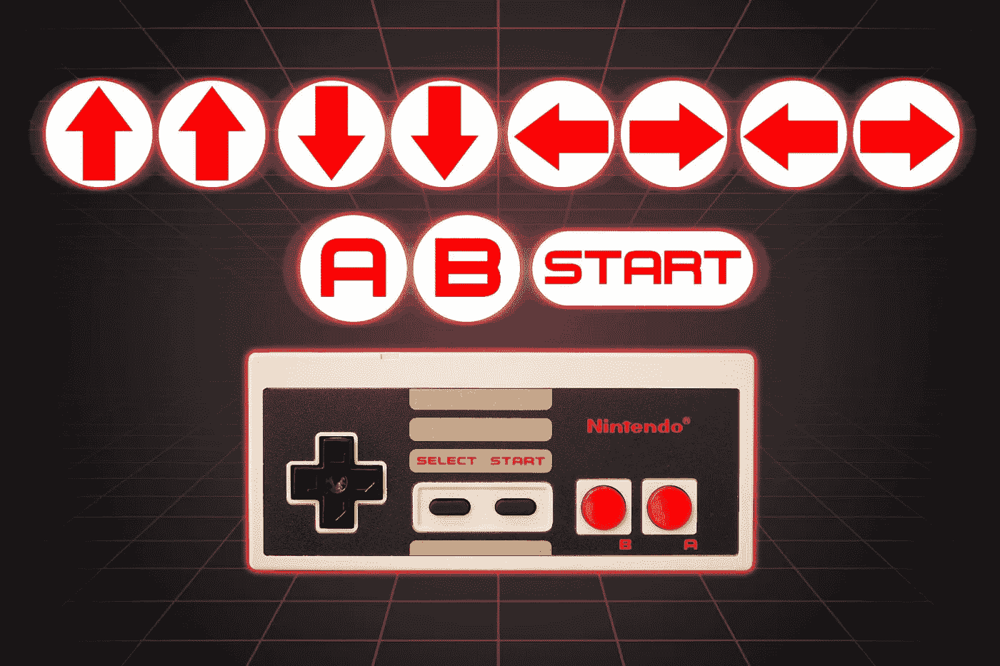

# 我得了 a🚀大多数 Javascript 技术都使用这个备忘单📑这样你就不需要重复所有的概念了。

> 原文：<https://medium.com/geekculture/i-aced-most-javascript-tech-rounds-using-this-cheatsheet-so-that-you-dont-have-to-go-through-636d60a3d77b?source=collection_archive---------8----------------------->



nintendo controller cheatcode

# 📚这是我为破解 Javascript 面试而创作的背景故事。

我的面试通过了人力资源部的审核，我接下来的(明显的)任务是编码挑战。我有不到一周的时间来准备它，我打开了我的[L**eetcode**挑战来解决问题并优化我的代码到 **O(n)** 以便我获得足够的信心。](https://leetcode.com/)

当我不得不面对编码挑战的那一天到来时，我打开了测试门户，我的压力水平直线上升(一如既往)，并且每分钟都变得更糟。

我分析了问题陈述和解决问题的核心算法模式。我首先声明输入和输出的变量(*只是为了减少我的压力*)，然后解决问题的一个**简单的**变体，使用来自问题语句的**零输入或者甚至样本输入**。

好吧！所以我为输入声明了一个**数组**，*，但是* *我如何搜索一个条目，以及如何移除一个条目呢？*🤔*是* ***拼接还是切片，*** *拼接是否需要两个或三个参数，是否会影响原来的数组，或者只是返回一个新的数组来代替，如何在数组前面添加一个项？*😵。如果这是一个真实的编码挑战，即使面试官最轻微的粗声粗气的迹象都可能扔出一枚核弹💣在我的脑海里


Photo by [Daniel Mingook Kim](https://unsplash.com/@danielmingookkim?utm_source=medium&utm_medium=referral) on [Unsplash](https://unsplash.com?utm_source=medium&utm_medium=referral)

当我的头脑第二次猜测一个我已经练习和使用了 1000 次的特定方法，但是在面试的时候忘记了我应该把最好的自己放在哪里时，我失去了信心。

> 走错路后后退一步，就是朝着正确的方向迈出了一步
> 
> 库尔特·冯内古特

# 恢复你的肌肉记忆💪

一旦你跨越了中级语言技能树，某些问题场景和语言方法就会成为你的肌肉记忆，因此在你的发展过程中，你会考虑它解决了什么，而不是如何解决。这些记忆必须在你面试前加强


Photo by [Volodymyr Hryshchenko](https://unsplash.com/@lunarts?utm_source=medium&utm_medium=referral) on [Unsplash](https://unsplash.com?utm_source=medium&utm_medium=referral)

你知道结果将被排序，而不是 Array.sort 是如何实现的，它使用什么算法来解决它。

在解决问题的过程中，我遇到了很多失败，这考验了你的技术技能和对你领域知识的深刻理解。

求职面试失败的概率是 0.9，他们会从所有的候选人中选择一个，但是你的目标是在求职面试中清除几轮中的目标🎊)。

在 frontend tech 的 8 年多时间里，我已经提高并优化了清理一轮技术的成功率，从 **60%到 95%，**每次迭代都优化了我的流程，并减少了花费在思考正确的数据结构和方法上的时间。

所有解决问题的技术回合都需要你用自己舒服的语言来解决问题，而 **Javascript** 是我的瑞士刀。每种语言都有自己的预烤实用程序或功能来解决问题。

# 面试备忘单📑

我已经解决了我的 leetcode 问题，这些是我观察到的常见操作模式，并创建了这个**面试备忘单。**

下面提到的方法可以节省你的时间，并给面试官留下一个积极的印象。我将解释**它们是如何有用的**而不是如何在引擎盖下工作。MDN 是 Javascript 的最佳可用文档。

本指南将作为您的补充指南/工具，而不是替代算法概念和问题解决技术。


Photo by [Patrick](https://unsplash.com/@pf91_photography?utm_source=medium&utm_medium=referral) on [Unsplash](https://unsplash.com?utm_source=medium&utm_medium=referral)

# 排列

*   **拼接** —插入/替换物品，对阵列产生永久影响。

```
splice(start, deleteCount, item1, item2, itemN)
```

```
const months = ['Jan', 'March', 'April', 'June'];
```

```
months.splice(1, 0, 'Feb');
// output: Array ["Jan", "Feb", "March", "April", "June"]
```

```
months.splice(4, 1, 'May');
// replaces 1 element at index 4
// output: Array ["Jan", "Feb", "March", "April", "May"]
```

*   **切片** —访问数组子集。主要用于嵌套循环概念。 **-1 值**帮助移至列表末尾。
    (*ex:` array _ items . slice(I，j)`其中* ***i*** *表示外循环引用，* ***j*** *引用内循环*)

```
slice(start, end)
```

```
const animals = ['ant', 'bison', 'camel', 'duck', 'elephant'];
```

```
console.log(animals.slice(2));
// output: Array ["camel", "duck", "elephant"]
```

```
console.log(animals.slice(2, 4));
// output: Array ["camel", "duck"]
```

*   **every** —验证数组中的所有项目都满足表达式。
*   **some**——验证至少有一个项目满足，如果满足表达式，则有效停止运行循环。
*   **from** —数组的浅拷贝或将字符串转换为数组。

```
Array.from(“level”) -> [‘l’, ‘e’, ‘v’, ‘e’, ‘l’]
```

*   **填充** —初始化带有约束的解决方案的状态。

```
To create m*n array. Array(m).fill(1)
```


```
Input: numRows = 5
Output: [[1],[1,1],[1,2,1],[1,3,3,1],[1,4,6,4,1]]
```

```
var generate = function(numRows) {
    let result = [];
    let i = 1;
    while(i <= numRows) {
        let prev = result[i-2];
        let temp = new Array(i).fill(1).map((j, index) => {
            if(index == 0 || index == i-1) {
                return j;
            }
            return prev[index] + prev[index -1];
        });
        result.push(temp);
        i++;
    }
    return result;
};
```

在这个简单的 leet 代码问题中，如果您已经注意到了逻辑，我使用了 fill，默认情况下，它将值添加到初始化的数组中，这减少了我在迭代每一行并填充值时的编译时间。

*   **flat** —带有嵌套数组的数组，需要计算或访问所有项。

```
ex: sum of all items a = [1,[2], [[3]]] -> a.flat(2)
```

*   **包含**——检查数组中是否存在项目。
*   **reduce** —数组中被低估的方法，大多数解决方案都要求你对项目进行操作，并将结果发送到下一次迭代。
*   **shift，un shift**——删除/添加与`pop/push`相对的第一个元素
*   **排序** —按升序或降序对项目进行排序，主要用于解决方案的开头或结尾。
*   **join** —按照指定的字符串合并数组中的项目。如果操作涉及最终结果的数组到字符串的转换，则大量使用。

# 线

*   **替换** —替换字符串中的字符。我会推荐使用正则表达式，因为它会给你留下积极的印象。
*   **split** —使用分隔字符将字符串转换为项目数组。
*   **测试** —根据正则表达式测试字符串
*   **charAt** —查找字符串中字符的位置，用于字谜/排列组合字符串等问题
*   **包括** —查找区分大小写的搜索，如果一个字符串可能在另一个字符串中找到

# 目标

*   **has own/hasOwnProperty**—检查对象中是否有 key/prop
*   [**对象强制**](https://developer.mozilla.org/en-US/docs/Web/JavaScript/Reference/Global_Objects/Object#object_coercion)

# 数学

大多数树问题都涉及到使用数学运算来比较节点之间的值。

*   数学最小值
*   Math.max
*   数学。无穷
*   数学符号

# 一组

大多数矩阵问题都涉及到使用频繁操作的项目列表来查找列表中的项目以进行添加/删除/搜索。
[布下比传统阵更好的优势。](/front-end-weekly/es6-set-vs-array-what-and-when-efc055655e1a)

集合不允许重复值

*   **有** —在集合中定位元素
*   **添加/删除** —插入和删除器械包中的物品。

```
var set = new Set([1,2,3]);
set.has(1) // true
set.add(1) // {1,2,3} no duplicates allowed
set.delete(1) // {2,3}
```

# 地图

[映射](/front-end-weekly/es6-map-vs-object-what-and-when-b80621932373)是组织记录的最佳方式，它为对象提供了**键**和**值的精确类型。**

像传统的将所有键转换为字符串的对象一样，map 使用与 type 相同的对象而不进行转换。

```
const map = new Map([1, “smile”], [2, “cry”], [42, “happy”])
```

```
map.get(42) // output: "happy" (42 is not string its a number)
```

```
// Easy for iterating the contents of the map
for (const [key,value] of map){
    console.log(`key: ${key}, value: ${value}`);
}
```

```
map.size // 3 (no of records in the map)
```

# 其他概念🏫

*   功能**(绑定、应用、调用**——确保你知道它们之间的正确区别，因为这可能有助于技术面试)
*   关闭
*   领域
*   提升
*   设置超时/设置间隔
*   回电/承诺
*   记忆化

**结论🔚**

在你面试之前浏览一下这个列表，这样你就可以把注意力集中在编码面试中最常用的操作上。


Photo by [Long Phan](https://unsplash.com/es/@longphan?utm_source=medium&utm_medium=referral) on [Unsplash](https://unsplash.com?utm_source=medium&utm_medium=referral)

在你的代码中实现这些操作/方法会给你留下更好的印象，并使你与其他候选人拉开距离。

请在推特上关注我[https://twitter.com/amerrnath21/](https://twitter.com/amerrnath21/)