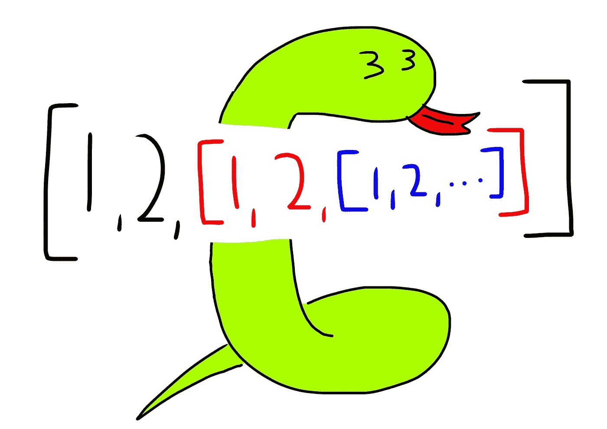

# 我在 Python 中添加了一个列表，然后就发生了这种情况

> 原文：<https://medium.com/geekculture/i-added-a-list-to-itself-in-python-and-this-happened-49f3b81fb1f2?source=collection_archive---------7----------------------->



这篇短文是无聊的结果，没有提供任何有用的知识。在 Python 中，列表可以包含任何数据类型——整数、浮点、字符串、列表、字典等等。

```
list1 = [1, 3.14, "apple", True, [1,2], {"apple": "pie"}]
```

好奇心驱使我去测试一个列表是否可以包含它自己:

```
list1 = [1, 2]…
```