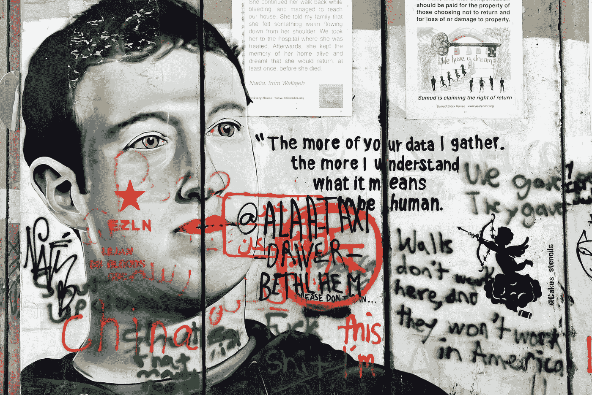

# 我将永远卸载脸书

> 原文：<https://medium.com/geekculture/i-am-uninstalling-facebook-forever-11d8bd1e996b?source=collection_archive---------11----------------------->

## 我发现脸书的所有错误

Photo by [Snowscat](https://unsplash.com/@snowscat?utm_source=medium&utm_medium=referral) on [Unsplash](https://unsplash.com?utm_source=medium&utm_medium=referral)

脸书是一个社交媒体平台，由马克·扎克伯格和其他一些哈佛大学的学生于 2004 年创立。当它成立时，仅限于哈佛大学的学生，后来北美几乎所有的大学都可以进入。看到它的受欢迎程度，它在 2006 年被提供给每个年龄更大的人…