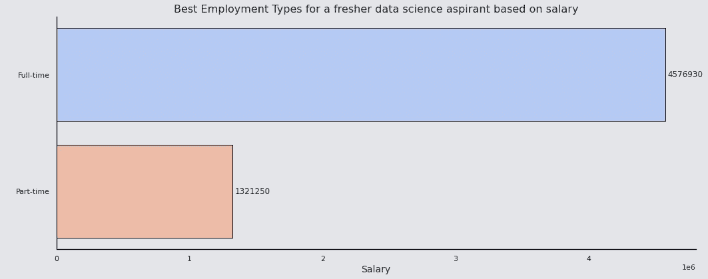
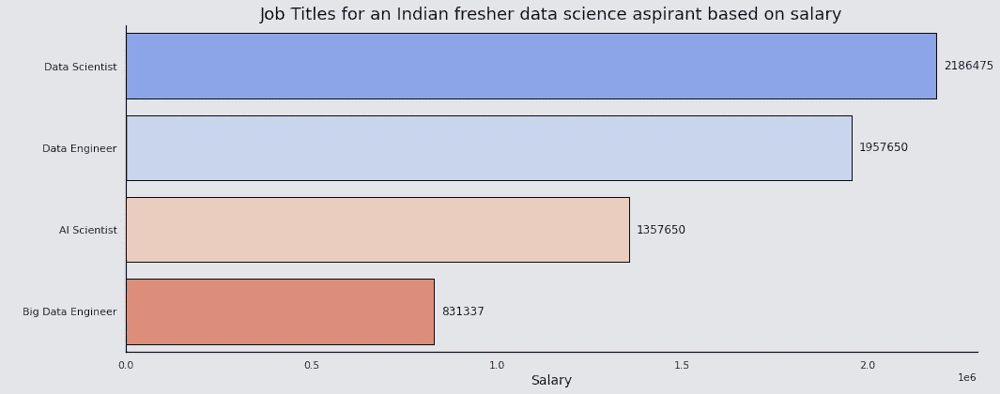
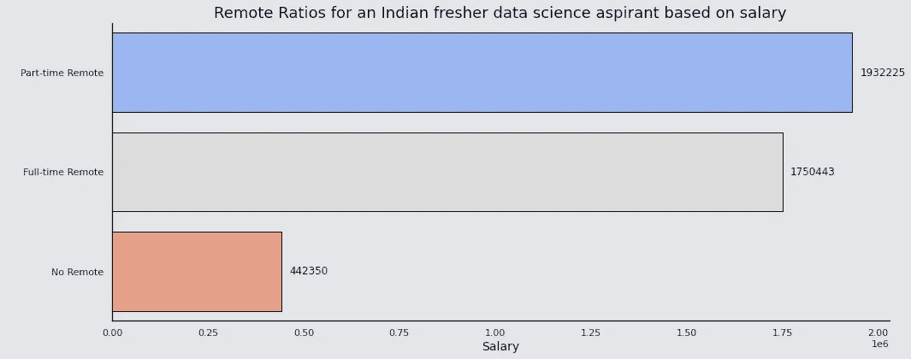
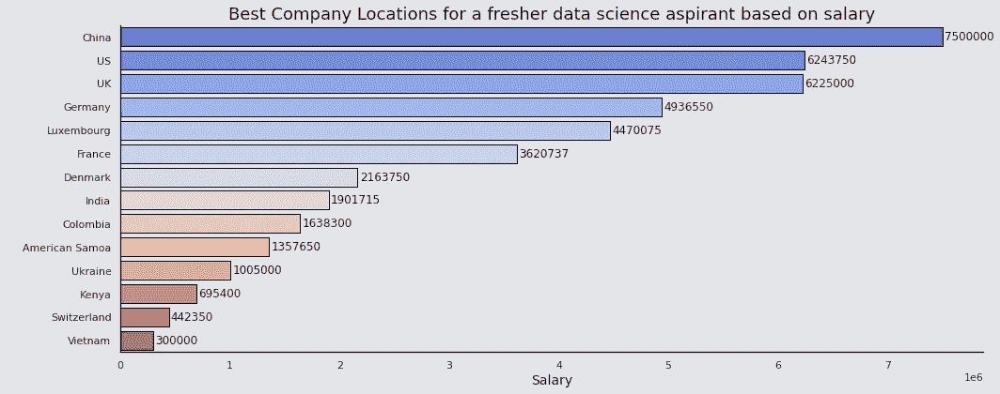
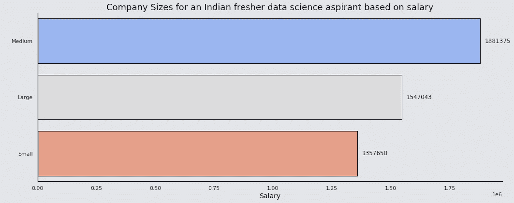

# 我分析了一个数据科学工作薪水数据集

> 原文：<https://medium.com/geekculture/i-analyzed-a-data-science-job-salaries-dataset-dca3c24081c0?source=collection_archive---------1----------------------->

## 这是我的发现。

Photo by [Luke Chesser](https://unsplash.com/@lukechesser?utm_source=medium&utm_medium=referral) on [Unsplash](https://unsplash.com?utm_source=medium&utm_medium=referral)

我在 Kaggle 上发现了这个有趣的 [**数据科学工作薪水数据集**](https://www.kaggle.com/saurabhshahane/data-science-jobs-salaries) ，我想在上面试试我的分析技能。

该数据集包含世界各地不同数据科学专业人员的薪酬详情，基于雇佣类型、公司所在地等因素。2020 年。它还提供了 2021 年数据科学专业人员的估计工资。

我绘制了 2020 年和 2021 年的工资分布图，这是我的发现。

Image by the author([https://retinpkumar.medium.com/](https://retinpkumar.medium.com/))

从 2020 年到 2021 年，我们可以观察到工资上限有相当大的增长。此外，可以看到收入高达 30 万美元的专业人员数量大幅增加。

因此，作为一名来自印度的数据科学爱好者，我想为什么不试一试，找出我脑海中出现的几个问题的答案。

(请注意，在接下来的图表中提到的工资是以印度卢比为单位的。)

# 问题 1。什么类型的就业最适合入门级的数据科学专业人员？

Image by the author([https://retinpkumar.medium.com/](https://retinpkumar.medium.com/))

我们发现全职角色是入门级数据科学专业人员的最佳选择，这是显而易见的。

# 问题 2。来自印度的入门级数据科学专业人员应该选择哪个职业选项？

Image by the author([https://retinpkumar.medium.com/](https://retinpkumar.medium.com/))

我们发现，对于印度的数据科学爱好者来说，成为一名数据科学家是最好的选择，但成为一名数据工程师也不错。毕竟，比金钱更重要的是对工作的热情。

# 问题 3。印度的入门级数据科学专业人士是否应该尝试远程工作？

Image by the author([https://retinpkumar.medium.com/](https://retinpkumar.medium.com/))

对于来自印度的入门级数据科学专业人员来说，拥有一份全职工作和远程工作是最佳选择。

抛开薪水不谈，这仍然是大学新生的最佳选择，因为从前辈和同事那里获得的办公室经验和经验是无价的。

# 问题 4。哪个国家对入门级数据科学专业人员的薪资最高？

Image by the author([https://retinpkumar.medium.com/](https://retinpkumar.medium.com/))

我们发现，年薪为 750 万卢比的中国，其次是美国和英国，将是入门级数据科学家的最佳选择，只考虑工资作为标准。

# 问题 5。根据公司的规模，来自印度的入门级数据科学专业人员应该选择什么类型的公司？

Image by the author([https://retinpkumar.medium.com/](https://retinpkumar.medium.com/))

这是一个有趣的发现，与我的假设相反，我认为大公司为任何级别的数据科学专业人员支付的薪酬最高。中型公司的薪酬比大型公司高 20%，因此是入门级数据科学专业人员的最佳选择。

这些是我在分析数据集时发现的一些有趣的观察结果。

你可以在我的 [**Kaggle 笔记本**](https://www.kaggle.com/retinpkumar/data-science-jobs-salaries-dataset-analysis) **中找到包括数据集探索在内的完整分析。**

请随意浏览笔记本，如果你喜欢，请考虑投赞成票，并发表你的宝贵反馈。

此外，如果您喜欢这篇文章，请关注我，获取有趣且可行的数据科学文章。