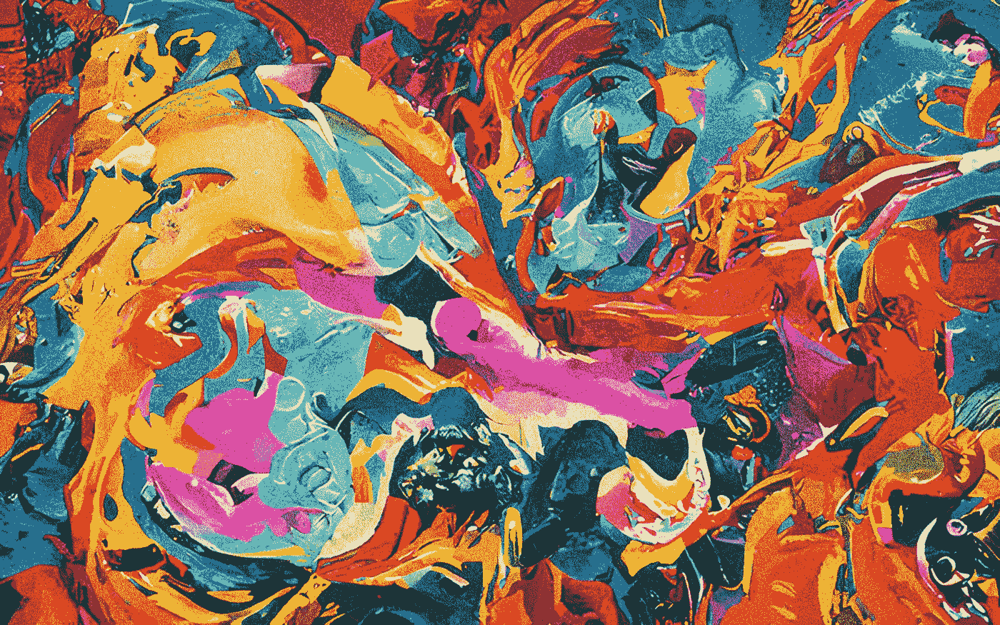

# 我让一个 AI 在一分钟内画出 10 个著名的科幻书名。这是结果。

> 原文：<https://medium.com/geekculture/i-asked-an-ai-to-paint-10-famous-sci-fi-book-titles-in-one-minute-here-are-the-results-73f2ed6f08c1?source=collection_archive---------0----------------------->

## 人工智能艺术家速度快，价格便宜，而且越来越好。他们注定要取代我们吗？

五十五年前，[的顶级科学家](https://www.newsweek.com/man-vs-machine-173038)认为人工智能永远无法在国际象棋上击败人类。