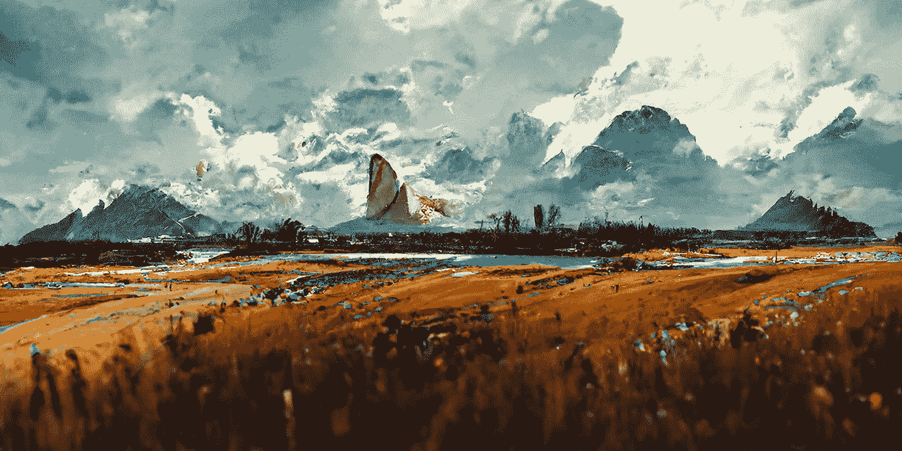

# 我让一个 AI 画了 100 幅幻想风景。事情是这样的。

> 原文：<https://medium.com/geekculture/i-asked-an-ai-to-paint-100-fantasy-landscapes-heres-what-happened-54096c41902b?source=collection_archive---------0----------------------->

“A far-flung fantasy world with rolling hills, mountains, and the imaginings of magical civilization”

## 比人类强？你决定吧。

人工智能越来越擅长创造艺术。比如，*真正的好*。大多数人没有意识到，它在大多数方面已经明显优于人类。

当然，你可能不相信我。