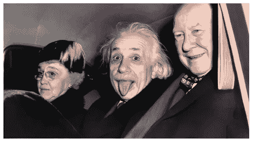
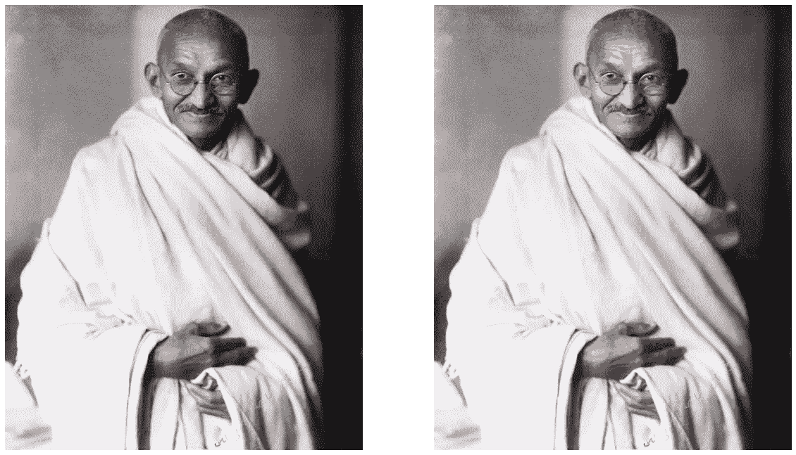
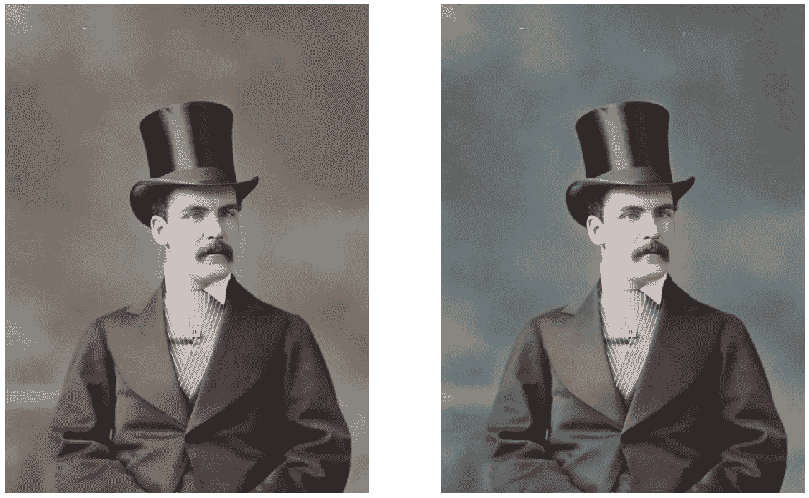
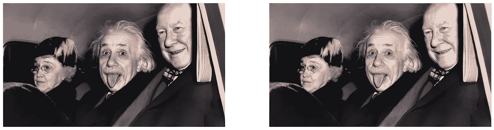
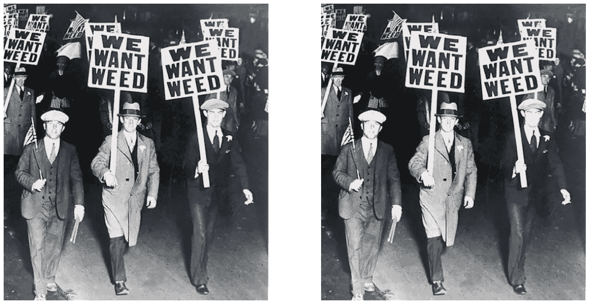
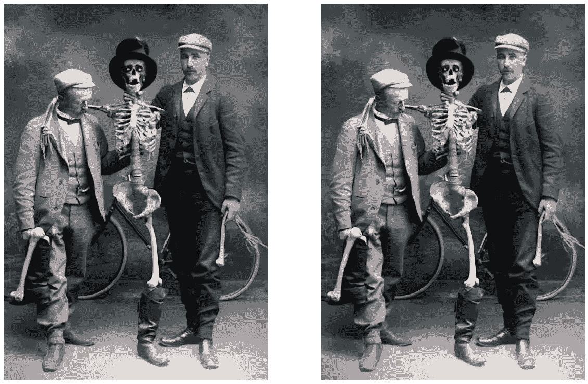
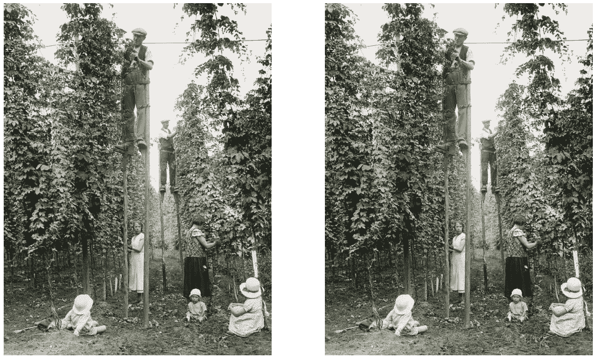

# 我用人工智能买回了黑白照片。

> 原文：<https://medium.com/geekculture/i-bought-back-black-and-white-pictures-to-life-with-ai-2b995773e234?source=collection_archive---------10----------------------->

Image by my AI

所以，我有这张我曾祖母的照片。它非常古老，而且是黑白的。我想看彩色的，所以我决定写这篇文章，做一个可以把黑白图像变成彩色图像的人工智能。

所以，我开始了一些研究。我为此找到了许多模型，但其中一个特别突出的是 [deoldify](https://github.com/jantic/DeOldify) 。这是一个令人惊叹的人工智能模型，由一个名叫[简蒂克](https://github.com/jantic)的家伙制作。我决定用这个模型。

现在让我们从代码开始。首先安装:

然后让我们开始设置:

让我们像在 google colab 上一样安装 colab 要求:

让我们导入:

让我们看看模型:

让我们得到水印:

让我们设置图像着色程序:

**现在让我补充一些说明:**

**source_url:** 输入图片的直接链接。通常这意味着他们会结束。png，。jpg 等。注意:如果你想使用你自己的图片，先把它上传到 Imgur 这样的网站上。

render_factor: 默认值 35 是经过仔细选择的，对于大多数情况应该可以(但可能不是最好的)。这决定了渲染图像颜色部分的分辨率。分辨率越低，渲染速度越快，颜色看起来也越鲜艳。尤其是较旧和较低质量的图像通常会受益于降低渲染因子。较高的渲染因子通常对较高质量的图像更好，但颜色可能会稍微褪色。

**水印:**默认选择，将调色板的水印图标放在图像的左下角。这是一种标准的方式，向其他观看图像的人传达图像是由人工智能着色的。我们希望帮助推广这一标准，特别是随着技术的不断进步，真假之间的区别变得越来越难以辨别。这种调色板水印实践是由 MyHeritage 公司在 MyHeritage In Color 特性中发起和领导的(它使用比您在这里使用的版本更新的 DeOldify)。

**如何下载副本:**只需右键单击显示的图像，然后单击“将图像另存为…”！Pro Tips 您可以使用底部的代码来评估图像在每个 render_factor 下的渲染效果(“在此处查看 render_factor 值在帧上的表现如何”下的单元格)。

现在让我们得到上面的输入并渲染彩色图像:

这样代码就完成了。让我们看看一些惊人的输出:

Gandhi

Some doctor

Einstein’s iconic tongue photo

I dont support this just thought it was funny af

random pic

random pic

看看这些惊人的转变，啊啊，我爱人工智能

如果你喜欢这篇文章，请在媒体上关注我。

关于 colab 笔记本，请点击此处:

 [## Oldtonew.py

### Eeman_Majumder

colab.research.google.com](https://colab.research.google.com/drive/18LQUurLy81asXUY6hCU_04vY4_BRkfbb?usp=sharing) 

更多内容请查看我的 github:

 [## GitHub-eeman 1113/黑白转彩色照片

### 此时您不能执行该操作。您已使用另一个标签页或窗口登录。您已在另一个选项卡中注销，或者…

github.com](https://github.com/Eeman1113/Black-and-white-to-colour-photos) 

请在 twitter 上关注我的每日 AIML 研究动态:

感谢阅读😁，下周见👋🏼